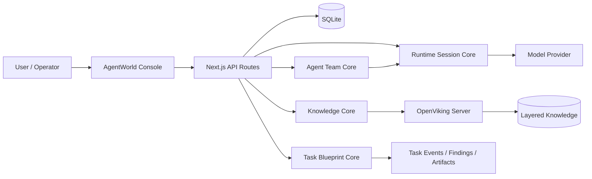

# AgentWorld

<p align="center">
  <strong>English</strong> | <a href="README.zh-CN.md">简体中文</a>
</p>

<p align="center">
  <strong>Team-scale agent operating system for governed, observable, multi-agent work.</strong>
</p>

<p align="center">
  <a href="https://nextjs.org/"></a>
  <a href="https://react.dev/"></a>
  <a href="https://www.typescriptlang.org/"></a>
  <a href="https://www.sqlite.org/"></a>
  <a href="https://pnpm.io/"></a>
  
  
</p>

AgentWorld is a governance-first platform for building and operating Agent teams. It turns isolated chat-style agents into a configurable system with team ownership, model governance, task blueprints, execution policies, human approvals, knowledge write-back, and traceable task runs.

The project is designed for serious internal platforms: every agent, team, model service, codebase, connector, skill, webhook, knowledge space, and execution environment is a persisted resource rather than a hard-coded demo.

## Contents

- [Why AgentWorld](#why-agentworld)
- [Core Capabilities](#core-capabilities)
- [Architecture](#architecture)
- [Quick Start](#quick-start)
- [Configuration](#configuration)
- [OpenViking Knowledge Base](#openviking-knowledge-base)
- [Development Workflow](#development-workflow)
- [Deployment](#deployment)
- [Project Map](#project-map)
- [Documentation](#documentation)
- [License](#license)

## Why AgentWorld

Most agent products stop at a prompt, a tool list, and a chat window. AgentWorld focuses on the missing operational layer:

| Layer | What it controls |
| --- | --- |
| Team governance | Tenant spaces, business teams, members, permissions, assets, and cross-team service access. |
| Agent governance | Agent definitions, system prompts, model bindings, tool policy, memory scope, and runtime constraints. |
| Agent team orchestration | Leaders, members, workflows, dependencies, human gates, and task-level service exposure. |
| Task execution | Task Blueprints, triggers, DAG nodes, runtime snapshots, approvals, retries, events, findings, and artifacts. |
| Knowledge foundation | OpenViking-backed spaces, layered retrieval, markdown editing, skill import, version history, and write-back. |
| Provider governance | Editable model providers, anonymized secrets, runtime bindings, health status, and capability flags. |

## Core Capabilities

### Agent And Team Operations

- Define reusable Agents with role prompts, default model services, tools, memory scopes, and execution constraints.
- Assemble Agent teams with a leader, member roles, orchestration prompt, service visibility, and business-team permissions.
- Run single-Agent and multi-Agent conversations with reasoning summaries, tool-call traces, and human intervention points.
- Convert repeatable work into Task Blueprints with triggers, execution environments, policy previews, and output policies.

### Knowledge Management

- Manage knowledge as a notebook-style workspace backed by OpenViking.
- Organize knowledge with spaces, folders, indexes, documents, skills, and markdown shadow files.
- Edit and preview markdown with task lists, code blocks, Mermaid, PlantUML-style fences, and rich document metadata.
- Import knowledge from URLs, dropped files, and skill-like directory packages.
- Keep short version history for safer collaboration and conflict recovery.

### Runtime And Provider Governance

- Configure OpenAI-compatible, OpenAI Responses, OpenAI Chat Completions, Anthropic, and Azure OpenAI style services.
- Store API keys as editable, masked configuration values in the console rather than hard-coded environment references.
- Bind default providers to knowledge-base understanding, Agent execution, and runtime sessions.
- Keep model configuration inspectable and replaceable across environments.

### Enterprise Console Foundations

- Tenant spaces, business teams, members, permissions, assets, access requests, and identity-access views.
- Model services, skills, MCP servers, connectors, codebases, execution environments, webhooks, and system settings.
- Language-pack governance through `src/locales/zh-CN.ts` and runtime system settings.
- Local-first SQLite persistence for fast development and portable Linux packaging.

## Architecture



AgentWorld separates **scheduling** from **invocation**:

- Scheduling decides what should run, in which order, under which team, policy, environment, and approval boundary.
- Invocation resolves provider configuration, tools, secrets, memory, runtime constraints, and execution events for a specific node.

That boundary keeps Agent orchestration auditable and prevents provider calls from becoming hidden workflow logic.

## Quick Start

### Requirements

- Node.js 20+
- pnpm 9+
- macOS or Linux for local development
- Optional: OpenViking binary or Python fallback environment for local knowledge service

### Install And Run

```bash
pnpm install
pnpm bootstrap
pnpm dev
```

Open the console:

```text
http://localhost:7369
```

`pnpm dev` runs `scripts/agentworld-next.mjs`. The script checks OpenViking health first and, when enabled, starts the local OpenViking service before starting the Next.js dev server.

### Production Mode

```bash
pnpm build
pnpm start
```

`pnpm start` uses the standalone Next.js server output and keeps the same OpenViking startup behavior as the development launcher.

## Configuration

`pnpm bootstrap` creates `.env.local` from `.env.example` when needed and ensures a local master key exists.

Common variables:

| Variable | Purpose |
| --- | --- |
| `PORT` | AgentWorld HTTP port. Defaults to `7369`. |
| `AGENTWORLD_MASTER_KEY` | Local encryption and signing root. Generated by bootstrap when empty. |
| `AGENTWORLD_PUBLIC_BASE_URL` | Public URL used by callbacks and generated links. |
| `OPENVIKING_BASE_URL` | OpenViking server URL. Defaults to `http://127.0.0.1:1933`. |
| `AGENTWORLD_OPENVIKING_AUTO_START` | Enables launcher-managed OpenViking startup when set to `1`. |
| `OPENVIKING_CONFIG_FILE` | OpenViking server config path. Defaults to `data/openviking/ov.conf`. |
| `OPENVIKING_CLI_CONFIG_FILE` | OpenViking CLI config path. Defaults to `data/openviking/ovcli.conf`. |

Model provider keys should be configured through the console whenever possible. Runtime and knowledge-base model settings are persisted resources and should not be treated as immutable environment constants.

## OpenViking Knowledge Base

AgentWorld uses OpenViking as the default knowledge substrate. The local service listens on port `1933` unless overridden.

Prepare local configuration:

```bash
pnpm openviking:prepare
pnpm openviking:cli-config
```

Initialize or inspect OpenViking:

```bash
pnpm openviking:init
pnpm openviking:doctor
```

Start and smoke-test the service:

```bash
pnpm openviking:start
pnpm openviking:smoke
```

If the repository does not have a bundled OpenViking binary, install the Python fallback:

```bash
pnpm openviking:install
```

Knowledge APIs:

```text
GET    /api/knowledge/layers
GET    /api/knowledge/read
GET    /api/knowledge/context
GET    /api/knowledge/spaces
POST   /api/knowledge/spaces
PATCH  /api/knowledge/spaces
DELETE /api/knowledge/spaces
GET    /api/knowledge/entries
POST   /api/knowledge/entries
PATCH  /api/knowledge/entries
DELETE /api/knowledge/entries
GET    /api/knowledge/entry-versions
POST   /api/knowledge/import
POST   /api/knowledge/retrieval-test
POST   /api/knowledge/sync
```

## Development Workflow

Quality gates:

```bash
pnpm config-data:audit
pnpm i18n:audit
pnpm quality:audit
pnpm security:audit
pnpm typecheck
pnpm lint
pnpm build
```

What they protect:

| Command | Purpose |
| --- | --- |
| `pnpm config-data:audit` | Prevents seeded business data, hidden defaults, and demo cases from becoming product state. |
| `pnpm i18n:audit` | Checks that visible Chinese UI text goes through the language-pack path. |
| `pnpm quality:audit` | Reports complexity hotspots, `TODO/FIXME`, `any`, and temporary escape hatches. |
| `pnpm security:audit` | Scans for dangerous execution, raw HTML injection, private-key material, and hard-coded secrets. |
| `pnpm typecheck` | Runs the TypeScript project check with `tsconfig.typecheck.json`. |
| `pnpm lint` | Runs ESLint across the repository. |
| `pnpm build` | Produces the standalone Next.js build. |

## Deployment

AgentWorld is packaged as a Linux self-contained service. The package includes:

- Standalone Next.js application.
- Node.js Linux runtime.
- OpenViking server binary when built.
- OpenViking configuration and CLI configuration files.
- `agentworld` and `openviking-server` launch scripts.

Build a Linux package:

```bash
pnpm openviking:build-binary
pnpm package:linux
```

OpenViking binary resolution order:

1. Healthy `OPENVIKING_BASE_URL`.
2. `OPENVIKING_SERVER_BIN`.
3. `thirdparty/openviking/bin/openviking-server`.
4. `thirdparty/openviking/bin/openviking-server-${platform}-${arch}`.
5. `.venv-openviking/bin/openviking-server` for development fallback.

## Project Map

```text
src/app                     Next.js pages and API routes
src/components              Console UI, forms, dialogs, knowledge workspace
src/server                  SQLite schema, queries, orchestration, runtime, knowledge core
src/locales                 Built-in language packs
scripts                     Bootstrap, audit, OpenViking, and packaging scripts
docs                        Architecture and implementation specifications
plugins                     Official extension packages
thirdparty/openviking       OpenViking binary and manifest location
data                        Local runtime data, ignored by git
```

Key console routes:

| Route | Area |
| --- | --- |
| `/overview` | System overview and operational status. |
| `/agents` | Agent definition management. |
| `/agent-teams` | Agent team assembly and service exposure. |
| `/interactions` | Human-in-the-loop Agent and Agent-team conversations. |
| `/task-blueprints` | Task Blueprint authoring and execution configuration. |
| `/task-runs` | Task run tracking and execution state. |
| `/knowledge` | OpenViking-backed knowledge workspace. |
| `/runtimes` | Model service configuration. |
| `/runtime-bindings` | Runtime binding policy. |
| `/skills` | Skill catalog and OpenViking sync. |
| `/mcp` | MCP server governance. |
| `/connectors` | IM, email, and push connector configuration. |
| `/codebases` | Code repository and operator-token management. |
| `/settings` | System settings, language pack, knowledge-base model configuration, and long-tail configuration. |

## Documentation

| Document | Focus |
| --- | --- |
| [`docs/system-design.zh-CN.md`](docs/system-design.zh-CN.md) | System positioning, 4+1 views, deployment model, and platform domains. |
| [`docs/system-design-detailed.zh-CN.md`](docs/system-design-detailed.zh-CN.md) | Detailed design for core modules and data flow. |
| [`docs/specs/agent-team-orchestration-spec.zh-CN.md`](docs/specs/agent-team-orchestration-spec.zh-CN.md) | Agent team scheduling, invocation boundary, DAG nodes, and human gates. |
| [`docs/specs/task-blueprint-spec.zh-CN.md`](docs/specs/task-blueprint-spec.zh-CN.md) | Task Blueprint model and execution planning. |
| [`docs/specs/memory-skill-spec.zh-CN.md`](docs/specs/memory-skill-spec.zh-CN.md) | Knowledge, memory, and skill behavior. |
| [`docs/specs/provider-adapter-spec.zh-CN.md`](docs/specs/provider-adapter-spec.zh-CN.md) | Provider adapter and runtime integration. |
| [`docs/specs/environment-secret-spec.zh-CN.md`](docs/specs/environment-secret-spec.zh-CN.md) | Execution environments and secret handling. |
| [`docs/specs/plugin-sdk-spec.zh-CN.md`](docs/specs/plugin-sdk-spec.zh-CN.md) | Plugin package and extension SDK. |
| [`docs/specs/console-visual-design-spec.zh-CN.md`](docs/specs/console-visual-design-spec.zh-CN.md) | Console visual and interaction direction. |

## Design Principles

- Configuration is product state. If users can operate it, it must be persisted, editable, deletable, and auditable.
- No hidden business defaults. The main branch should not seed teams, agents, code-review cases, providers, or knowledge spaces as implicit production state.
- Runtime secrets stay governed. Keys are masked, editable, and stored as configuration resources rather than hard-coded application constants.
- Agent work must be observable. Plans, reasoning summaries, tool calls, approvals, retries, findings, costs, and artifacts should be visible in task context.
- Knowledge is part of execution. Retrieval, write-back, skill import, and human feedback should be traceable and reusable.

## License

This repository does not currently declare an open-source license. Add a `LICENSE` file before distributing or accepting external contributions under a formal open-source model.
