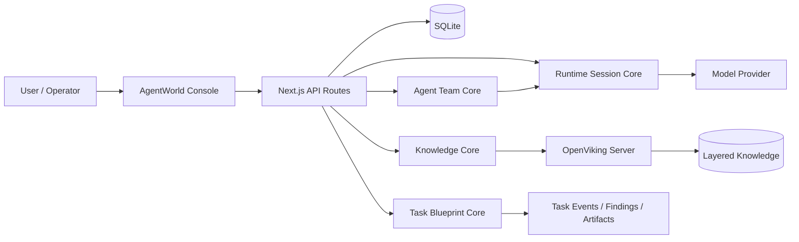

# AgentWorld

<p align="center">
  <a href="README.md">English</a> | <strong>简体中文</strong>
</p>

<p align="center">
  <strong>面向团队级 Agent 工作负载的可治理、可观测、多 Agent 操作系统。</strong>
</p>

<p align="center">
  <a href="https://nextjs.org/"></a>
  <a href="https://react.dev/"></a>
  <a href="https://www.typescriptlang.org/"></a>
  <a href="https://www.sqlite.org/"></a>
  <a href="https://pnpm.io/"></a>
  <a href="LICENSE"></a>
  
  
</p>

AgentWorld 是一个治理优先的 Agent 团队构建与运营平台。它将单次对话式 Agent 升级为可配置的团队系统，覆盖团队归属、模型治理、任务蓝图、执行策略、人工审批、知识回写和可追溯任务执行。

这个项目面向严肃的企业内部平台场景：Agent、团队、模型服务、代码仓、连接器、Skill、Webhook、知识空间和执行环境都必须是可持久化资源，而不是写死在页面或代码里的演示数据。

## 目录

- [为什么是 AgentWorld](#为什么是-agentworld)
- [核心能力](#核心能力)
- [架构](#架构)
- [快速开始](#快速开始)
- [从源码仓库构建并启动](#从源码仓库构建并启动)
- [配置](#配置)
- [OpenViking 知识库](#openviking-知识库)
- [开发工作流](#开发工作流)
- [部署](#部署)
- [项目结构](#项目结构)
- [文档](#文档)
- [许可证](#许可证)

## 为什么是 AgentWorld

大多数 Agent 产品停留在提示词、工具列表和聊天窗口。AgentWorld 关注的是更关键的运行治理层：

| 层级 | 管理内容 |
| --- | --- |
| 团队治理 | 租户空间、业务团队、成员、权限、资产和跨团队服务访问。 |
| Agent 治理 | Agent 定义、系统提示词、模型绑定、工具策略、记忆范围和运行约束。 |
| Agent 团队编排 | Leader、成员角色、工作流、依赖关系、人工门禁和任务级服务暴露。 |
| 任务执行 | Task Blueprint、触发器、DAG 节点、运行快照、审批、重试、事件、Finding 和 Artifact。 |
| 知识底座 | OpenViking 支撑的知识空间、分层检索、Markdown 编辑、Skill 导入、版本历史和知识回写。 |
| Provider 治理 | 可编辑模型服务、匿名化密钥、运行绑定、健康状态和能力标记。 |

## 核心能力

### Agent 与团队运营

- 定义可复用 Agent，包括角色提示词、默认模型服务、工具、记忆范围和执行约束。
- 组装 Agent 团队，包括 Leader、成员角色、编排提示词、服务可见性和业务团队权限。
- 运行单 Agent 与多 Agent 会话，保留推理摘要、工具调用轨迹和人工介入点。
- 将可重复工作沉淀为 Task Blueprint，绑定触发器、执行环境、权限预览和输出策略。

### 知识管理

- 以 OpenViking 为底座，提供类云笔记的知识工作区。
- 支持空间、目录、索引、文档、Skill 和 Markdown shadow 文件组织方式。
- 支持 Markdown 编辑与预览，包括任务列表、代码块、Mermaid、PlantUML 风格代码块和文档元信息。
- 支持从 URL、拖入文件和类似 Skill 的目录包导入知识。
- 保留短版本历史，降低多人协作和冲突恢复成本。

### Runtime 与 Provider 治理

- 支持 OpenAI Compatible、OpenAI Responses、OpenAI Chat Completions、Anthropic、Azure OpenAI 等模型服务风格。
- API Key 通过控制台可编辑、可匿名化展示的配置值管理，而不是写死为环境变量引用。
- 可为知识理解、Agent 执行和 runtime session 绑定默认模型服务。
- 模型配置在不同环境中保持可检查、可替换、可治理。

### 企业级控制台基础

- 租户空间、业务团队、成员、权限、资产、访问申请和身份访问视图。
- 模型服务、Skill、MCP Server、Connector、Codebase、执行环境、Webhook 和系统设置。
- 基于 `src/locales/zh-CN.ts` 与运行时系统设置的语言包治理。
- 本地优先的 SQLite 持久化，适合快速开发和可移植 Linux 发布包。

## 架构



AgentWorld 明确区分 **调度** 与 **调用**：

- 调度决定什么要运行、按什么顺序运行、归属哪个团队、采用什么策略、环境和审批边界。
- 调用为具体节点解析 Provider 配置、工具、密钥、记忆、运行约束和执行事件。

这个边界让 Agent 编排保持可审计，也避免模型调用把工作流逻辑隐藏起来。

## 快速开始

### 环境要求

- Node.js 20+
- pnpm 9+
- macOS 或 Linux 开发环境
- OpenViking 运行时由托管 CLI 安装；部署包也可以直接提供 server 二进制

### 安装并启动

使用托管 CLI 从 GitHub 一键安装，保持和常见开源项目类似的 source-based 安装方式：

```bash
curl -fsSL https://raw.githubusercontent.com/SimonMing47/agent-world/main/scripts/install.sh | bash
agentworld start
```

安装脚本会把仓库克隆到 `~/.agentworld/agent-world`，安装依赖，初始化 `.env.local` 与 SQLite，安装/准备 OpenViking，构建生产应用，并在 `~/.local/bin` 下创建 `agentworld` 命令。

如果已经在源码目录中：

```bash
pnpm agentworld install
pnpm agentworld start
```

打开控制台：

```text
http://localhost:7369
```

`agentworld start` 会运行生产启动器。该脚本会先检查 OpenViking 健康状态；在启用自动启动时，会先拉起本地 OpenViking 服务，再启动 Next.js production server。只有明确需要开发服务时才使用 `agentworld dev` 或 `pnpm dev`。

### 升级

升级托管安装：

```bash
agentworld upgrade
agentworld start
```

升级已有源码目录：

```bash
pnpm agentworld upgrade
pnpm agentworld start
```

`agentworld upgrade` 会拒绝在 dirty git worktree 上执行，使用 `--ff-only` 拉取最新代码，按 lockfile 重新安装依赖，重新执行 bootstrap，准备 OpenViking，构建应用，并输出本地健康检查摘要。

常用 CLI：

| 命令 | 用途 |
| --- | --- |
| `agentworld` | 在默认安装/构建后启动生产服务。 |
| `agentworld install` | 安装依赖，初始化本地配置和 SQLite，安装 OpenViking，并构建生产应用。 |
| `agentworld upgrade` | 拉取最新源码，重新安装依赖，执行 bootstrap，准备 OpenViking，并构建应用。 |
| `agentworld start` | 在 `agentworld build` 后启动生产服务。 |
| `agentworld dev` | 显式在 `PORT` 或默认 `7369` 上启动本地开发控制台。 |
| `agentworld doctor` | 检查 Node.js、pnpm、git、本地配置、AgentWorld HTTP 和 OpenViking 健康状态。 |

### 生产模式

```bash
agentworld install
agentworld start
```

`agentworld start` 使用 Next.js standalone server 输出，并保留与开发启动器一致的 OpenViking 启动逻辑。

## 从源码仓库构建并启动

当你需要直接基于 Git 代码仓库部署或验证时，使用下面的流程。默认启动方式必须是生产模式；开发模式需要显式选择。

### 克隆并安装依赖

```bash
git clone https://github.com/SimonMing47/agent-world.git
cd agent-world
corepack enable
corepack prepare pnpm@9 --activate
pnpm install --frozen-lockfile
pnpm bootstrap
```

`pnpm bootstrap` 会在缺少 `.env.local` 时创建该文件，生成本地 `AGENTWORLD_MASTER_KEY`，并初始化 SQLite 数据目录。

### 准备 OpenViking

```bash
pnpm openviking:install
pnpm openviking:prepare
pnpm openviking:cli-config
```

当仓库里没有可运行的 OpenViking server 二进制时，`openviking:install` 会安装托管的本地 OpenViking 运行时。`openviking:prepare` 和 `openviking:cli-config` 默认会把 server 与 CLI 配置写入 `data/openviking/`。

### 构建生产产物

```bash
pnpm build
```

构建会在 `.next/standalone` 下生成 standalone Next.js 产物。生产启动器会优先使用这个产物。

### 启动生产服务

```bash
pnpm start
```

`pnpm start` 会运行 `scripts/agentworld-next.mjs start`。当 `AGENTWORLD_OPENVIKING_AUTO_START` 不为 `0` 时，它会先启动本地 OpenViking 服务，再在 `PORT` 或默认 `7369` 上启动 standalone Next.js 服务。

打开控制台：

```text
http://localhost:7369
```

等价的 CLI 方式：

```bash
pnpm agentworld install
pnpm agentworld start
```

### 开发模式

只有本地迭代时才使用开发模式：

```bash
pnpm dev
```

或：

```bash
pnpm agentworld dev
```

开发模式使用 Next.js development server，同时仍沿用本地 OpenViking 自动启动逻辑。

### 验证本地服务

```bash
pnpm agentworld doctor
pnpm openviking:smoke
```

快速 HTTP 检查：

```bash
curl -I http://localhost:7369
curl -fsS http://127.0.0.1:1933/health
```

## 配置

`pnpm bootstrap` 会在需要时从 `.env.example` 创建 `.env.local`，并确保本地 master key 已生成。

常用变量：

| 变量 | 用途 |
| --- | --- |
| `PORT` | AgentWorld HTTP 端口，默认 `7369`。 |
| `AGENTWORLD_MASTER_KEY` | 本地加密和签名根密钥；为空时由 bootstrap 生成。 |
| `AGENTWORLD_PUBLIC_BASE_URL` | 回调和生成链接使用的公开地址。 |
| `OPENVIKING_BASE_URL` | OpenViking 服务地址，默认 `http://127.0.0.1:1933`。 |
| `AGENTWORLD_OPENVIKING_AUTO_START` | 设置为 `0` 时禁用启动器托管的 OpenViking 自动启动。 |
| `OPENVIKING_CONFIG_FILE` | OpenViking 服务端配置路径，默认 `data/openviking/ov.conf`。 |
| `OPENVIKING_CLI_CONFIG_FILE` | OpenViking CLI 配置路径，默认 `data/openviking/ovcli.conf`。 |

模型 Provider 密钥应尽量通过控制台配置。Runtime 和知识库模型设置是持久化资源，不应被当作不可变的环境常量。

## OpenViking 知识库

AgentWorld 使用 OpenViking 作为默认知识底座。本地服务默认监听 `1933` 端口。

准备本地配置：

```bash
pnpm openviking:prepare
pnpm openviking:cli-config
```

初始化或检查 OpenViking：

```bash
pnpm openviking:init
pnpm openviking:doctor
```

启动并做 smoke test：

```bash
pnpm openviking:start
pnpm openviking:smoke
```

`agentworld install` 会在没有内置 OpenViking server 二进制时安装托管 OpenViking 运行时。如需手动修复或刷新该运行时：

```bash
pnpm openviking:install
```

知识 API：

```text
GET    /api/knowledge/layers
GET    /api/knowledge/read
GET    /api/knowledge/context
GET    /api/knowledge/spaces
POST   /api/knowledge/spaces
PATCH  /api/knowledge/spaces
DELETE /api/knowledge/spaces
GET    /api/knowledge/entries
POST   /api/knowledge/entries
PATCH  /api/knowledge/entries
DELETE /api/knowledge/entries
GET    /api/knowledge/entry-versions
POST   /api/knowledge/import
POST   /api/knowledge/retrieval-test
POST   /api/knowledge/sync
```

## 开发工作流

质量门禁：

```bash
pnpm config-data:audit
pnpm i18n:audit
pnpm quality:audit
pnpm security:audit
pnpm typecheck
pnpm lint
pnpm build
```

门禁含义：

| 命令 | 用途 |
| --- | --- |
| `pnpm config-data:audit` | 防止 seed 业务数据、隐藏默认值和演示 case 变成产品状态。 |
| `pnpm i18n:audit` | 检查中文可见 UI 文案是否经过语言包路径。 |
| `pnpm quality:audit` | 报告复杂度热点、`TODO/FIXME`、`any` 和临时逃逸写法。 |
| `pnpm security:audit` | 扫描危险执行、原始 HTML 注入、私钥材料和硬编码密钥。 |
| `pnpm typecheck` | 使用 `tsconfig.typecheck.json` 运行 TypeScript 检查。 |
| `pnpm lint` | 对仓库运行 ESLint。 |
| `pnpm build` | 生成 standalone Next.js 构建产物。 |

## 部署

AgentWorld 可以打包为 Linux 自包含服务。发布包包含：

- Standalone Next.js 应用。
- Node.js Linux runtime。
- 已构建的 OpenViking server 二进制。
- OpenViking 配置和 CLI 配置文件。
- `agentworld` 与 `openviking-server` 启动脚本。

构建 Linux 发布包：

```bash
pnpm openviking:build-binary
pnpm package:linux
```

OpenViking 二进制解析顺序：

1. 健康的 `OPENVIKING_BASE_URL`。
2. `OPENVIKING_SERVER_BIN`。
3. `thirdparty/openviking/bin/openviking-server`。
4. `thirdparty/openviking/bin/openviking-server-${platform}-${arch}`。
5. 托管源码安装生成的 `.venv-openviking/bin/openviking-server`。

## 项目结构

```text
src/app                     Next.js 页面与 API routes
src/components              控制台 UI、表单、弹窗、知识工作区
src/server                  SQLite schema、查询、编排、runtime、知识核心
src/locales                 内置语言包
scripts                     Bootstrap、审计、OpenViking 和打包脚本
docs                        架构与实现规格
plugins                     官方扩展包
thirdparty/openviking       OpenViking 二进制和 manifest 位置
data                        本地运行数据，git 忽略
```

核心控制台路由：

| 路由 | 区域 |
| --- | --- |
| `/overview` | 系统总览与运行状态。 |
| `/agents` | Agent 定义管理。 |
| `/agent-teams` | Agent 团队组装与服务暴露。 |
| `/interactions` | Human-in-the-loop 的 Agent 与 Agent 团队会话。 |
| `/task-blueprints` | Task Blueprint 编写与执行配置。 |
| `/task-runs` | 任务运行跟踪和执行状态。 |
| `/knowledge` | OpenViking 支撑的知识工作区。 |
| `/runtimes` | 模型服务配置。 |
| `/runtime-bindings` | Runtime 绑定策略。 |
| `/skills` | Skill 目录与 OpenViking 同步。 |
| `/mcp` | MCP Server 治理。 |
| `/connectors` | IM、邮件和推送连接器配置。 |
| `/codebases` | 代码仓和操作者 token 管理。 |
| `/settings` | 系统设置、语言包、知识库模型配置和长尾配置。 |

## 文档

| 文档 | 重点 |
| --- | --- |
| [`docs/system-design.zh-CN.md`](docs/system-design.zh-CN.md) | 系统定位、4+1 视图、部署模型和平台域。 |
| [`docs/system-design-detailed.zh-CN.md`](docs/system-design-detailed.zh-CN.md) | 核心模块与数据流详细设计。 |
| [`docs/specs/agent-team-orchestration-spec.zh-CN.md`](docs/specs/agent-team-orchestration-spec.zh-CN.md) | Agent 团队调度、调用边界、DAG 节点和人工门禁。 |
| [`docs/specs/task-blueprint-spec.zh-CN.md`](docs/specs/task-blueprint-spec.zh-CN.md) | Task Blueprint 模型和执行计划。 |
| [`docs/specs/memory-skill-spec.zh-CN.md`](docs/specs/memory-skill-spec.zh-CN.md) | 知识、记忆和 Skill 行为。 |
| [`docs/specs/provider-adapter-spec.zh-CN.md`](docs/specs/provider-adapter-spec.zh-CN.md) | Provider Adapter 与 Runtime 集成。 |
| [`docs/specs/environment-secret-spec.zh-CN.md`](docs/specs/environment-secret-spec.zh-CN.md) | 执行环境与密钥处理。 |
| [`docs/specs/plugin-sdk-spec.zh-CN.md`](docs/specs/plugin-sdk-spec.zh-CN.md) | 插件包与扩展 SDK。 |
| [`docs/specs/console-visual-design-spec.zh-CN.md`](docs/specs/console-visual-design-spec.zh-CN.md) | 控制台视觉与交互方向。 |

## 设计原则

- 配置就是产品状态。用户能操作的内容必须可持久化、可编辑、可删除、可审计。
- 不做隐藏业务默认值。主干不应把团队、Agent、代码检视 case、Provider 或知识空间作为隐式生产状态写死。
- Runtime 密钥必须受治理。Key 需要匿名化展示、可编辑，并作为配置资源存储，而不是硬编码应用常量。
- Agent 工作必须可观测。Plan、推理摘要、工具调用、审批、重试、Finding、成本和 Artifact 都应在任务上下文中可见。
- 知识是执行的一部分。检索、回写、Skill 导入和人工反馈都应可追溯、可复用。

## 许可证

AgentWorld 使用 [MIT License](LICENSE) 开源许可证。
