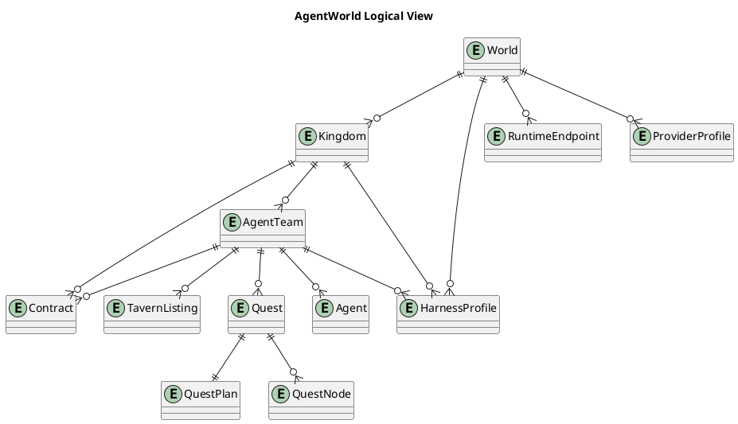
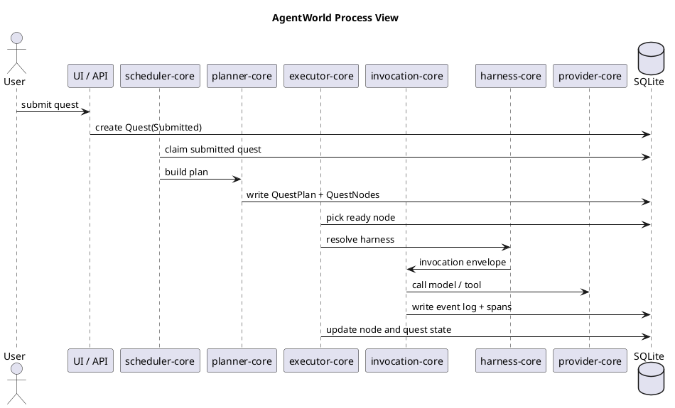
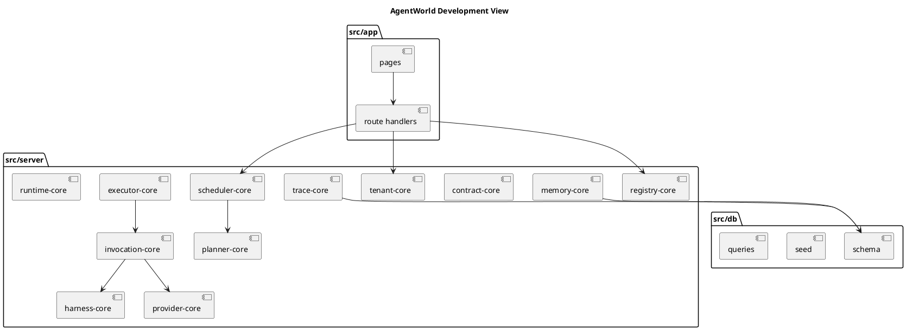
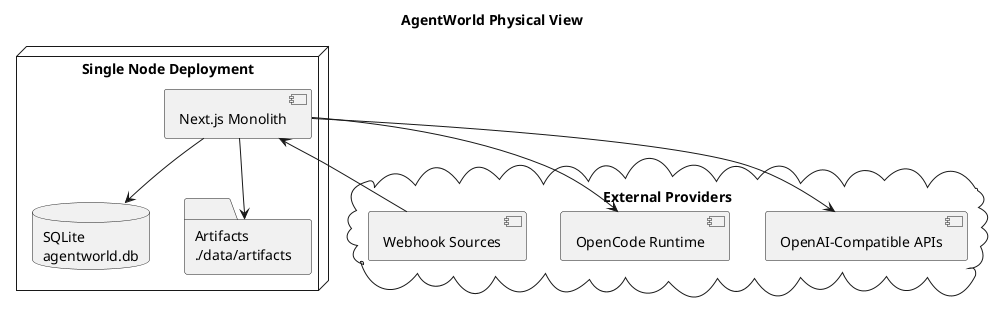
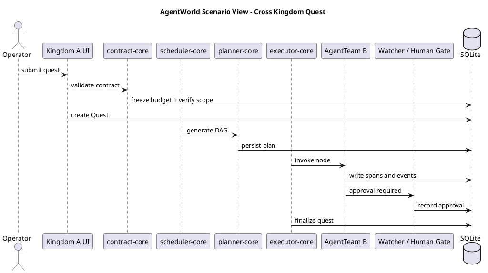
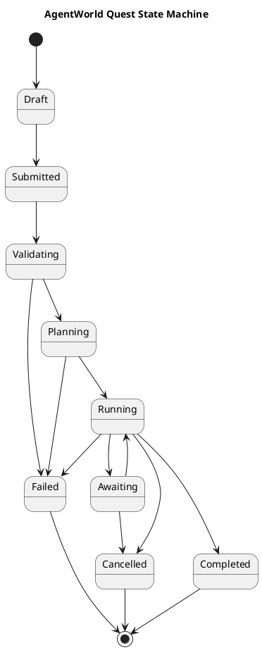
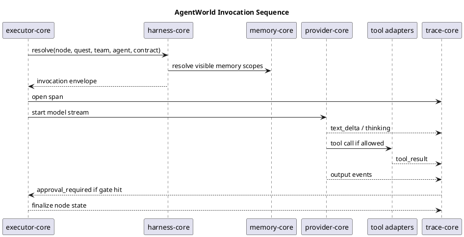

# AgentWorld Detailed Design

This is the English detailed design for AgentWorld.

It is not a concept note. It is an implementation-oriented design for turning the World, Kingdom, AgentTeam, Agent, Tavern, Quest, and Contract model into a real platform built with a full TypeScript stack, a single deployable service, and an embedded database.

## 0. Document Goal

This document answers six practical questions:

1. What exactly AgentWorld is
2. Why the design is now a TypeScript monolith instead of a distributed control plane
3. How Quest scheduling, planning, execution, and human intervention work together
4. How harness engineering constrains agent invocation
5. How World, Kingdom, AgentTeam, Contract, and Tavern map into database objects and APIs
6. What the first development milestones should be

## 1. System Positioning

### 1.1 One-Sentence Definition

AgentWorld is a multi-tenant, orchestrated, governable, observable AI agent runtime platform that supports cross-team agent marketplaces and collaborative execution.

### 1.2 Plain-Language Explanation

AgentWorld is not a chat app.

It is also not just a thin agent shell around a model endpoint.

It is an operating surface for teams:

- World is the top-level tenant boundary
- Kingdom is the team boundary inside a world
- AgentTeam is the service unit exposed to users or other kingdoms
- Agent is the execution unit
- Quest is the actual job instance that gets scheduled, executed, observed, and settled
- Tavern is the registry and marketplace for AgentTeams
- Contract is the formal permission model for cross-kingdom calls

## 2. Design Convergence Principles

### 2.1 Hard Constraints for This Version

This version of AgentWorld is deliberately constrained as follows:

- full-stack TypeScript
- monolithic service
- no Redis, Kafka, Temporal, PostgreSQL, Milvus, S3, Knative, or similar extra middleware
- embedded database only
- one-command local install and startup
- support for external OpenAI-compatible model providers
- support for discovering external OpenCode runtimes without making the platform itself a service mesh

### 2.2 What Was Intentionally Simplified

| Original direction | Optimized design | Why |
| --- | --- | --- |
| distributed control plane and runtime plane | logical layers inside one monolith | the domain needs to stabilize before service splits |
| standalone quest scheduler service | in-process scheduling core | scheduling is a database-driven state machine first |
| serverless agent executors | in-process worker slots | simpler logging, tracing, cost control, and intervention |
| Redis for short context | SQLite tables plus in-memory cache | easier embedded deployment |
| separate vector database | SQLite FTS5 plus optional embedding fields | enough for v1 retrieval without new infrastructure |
| S3 | local filesystem artifacts | simpler single-node setup |
| Docker or WASM sandbox by default | harness constraints plus controlled tool adapters and selective process isolation | governance first, stronger isolation later |

### 2.3 Why This Is Not a Regression

This convergence is not a downgrade. It gives the platform the three things it actually needs first:

- a clear domain model
- a stable scheduling and execution state machine
- an explainable, auditable, human-interruptible invocation chain

Once those are solid, later splits become much safer.

## 3. Core Terms

| Term | Meaning | Role in the platform |
| --- | --- | --- |
| World | top-level tenant space | quota, model whitelist, top-level guardrails |
| Kingdom | team space inside a world | team budget, private tool refs, private memory scope |
| AgentTeam | service unit | receives input, orchestrates agents, returns a contractable result |
| Agent | execution unit | performs a step and can call models and tools |
| Tavern | marketplace and registry | exposes AgentTeams for discovery and recruitment |
| Quest | job instance | one real execution with plan, nodes, result, and cost |
| Contract | service agreement | constrains cross-kingdom access, price, scope, and SLA |
| Harness | constraint layer | limits agent behavior through tools, config, and internal policy |
| Captain Agent | planning agent | generates the Quest DAG or execution plan |
| Watcher | supervisory component | validates outputs, enforces SLA, and triggers human gates |

## 4. Overall Architecture

### 4.1 Shape of the System

AgentWorld is implemented as a single Next.js service:

- UI for dashboards, configuration, wallboard, trace views, and intervention
- Route Handlers for APIs
- Server Components reading service-layer queries directly
- service modules grouped by domain responsibility
- SQLite as the only persistent database
- local filesystem for artifacts, reports, and attachments

### 4.2 Logical Layers

Although the deployment is monolithic, the codebase is still layered:

1. Presentation Layer
2. Application Layer
3. Domain Layer
4. Infrastructure Layer

| Layer | Responsibility |
| --- | --- |
| Presentation | pages, forms, SSE trace streams, admin surfaces, wallboard |
| Application | use-case orchestration such as submit Quest, approve gate, discover runtime |
| Domain | World, Kingdom, Quest, Contract, Tavern, Harness, Scheduler, Executor rules |
| Infrastructure | SQLite, filesystem, OpenCode SDK, OpenAI-compatible HTTP providers, webhook ingestion |

### 4.3 Major Modules

| Module | Responsibility |
| --- | --- |
| tenant-core | manages Worlds, Kingdoms, quota, and boundaries |
| registry-core | manages AgentTeams, Agents, and Tavern listings |
| contract-core | manages cross-kingdom contracts, scopes, and service accounts |
| scheduler-core | handles schedule ticks, prioritization, leasing, and Quest creation |
| planner-core | creates DAGs through a captain agent or rule planner |
| executor-core | drives DAG node execution, retry, and recovery |
| invocation-core | performs single-agent invocation including model and tool calls |
| harness-core | resolves prompts, tool policy, budget policy, output policy, and human gates |
| memory-core | manages short-term memory, summaries, and searchable notes |
| trace-core | records spans, event logs, cost, and audits |
| provider-core | manages OpenAI-compatible providers, model routing, and limits |
| runtime-core | discovers OpenCode runtimes and stores health and capability catalogs |

## 5. Technology Stack

### 5.1 Selected Stack

| Layer | Technology |
| --- | --- |
| full-stack app | Next.js + TypeScript |
| UI | React 19 + Server Components |
| APIs | Next.js Route Handlers |
| database | SQLite via `node:sqlite` |
| validation | Zod |
| runtime discovery | OpenCode SDK |
| model connectivity | OpenAI-compatible HTTP APIs |
| artifacts | local filesystem |
| search and memory | SQLite FTS5 |

### 5.2 Why No Extra Middleware

The first real risk is not throughput. It is architectural ambiguity.

Before the domain and execution chain are stable, adding Redis, queues, orchestration systems, and vector databases mostly adds debugging cost and deployment noise.

## 6. Domain Model

This section focuses on the objects that should exist in the first real database schema.

### 6.1 World

```ts
type World = {
  id: string;
  slug: string;
  name: string;
  ownerUserId: string;
  status: "active" | "suspended" | "archived";
  quotaLimitJson: string;
  modelWhitelistJson: string;
  globalGuardrailsJson: string;
  defaultHarnessId: string | null;
  createdAt: string;
};
```

Invariants:

- World is the outermost governance boundary
- World-level guardrails are inherited by all kingdoms
- no Kingdom may bypass the World model whitelist

### 6.2 Kingdom

```ts
type Kingdom = {
  id: string;
  worldId: string;
  slug: string;
  name: string;
  lordUserId: string;
  status: "active" | "suspended" | "archived";
  balance: number;
  creditLimit: number;
  privateToolRefsJson: string;
  privateMemoryNamespace: string;
  policyJson: string;
  createdAt: string;
};
```

Invariants:

- privateToolRefs store references, not raw secrets
- Kingdom has independent cost attribution and credit control
- Kingdom policies can tighten but not loosen World policies

### 6.3 AgentTeam

```ts
type AgentTeam = {
  id: string;
  kingdomId: string;
  slug: string;
  name: string;
  description: string;
  captainAgentId: string | null;
  workflowType: "single" | "sequential" | "parallel" | "dag";
  inputSchemaJson: string;
  outputSchemaJson: string;
  maxConcurrency: number;
  timeoutMs: number;
  successRateThreshold: number;
  pricingModelJson: string;
  visibility: "private" | "public";
  defaultHarnessId: string | null;
  createdAt: string;
};
```

Invariants:

- AgentTeam is the service interface exposed by the platform
- a public AgentTeam is eligible for Tavern listing
- a team may contain multiple Agents and one optional captain

### 6.4 Agent

```ts
type Agent = {
  id: string;
  teamId: string;
  slug: string;
  name: string;
  role: string;
  personaPrompt: string;
  model: string;
  shortTermWindow: number;
  ragConfigJson: string;
  toolBindingsJson: string;
  memoryScope: "private" | "team_shared";
  safetyPolicyJson: string;
  status: "active" | "disabled";
  createdAt: string;
};
```

Invariants:

- the agent never owns cross-kingdom access by itself
- tool visibility is constrained by both Harness and Contract

### 6.5 Quest

```ts
type Quest = {
  id: string;
  worldId: string;
  kingdomId: string;
  teamId: string;
  sourceType: "manual" | "schedule" | "webhook" | "contract";
  sourceRef: string | null;
  status:
    | "draft"
    | "submitted"
    | "validating"
    | "planning"
    | "running"
    | "awaiting"
    | "completed"
    | "failed"
    | "cancelled";
  priority: number;
  inputPayloadJson: string;
  outputPayloadJson: string | null;
  costEstimate: number;
  costActual: number;
  traceId: string;
  createdAt: string;
  completedAt: string | null;
};
```

### 6.6 QuestPlan and QuestNode

```ts
type QuestPlan = {
  id: string;
  questId: string;
  plannerMode: "rule" | "captain_agent";
  dagJson: string;
  summary: string;
  createdAt: string;
};

type QuestNode = {
  id: string;
  questId: string;
  planId: string;
  nodeKey: string;
  agentId: string;
  dependsOnJson: string;
  inputJson: string;
  outputJson: string | null;
  status: "pending" | "ready" | "running" | "awaiting" | "completed" | "failed" | "cancelled";
  attemptCount: number;
  maxAttempts: number;
  startedAt: string | null;
  completedAt: string | null;
};
```

### 6.7 Contract

```ts
type Contract = {
  id: string;
  providerTeamId: string;
  consumerKingdomId: string;
  pricingModelJson: string;
  slaJson: string;
  accessScopeJson: string;
  serviceAccountRef: string;
  status: "draft" | "active" | "suspended" | "expired";
  createdAt: string;
};
```

### 6.8 TavernListing

```ts
type TavernListing = {
  id: string;
  teamId: string;
  resumeJson: string;
  recruitmentMode: "copy" | "subscribe" | "dedicated";
  tagsJson: string;
  status: "listed" | "hidden" | "suspended";
  createdAt: string;
};
```

### 6.9 HarnessProfile

```ts
type HarnessProfile = {
  id: string;
  worldId: string | null;
  kingdomId: string | null;
  teamId: string | null;
  name: string;
  systemInstruction: string;
  toolPolicyJson: string;
  approvalPolicyJson: string;
  budgetPolicyJson: string;
  outputPolicyJson: string;
  securityPolicyJson: string;
  createdAt: string;
};
```

### 6.10 Trace and Audit

```ts
type TraceSpan = {
  id: string;
  traceId: string;
  parentSpanId: string | null;
  questId: string;
  nodeId: string | null;
  kind: "quest" | "planning" | "agent" | "tool" | "approval" | "contract";
  status: "open" | "ok" | "error";
  startedAt: string;
  endedAt: string | null;
  attributesJson: string;
};

type EventLog = {
  id: string;
  traceId: string;
  questId: string;
  nodeId: string | null;
  seq: number;
  phase: string;
  foldGroup: string;
  title: string;
  content: string;
  metadataJson: string;
  createdAt: string;
};
```

## 7. Quest State Machine

### 7.1 Top-Level Statuses

| Status | Meaning |
| --- | --- |
| Draft | not fully submitted yet |
| Submitted | accepted and waiting to enter validation |
| Validating | permissions, budget, contract, and harness pre-checks are running |
| Planning | DAG or execution plan is being created |
| Running | one or more nodes are being executed |
| Awaiting | blocked on human approval or missing user input |
| Completed | finished successfully |
| Failed | execution failed |
| Cancelled | cancelled by a person or policy |

### 7.2 Key Rules

- database state is the source of truth
- every status change writes an event
- human intervention is a first-class state transition, not a side channel

## 8. Scheduling Design

This is one of the most important sections of the platform.

### 8.1 Why There Is No External Orchestrator

In the first phase, Quest scheduling mainly does four things:

1. find due work
2. claim ownership
3. create or advance Quests
4. move Quests from one stable state to another stable state

That is fundamentally a database state machine. It does not require a separate orchestration platform yet.

### 8.2 What the Scheduler Operates On

The scheduling core works with three object types:

- ScheduleTemplate
- Quest
- QuestNode

### 8.3 Internal Loops

The monolith runs two lightweight loops:

- Schedule Tick: every 5 seconds
- Executor Tick: every 1 second

### 8.4 Schedule Tick Algorithm

1. query schedule templates where `next_run_at <= now`
2. sort by World, Kingdom, priority, and SLA
3. claim a lease through SQLite update semantics
4. create a Quest
5. write the next schedule time

### 8.5 Executor Tick Algorithm

1. load Quests in `submitted`, `validating`, `planning`, `running`, or `awaiting`
2. route each Quest to the correct state handler
3. when a Quest is running, pick `ready` QuestNodes
4. start nodes within the team `max_concurrency` and runtime slot limits

### 8.6 Priority Model

Effective priority combines:

- Quest priority
- Kingdom priority class
- Contract SLA
- human wait time
- time-to-timeout

## 9. Planning and DAG Design

### 9.1 Planning Entry

Every Quest must have a QuestPlan before it enters Running.

### 9.2 Two Planning Modes

| Mode | Use case |
| --- | --- |
| rule | simple, predictable flows |
| captain_agent | dynamic or complex work where the DAG depends on the input |

### 9.3 Responsibility of the Captain Agent

The captain agent should do only three things:

- generate a DAG from the input
- explain node goals and dependencies
- estimate cost and risk

The captain should not directly run heavyweight tools.

### 9.4 DAG Validation

Every generated DAG is validated:

- it must be acyclic
- node count must stay within team limits
- every node must bind to a concrete Agent
- final outputs must map back to the team output schema

### 9.5 Node Recovery

If a node fails:

- retryable nodes re-enter the retry queue
- non-retryable failures move the Quest to Failed or Awaiting
- completed nodes are never re-executed unnecessarily

## 10. Agent Invocation Design

This is the other most important section.

### 10.1 Invocation Goal

An agent call is not just a prompt sent to a model.

Inside AgentWorld, invocation is a controlled pipeline:

1. build the InvocationEnvelope
2. merge World, Kingdom, Team, and Agent harness layers
3. trim visible tools and memory scopes
4. validate Contract scope
5. select provider and model
6. execute as a stream and write trace data
7. pause if a human gate is reached
8. validate output and persist node results

### 10.2 InvocationEnvelope

```ts
type InvocationEnvelope = {
  questId: string;
  nodeId: string;
  worldId: string;
  kingdomId: string;
  teamId: string;
  agentId: string;
  inputJson: string;
  contractId: string | null;
  visibleToolsJson: string;
  visibleMemoryScopesJson: string;
  providerPolicyJson: string;
  harnessProfileId: string;
};
```

### 10.3 Why Harness Resolution Happens Before the First Token

Because the agent does not get to decide what it is allowed to do.

AgentWorld applies harness engineering before execution begins:

- which tools are visible
- which tools need human approval
- which models are allowed
- max tokens, max steps, and max runtime
- whether output must be structured

### 10.4 Tool Call Decision Chain

Every tool call passes four checks:

1. is the tool bound to the Agent
2. is it allowed by the Harness
3. is it allowed by the Contract scope
4. is it allowed by runtime safety policy

If any layer denies it, the call stops.

### 10.5 Model Call Decision Chain

provider-core selects the model using:

- World model whitelist
- Kingdom cost policy
- Team default model policy
- Agent preferred model
- fallback strategy

### 10.6 Streaming Output

Every invocation must emit observable events:

- `thinking`
- `tool_call`
- `tool_result`
- `text_delta`
- `approval_required`
- `output_validated`
- `node_completed`

These events are written into a unified event log and rendered as foldable trace groups in the UI.

## 11. Harness Engineering Design

### 11.1 Position of Harness in AgentWorld

Harness is not optional configuration. It is the platform constraint layer.

Every Quest goes through HarnessResolve before a real Agent invocation can start.

### 11.2 Three Sources of Constraints

#### 1. Tool-Calling Constraints

- allow list
- block list
- approval-required list
- per-tool call limits

#### 2. External Configuration Constraints

- World model whitelist
- Kingdom budget and credit limit
- Contract access scope
- runtime health state

#### 3. Internal Policy Constraints

- max runtime
- max tokens
- max step count
- structured output validation
- prompt scan and output scan

### 11.3 Harness Resolution Order

Final policy is composed in this order:

1. World Harness
2. Kingdom Harness
3. AgentTeam Harness
4. Agent Safety Policy
5. Contract restrictions
6. runtime safety patch

Later layers may only tighten policy, never relax it.

### 11.4 Harness Preview

Before submission, the UI should be able to show:

- the model that would be used
- which tools would be visible
- which tools would trigger approval
- the effective budget ceiling
- where the Quest is likely to pause or fail

## 12. Tavern Design

### 12.1 What Tavern Really Is

Tavern is not a list of chatbots.

It is the marketplace for AgentTeams that can be recruited, subscribed to, or hosted for another Kingdom.

### 12.2 Hero Resume Generation

The platform automatically computes:

- success rate
- average latency
- average cost
- top tasks
- domain tags
- recent failures

### 12.3 Recruitment Modes

| Mode | Meaning |
| --- | --- |
| Copy | clone the team configuration into the current Kingdom |
| Subscribe | call the remote service through a Contract |
| Dedicated | the provider offers a dedicated hosted team instance |

### 12.4 Tavern Sandbox

Tavern mode always enforces:

- no unrestricted write tools
- no raw provider secret exposure
- no access to another Kingdom's private memory
- no privilege escalation on model usage

## 13. Contract Design

### 13.1 Role of Contracts

Contract is the only formal entry point for cross-kingdom service access.

No Contract means no legitimate cross-kingdom invocation.

### 13.2 Call Chain

Consumer Kingdom
-> Contract validation
-> Service account scope
-> Provider AgentTeam

### 13.3 A Contract Must Define

- who can call
- which input and output interface is exposed
- how pricing works
- what SLA is promised

### 13.4 Security Boundary

A Contract must not grant:

- raw secret access in the provider Kingdom
- raw private memory access in the provider Kingdom
- local filesystem access on the provider side
- direct bypass of the Tavern sandbox for high-risk tools

## 14. Memory, Artifact, and Trace

### 14.1 Memory

The first version does not depend on an external vector database. It uses:

- SQLite tables for short-term working memory
- SQLite FTS5 for text retrieval
- summary tables for condensed memory
- optional embedding JSON fields for later use

### 14.2 Artifacts

Artifacts are stored on local disk:

- run transcripts
- tool outputs
- exported reports
- uploaded attachments

SQLite stores metadata, not large binary payloads.

### 14.3 Trace

Trace is modeled in two layers:

- spans for latency, parent-child structure, and cost
- event logs for thinking, tool calls, and human-readable streaming output

## 15. API and UI Design

### 15.1 Left Navigation

The first version should include:

- Overview
- Worlds
- Kingdoms
- AgentTeams
- Quests
- Tavern
- Contracts
- Runtimes
- Harness
- Wallboard
- Settings

### 15.2 Core Pages

| Page | Responsibility |
| --- | --- |
| Overview | high-level system status, cost, success rate, pending Quest work |
| World Detail | quota, model whitelist, global governance |
| Kingdom Detail | team budget, tool refs, private task view |
| Quest List | filterable job list |
| Quest Detail | DAG, trace, intervention, and artifacts |
| Tavern | browse and recruit AgentTeams |
| Contract Center | inspect permissions, SLA, and cost rules |
| Runtime Center | discover OpenCode runtimes and show health |
| Harness Center | inspect and preview constraints |
| Wallboard | big-screen view for active agents, developers, repositories, and Quest health |

### 15.3 Webhooks

The monolith exposes webhook endpoints directly:

- configurable path
- configurable method
- configurable request schema
- configurable target AgentTeam

After ingestion, a webhook becomes a Quest. It does not bypass the internal execution model.

## 16. Security and Isolation

### 16.1 Isolation Model

| Level | First-version implementation |
| --- | --- |
| World | tenant field isolation, with a future path to per-World SQLite files |
| Kingdom | namespace, budget, and tool-ref isolation |
| Agent | memory scope, tool scope, and harness scope |
| Contract | API-level scope isolation |

### 16.2 Tool Safety

The first version does not promise a full OS sandbox. It does promise:

- allowlisted tool adapters
- cwd allowlists
- schema validation for arguments
- network allowlists
- human approval for high-risk actions
- audit logs for every tool execution

### 16.3 Risk Controls

- prompt scan
- output scan
- PII redaction
- cost threshold blocking
- repeated-failure circuit breaking

## 17. Observability and Cost

### 17.1 Metrics

At minimum the platform should track:

- World cost
- Kingdom cost
- Team cost
- Agent success rate
- Quest latency
- node retry count
- human intervention count

### 17.2 Cost Settlement

Quest cost should be broken into at least:

- model token cost
- tool execution cost
- platform fee
- contract revenue share

## 18. Installation and Deployment

### 18.1 Local Startup

1. `pnpm install`
2. `pnpm bootstrap`
3. `pnpm dev`

### 18.2 Production Deployment

The first version is just one Node service:

- one Next.js process
- one SQLite file
- one artifacts directory

If the system grows, the first step is to place the SQLite file and artifact directory on stable storage before splitting modules.

## 19. MVP Development Order

### Phase 1

- World and Kingdom
- AgentTeam and Agent
- Quest base lifecycle
- Harness constraints
- single-node execution
- trace pages

### Phase 2

- captain planning
- DAG execution
- Tavern
- Contracts
- Wallboard

### Phase 3

- cost accounting
- stronger tool isolation
- per-World data files
- richer memory retrieval

## 20. 4+1 Views and Key Diagrams

The diagrams are embedded directly in this document.

### 20.1 Logical View



### 20.2 Process View



### 20.3 Development View



### 20.4 Physical View



### 20.5 Scenario View



### 20.6 Quest State Machine



### 20.7 Agent Invocation Sequence



## 21. Conclusion

The key to AgentWorld is not having many nouns. It is making this chain explicit and reliable:

Quest submission
-> permission and budget validation
-> DAG planning
-> node scheduling
-> agent invocation
-> harness-constrained execution
-> full trace, cost, and human intervention recording

If that chain is solid, AgentWorld is no longer a chat demo. It becomes a real agent operating system that teams can run.
