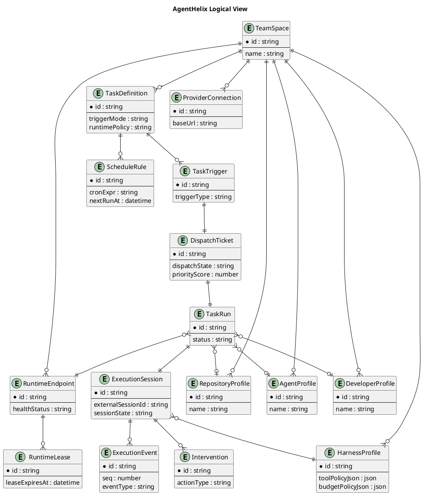
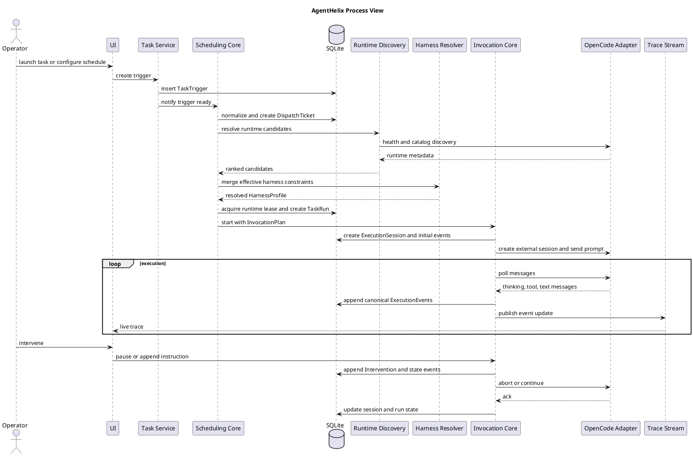
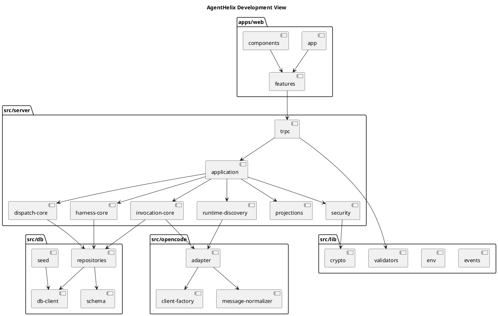
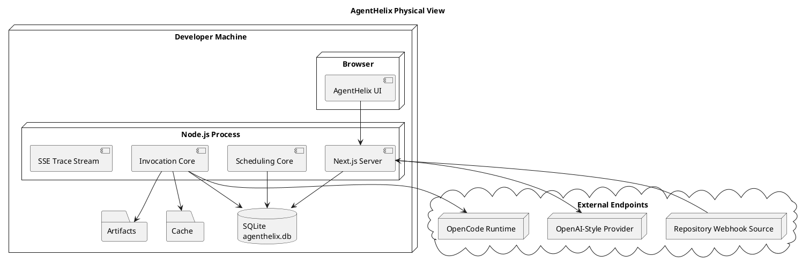
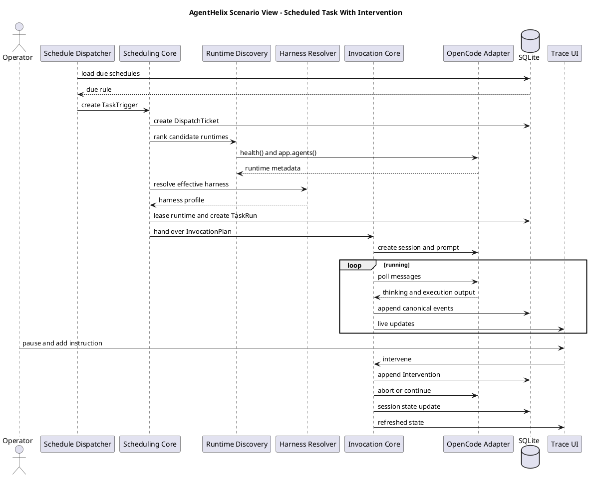
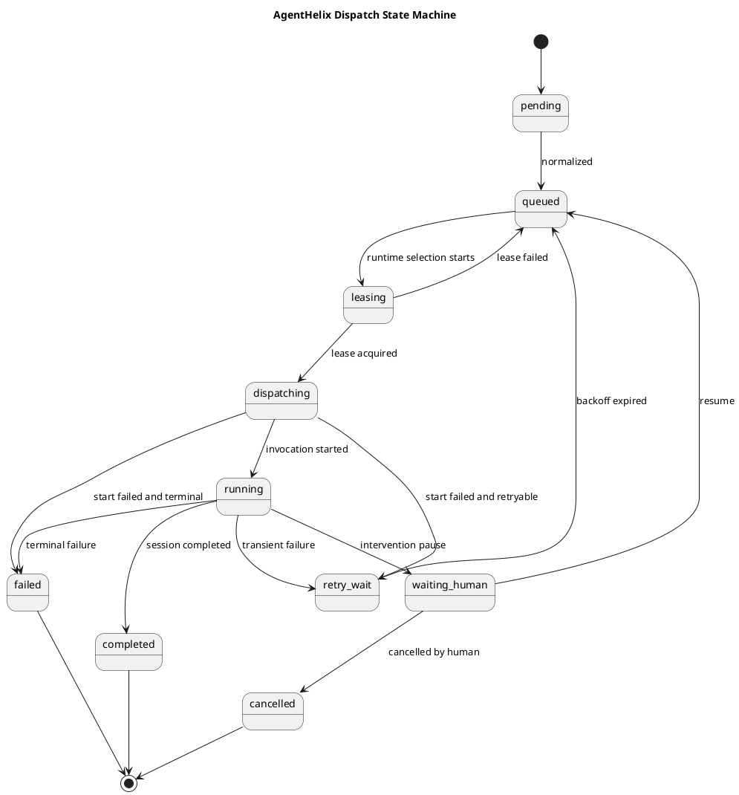
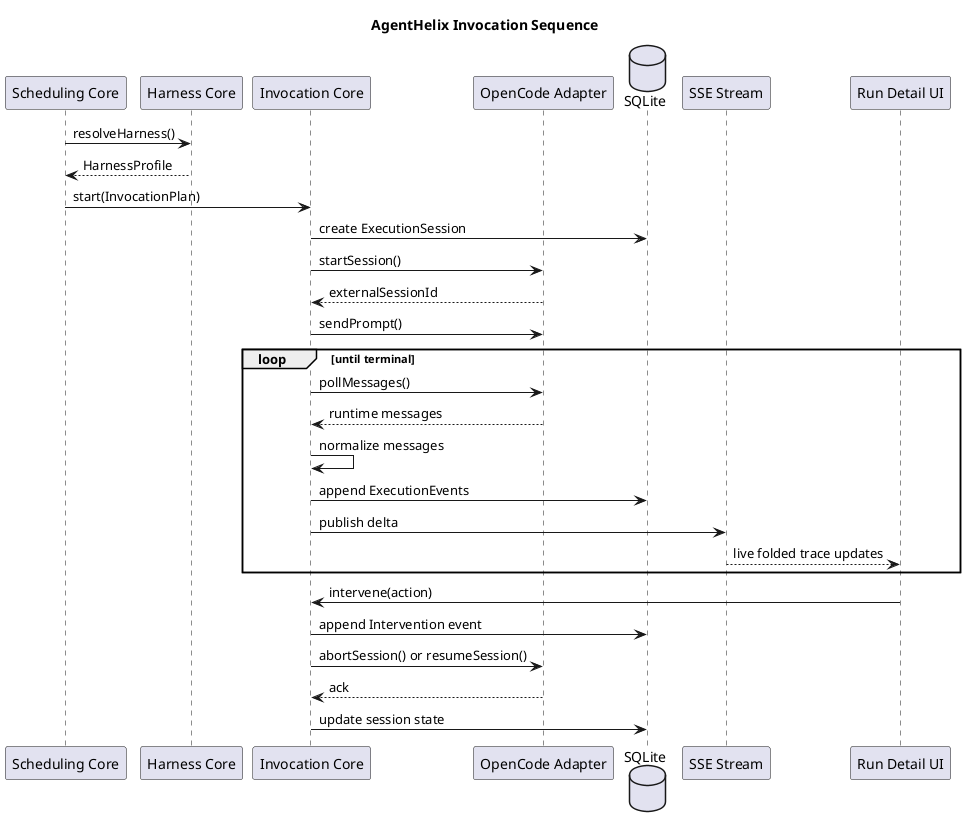

# AgentHelix Detailed Design

## 1. Purpose of This Document

This is the English detailed design document for AgentHelix.

Its purpose is very practical:

- explain what the product is supposed to do
- explain how the system is layered
- explain agent scheduling clearly
- explain agent invocation clearly
- explain the database, APIs, screens, failure handling, and human intervention model

This is not meant to be a vague concept paper. It is intended to be detailed enough for implementation work.

## 2. Product Positioning

AgentHelix is an agent platform for teams.

It is not just a chat interface, and it is not just a timer-based job runner. The goal is to let teams use agents as an execution capability that is schedulable, observable, and interruptible by people when needed.

The platform is designed to answer practical questions:

- how different teams manage their own tasks and configurations
- how scheduled work runs reliably
- how agent runtimes are discovered and chosen
- what exactly happened during a task run
- how a person can step in during execution
- how to tell the difference between a scheduling problem and an invocation problem

## 3. Target Capabilities

### 3.1 Product Capabilities

- team spaces
- task definitions and run records
- manual, scheduled, and webhook triggers
- OpenCode runtime discovery
- OpenAI-style provider configuration
- trace pages that show thinking, execution, and text output
- pause, resume, cancel, and add-instruction controls
- team views and wallboard views
- separate activity metrics for agents, developers, and repositories

### 3.2 Technical Constraints

- the entire stack must be TypeScript
- the database must be embedded
- frontend and backend must be integrated
- installation must stay simple and close to one-command setup

## 4. Design Principles

### 4.1 Make State Clear Before Making Calls

When work arrives, the system should not call an agent immediately. It should first create a clear scheduling state so the execution path remains understandable.

### 4.2 Scheduling and Invocation Must Stay Separate

Scheduling decides who should run the work. Invocation decides how the work is actually run. Those concerns must not be merged.

### 4.3 Important Actions Must Leave Structured Records

Queueing, runtime selection, execution start, human intervention, and failures must all become durable records.

### 4.4 The UI Should Feel Like an Operations Console

The interface should be calm, readable, and restrained, with a slight Anthropic-like sense of discipline, but its purpose is operational clarity rather than brand presentation.

### 4.5 The Harness Is a Platform Constraint Layer, Not Just a Prompt

In AgentHelix, the harness is not only a system prompt, and it is not just an ad hoc tool allowlist.

It is the formal mechanism the platform uses to constrain agent behavior across at least three dimensions:

- tool call boundaries
- external configuration inputs
- internal policy limits

In plain terms, AgentHelix does not connect a model and let it run freely. It wraps the model inside a harness-defined operating boundary.

## 5. Technology Stack

### 5.1 Application Layer

- Next.js App Router
- React
- TypeScript
- tRPC
- Zod
- TanStack Query
- Zustand
- Tailwind CSS
- shadcn/ui
- Framer Motion

### 5.2 Data Layer

- SQLite
- better-sqlite3
- Drizzle ORM
- drizzle-kit

### 5.3 Scheduling and Invocation Layer

- cron-parser
- `@opencode-ai/sdk`
- Server-Sent Events

### 5.4 Why This Stack

This stack is chosen because:

- TypeScript remains consistent across the whole system
- SQLite avoids external operational overhead
- Next.js fits an integrated product very well
- the OpenCode SDK already covers runtime discovery and session calls

## 6. System Layers

The system is split into four layers:

1. product UI layer
2. application service layer
3. scheduling and invocation core layer
4. infrastructure layer

### 6.1 Product UI Layer

Responsibilities:

- left navigation
- team space switching
- task lists
- run lists
- runtime views
- webhook views
- settings
- wallboard
- trace detail pages

### 6.2 Application Service Layer

Responsibilities:

- task creation
- team space management
- webhook intake
- schedule management
- provider configuration
- dashboard and wallboard queries

### 6.3 Scheduling and Invocation Core Layer

This is the most important layer. It has two parts:

- scheduling core
- invocation core

The scheduling core is responsible for:

- accepting work
- queueing work
- selecting runtimes
- assigning concurrency
- deciding retries or waiting for a human

The invocation core is responsible for:

- creating OpenCode sessions
- sending prompts
- collecting messages
- normalizing events
- writing traces
- handling pause, resume, and cancel actions

### 6.4 Infrastructure Layer

Responsibilities:

- SQLite persistence
- file storage
- provider key encryption
- SSE streaming
- OpenCode SDK connectivity

## 7. Core Data Objects

This section intentionally keeps only the important objects.

### 7.1 TeamSpace

Represents a team boundary.

It isolates:

- tasks
- runtimes
- provider configuration
- webhooks
- dashboard metrics

### 7.2 TaskDefinition

Represents a reusable task template.

It defines:

- task name
- task instructions
- trigger mode
- input shape
- default priority
- runtime policy

### 7.3 TaskTrigger

Represents one task arrival.

It can come from:

- a user action
- a schedule
- a webhook

### 7.4 DispatchTicket

This is the most important object in the scheduling layer.

It means:

- the task has entered the scheduling queue
- the system has not yet started the runtime call
- the task can be queued, retried, delayed, or blocked for a human

Without this object, task requests and task execution become mixed together.

### 7.5 TaskRun

Represents the run record visible to users.

It is the product-facing object used for:

- run lists
- team views
- wallboard views

### 7.6 ExecutionSession

Represents the real execution session.

It links:

- the task run
- the selected runtime
- the external OpenCode session id
- the current invocation state

### 7.7 ExecutionEvent

Represents one event inside execution history.

It can be:

- a thinking fragment
- a tool start
- tool output
- a tool finish
- text output
- a human intervention
- a system state change

### 7.8 RuntimeEndpoint

Represents an OpenCode runtime address.

It stores:

- base URL
- health status
- available agent catalog
- available provider catalog
- concurrency limit

### 7.9 ScheduleRule

Represents a schedule definition.

The most important field is not just the cron expression. It is:

- `nextRunAt`

Because the dispatcher really asks:

- which schedules are due now

### 7.10 Intervention

Represents a human action.

Intervention types include:

- add instruction
- pause
- resume
- cancel
- approve
- reject

### 7.11 ProviderConnection

Represents an OpenAI-style model endpoint configuration.

Key fields:

- base URL
- API key
- default model
- model list

### 7.12 HarnessProfile

This is the key object AgentHelix uses to make harness engineering explicit.

It represents the final set of constraints that actually apply to one run.

It should contain at least:

- systemInstruction
- toolPolicyJson
- approvalPolicyJson
- budgetPolicyJson
- outputPolicyJson
- contextPolicyJson

The HarnessProfile should be merged from several layers:

1. platform baseline
2. team-space level rules
3. task-definition level rules
4. runtime capability intersection

### 7.13 How Harness Constraints Affect the System

Harness constraints operate in three layers.

The first layer is tool-call constraints:

- which tools are allowed
- which tools need approval
- which tools are blocked
- parameter schemas
- tool-call count limits

The second layer is external configuration constraints:

- the provider bound to the current team space
- the runtime policy on the task definition
- webhook input mappings
- repository and context bindings

The third layer is internal policy constraints:

- maximum runtime duration
- maximum step count
- maximum retry count
- maximum concurrency
- forced human stop points
- trace output size limits

These three layers are merged into one HarnessProfile and then passed into scheduling and invocation.

## 8. Most Important Part One: Agent Scheduling

This is the core of the system.

### 8.1 What Scheduling Needs to Solve

Scheduling is not “receive a task and immediately call the agent”.

Scheduling must answer:

- when work becomes runnable
- which runtime should take it
- what happens when the runtime is busy
- what happens when the runtime is unhealthy
- how scheduled work avoids duplicate firing
- how pause and resume affect dispatch state
- whether a failure should retry or end

### 8.2 Why a Dispatch Ticket Is Necessary

AgentHelix requires every task to become a `DispatchTicket` before execution.

The reasons are simple:

1. queue state becomes visible
2. retry counts can be tracked cleanly
3. humans can act before invocation starts
4. queue problems and invocation problems stay separate

### 8.3 Scheduling Flow

The full flow is:

1. receive the trigger
2. normalize input
3. compute priority
4. create the dispatch ticket
5. select candidate runtimes
6. acquire a runtime slot
7. create TaskRun and ExecutionSession
8. build the InvocationPlan
9. hand off to invocation

### 8.4 Trigger Normalization

Different trigger sources must become one common internal shape.

The normalized trigger must contain at least:

- teamSpaceId
- taskDefinitionId
- triggerType
- effective payload
- requester identity
- base priority value

This allows the rest of the scheduler to ignore whether the task came from a button click or a webhook.

### 8.5 Priority Calculation

Priority should not be overly clever, but it must exist.

Recommended inputs:

- task default priority
- trigger type weight
- lateness weight
- human escalation weight
- retry penalty

A simple explainable formula could be:

`priority = base + triggerWeight + latenessWeight + escalationWeight - retryPenalty`

The key point is not complexity. The key point is:

- explainability
- traceability
- operability

### 8.6 Runtime Selection Strategy

Runtime selection has two stages:

First, filtering:

1. same team space only
2. enabled only
3. healthy only
4. supports the required agent capability
5. still has remaining concurrency

Second, ranking:

1. explicit runtime preference on the task
2. recent success for similar tasks
3. more free capacity
4. lower recent latency
5. lower recent failure rate

One more rule must be checked:

6. whether the runtime satisfies the current HarnessProfile for tools, approvals, and budget constraints

### 8.7 Why Runtime Slots and Leases Matter

If a runtime has concurrency 4, the platform must ensure that at most 4 runs actually occupy it.

So the system cannot only store “selected runtime”. It must also store:

- whether a runtime slot was actually claimed
- how long the claim is valid
- when the slot should be released if the process crashes

That is what leases are for.

A lease should keep:

- runtimeId
- taskRunId
- leaseToken
- leaseExpiresAt

### 8.8 Scheduling State Machine

Recommended states:

- `pending`
- `queued`
- `leasing`
- `dispatching`
- `running`
- `waiting_human`
- `retry_wait`
- `completed`
- `failed`
- `cancelled`

Core meaning:

- `pending`: the work just entered the system
- `queued`: ready to wait for dispatch
- `leasing`: trying to claim runtime capacity
- `dispatching`: execution records are ready and invocation handoff is in progress
- `running`: work is already executing
- `waiting_human`: blocked by a person
- `retry_wait`: waiting for a future retry

### 8.9 Dedicated Optimization for Scheduled Work

This must be called out explicitly.

AgentHelix should not create one in-memory timer per scheduled task.

Instead:

- all schedules are stored in SQLite
- every schedule keeps `nextRunAt`
- the dispatcher loop scans due work by time window
- after firing, the system computes the next `nextRunAt`

This gives four major benefits:

1. clean recovery after restart
2. no timer explosion
3. easy visibility into upcoming scheduled work
4. clean handling of duplicate firing and expired leases

### 8.10 How Scheduled Work Avoids Duplicate Firing

The key is:

- schedules need leases too

Flow:

1. the dispatcher finds a due schedule
2. it tries to lease that schedule
3. only after lease success does it create a TaskTrigger
4. after trigger creation, it computes and stores the next `nextRunAt`

This makes crash recovery predictable.

### 8.11 Scheduling Failure Categories

Scheduling failures should be split clearly:

1. no runtime found
2. all runtimes are full
3. runtimes are unhealthy
4. scheduler data error

Suggested handling:

| Failure Type | Handling |
|---|---|
| no runtime found | move to `retry_wait` |
| runtime full | move back to `queued` |
| runtime unhealthy | move to `retry_wait` and lower runtime score |
| data error | fail directly and alert |

### 8.12 How Human Intervention Affects Scheduling

Human actions are not just UI controls. They change dispatch state.

Examples:

- manual pause: `running -> waiting_human`
- manual resume: `waiting_human -> queued`
- manual cancel: `running -> cancelled`

That is the only way to keep scheduling state and trace state aligned.

## 9. Most Important Part Two: Agent Invocation

### 9.1 Responsibilities of the Invocation Layer

After the scheduler hands work over, the invocation layer is responsible for:

- creating the OpenCode client
- creating the session
- sending the prompt
- collecting messages
- converting them into internal events
- pushing them to the UI
- supporting pause, resume, and stop

### 9.2 Why Invocation Must Not Live Inside the Scheduler

If invocation logic is embedded in the scheduler:

- runtime adapter logic and scheduling logic get mixed
- trace behavior becomes harder to evolve
- adding new runtimes later becomes expensive

So invocation must be a separate core.

### 9.3 InvocationPlan

The scheduler should hand one standard object to the invocation layer, not a loose bag of parameters.

That object should be called `InvocationPlan`.

It should contain at least:

- taskRunId
- sessionId
- runtimeEndpoint
- instruction
- payload
- providerRef
- harnessProfile
- timeoutPolicy
- interventionPolicy
- tracePolicy

This keeps the invocation layer focused on execution, not dispatch decisions.

### 9.4 OpenCode Invocation Steps

The actual call flow should be:

1. create the OpenCode client from the runtime endpoint
2. create the external session
3. send the task instructions and payload
4. poll or stream session messages
5. convert them into AgentHelix internal events
6. store the events
7. push updates through SSE
8. update session and run states

### 9.5 Why Internal Event Normalization Is Necessary

OpenCode returns runtime-specific message shapes.

If the UI depends on them directly, two problems appear:

1. SDK upgrades may break rendering
2. future runtime integrations will force UI rewrites

So AgentHelix needs its own internal event model.

Recommended event types:

- `thinking.delta`
- `thinking.block`
- `tool.started`
- `tool.output`
- `tool.finished`
- `text.output`
- `runtime.status`
- `human.intervention`
- `session.completed`
- `session.failed`

### 9.6 How Thinking, Execution, and Text Are Grouped

If the platform wants a clean foldable trace, it cannot just store raw messages.

Events should be grouped before storage:

- continuous thinking fragments become thought blocks
- one tool call becomes one execution block
- continuous text output becomes one text block
- human interventions become highlighted standalone blocks

This lets the UI render a clear trace without guessing after the fact.

### 9.7 Invocation State

ExecutionSession should use its own states:

- `bootstrapping`
- `invoking`
- `streaming`
- `paused`
- `completed`
- `failed`
- `aborted`

Dispatch state and invocation state should not share the same field.

Why:

- dispatch state describes queue and runtime assignment
- invocation state describes live session execution

### 9.8 How Human Intervention Enters the Invocation Path

There are three main classes of human action:

1. add instructions and continue
2. pause and wait
3. terminate the run

The handling order must be fixed:

1. write the Intervention record
2. write the ExecutionEvent
3. send the control command to the runtime

This keeps replay history trustworthy.

### 9.9 Invocation Failure Categories

Invocation failures should at least distinguish:

- session creation failure
- prompt send failure
- message stream interruption
- runtime timeout
- runtime-initiated abort
- provider configuration error

Each failure should keep:

- failureType
- retryable
- summary
- rawPayload

### 9.10 Invocation Recovery

Recovery happens at two levels:

1. internal platform recovery
2. external runtime recovery

If the OpenCode session is still resumable, continue it.

If it is not resumable, the platform should still recover by:

- rebuilding a short checkpoint from prior events
- creating a fresh external session
- continuing from there

That is why the platform session must be independent from the runtime session.

### 9.11 How the Harness Lands in the Invocation Path

The harness cannot remain an abstract idea in the invocation layer. It must be applied at specific execution points.

At minimum, it needs to land in these four places:

1. Prompt constraints
   - systemInstruction
   - context boundary
   - output format expectations
2. Tool constraints
   - allowedTools
   - blockedTools
   - approvalRequiredTools
3. Budget constraints
   - maxRuntimeMs
   - maxSteps
   - maxToolCalls
4. Human gates
   - which actions must stop for a human
   - which actions may continue automatically

That is how the harness becomes a real execution control plane instead of a design note.

## 10. Database Design

This section does not list every field, but it makes the key tables explicit.

### 10.1 Table List

- `team_spaces`
- `task_definitions`
- `task_triggers`
- `dispatch_tickets`
- `task_runs`
- `execution_sessions`
- `execution_events`
- `runtime_endpoints`
- `runtime_leases`
- `schedule_rules`
- `interventions`
- `provider_connections`
- `harness_profiles`
- `repository_profiles`
- `agent_profiles`
- `developer_profiles`
- `webhook_endpoints`

### 10.2 Most Important Indexes

- `schedule_rules(next_run_at, is_paused)`
- `dispatch_tickets(dispatch_state, next_attempt_at, priority_score)`
- `execution_events(session_id, seq)`
- `runtime_endpoints(team_space_id, health_status)`
- `task_runs(team_space_id, started_at desc)`

### 10.3 Why execution_events Must Be a Separate Table

Trace data grows quickly.

If trace data is stored as one large JSON blob on `task_runs` or `execution_sessions`, it becomes hard to support:

- pagination
- folding
- partial loading
- realtime updates

### 10.4 Why harness_profiles Should Also Be Persisted

Keeping only a harness template on TaskDefinition is not enough.

The platform should also persist the effective harness version used by a run, for three reasons:

1. auditability
2. replayability
3. comparison across different policy versions

## 11. API Design

### 11.1 Query APIs

- `teamSpaces.list`
- `tasks.list`
- `runs.list`
- `runs.detail`
- `runtimes.list`
- `wallboard.summary`
- `providers.list`
- `webhooks.list`

### 11.2 Command APIs

- `tasks.trigger`
- `tasks.pause`
- `tasks.resume`
- `tasks.cancel`
- `runtimes.discover`
- `harness.preview`
- `schedules.save`
- `providers.save`
- `webhooks.save`

### 11.3 SSE API

- `GET /api/runs/:id/stream`

This endpoint pushes incremental trace updates to the run detail page.

## 12. Screen Design

### 12.1 Overall Layout

- left sidebar
- top team switcher and search
- main workspace
- optional right-side detail panel

### 12.2 Left Sidebar

Suggested items:

- Overview
- Team Spaces
- Tasks
- Schedules
- Runs
- Runtimes
- Agents
- Developers
- Repositories
- Webhooks
- Wallboard
- Harness
- Settings

### 12.3 Task Page

The task page should show:

- task definitions
- recent runs
- current status
- trigger mode
- next scheduled run

### 12.4 Run Detail Page

This is one of the most important pages.

It must show:

- current status
- owning team space
- selected runtime
- dispatch state
- invocation state
- thinking
- execution
- text output
- human actions
- current HarnessProfile summary
- current allowed tools
- current budget consumption

### 12.5 Wallboard

The wallboard should show:

- current running count
- daily success rate
- upcoming schedules
- runtime health
- active agents
- active developers
- active repositories

## 13. Webhook Design

The webhook layer should not execute business logic directly. It should convert external events into a standard `TaskTrigger`.

Flow:

1. verify signature or secret
2. validate request schema
3. transform input
4. create TaskTrigger
5. hand off to the scheduler

This prevents webhooks from becoming a special bypass path in the system.

## 14. Provider Configuration Design

Each team space can configure its own OpenAI-style endpoints.

Fields:

- name
- baseUrl
- apiKey
- defaultModel
- modelsJson

Security requirements:

- encrypt apiKey before storing it in SQLite
- never return it back to the browser after save
- only the server can decrypt and use it

## 15. Security and Failure Handling

### 15.1 Security Requirements

- provider keys must never be sent back to the browser
- webhook secrets must not be returned in plaintext
- human interventions must be recorded
- cancel, approve, resume, and reject actions must all become events
- harness rule changes must be versioned

### 15.2 Common Failure Cases

- runtime offline
- OpenCode session creation fails
- provider unavailable
- SSE disconnects
- SQLite blocked by long transactions
- tool calls exceed the active harness budget
- runtime output violates active harness constraints

### 15.3 Handling Strategy

- runtime offline: return work to scheduling or fail it clearly
- provider unavailable: fail fast
- SSE disconnect: reconnect and replay by sequence number
- SQLite long transactions: keep writes short and event batches controlled
- harness budget exceeded: pause or fail immediately
- harness violation: emit audit event and stop progression

## 16. Installation and Deployment

### 16.1 Local Install Goal

The install path should stay very simple:

1. `pnpm install`
2. `pnpm bootstrap`
3. `pnpm dev`

### 16.2 What pnpm bootstrap Should Do

- copy `.env.example` into `.env.local`
- create a local encryption master key
- initialize SQLite
- run migrations
- insert demo data

## 17. 4+1 Views and Key Diagrams

The diagrams are embedded directly in this document so readers do not need to jump between files.

### 17.1 Logical View

### 17.2 Process View

### 17.3 Development View

### 17.4 Physical View

### 17.5 Scenario View

### 17.6 Dispatch State Machine

### 17.7 Invocation Sequence

## 18. Implementation Order

Recommended order:

1. build the SQLite schema and base entities first
2. implement the scheduling core
3. implement the OpenCode invocation core
4. implement the trace UI
5. finish intervention, webhook, and wallboard

This order works because:

- scheduling and invocation are the actual foundation
- the UI can build on stable state and data
- later features do not need to keep rewriting the base structure

## 19. Summary

If there is one thing to remember from this design, it is this:

when work arrives, do not call the agent immediately; make scheduling state clear first, then make the invocation path clear.

That is what allows AgentHelix to stay:

- easy to install
- easy to understand
- easy to debug
- easy to collaborate with
- easy to extend

## 20. Harness Design References

This version of the design is especially informed by a few harness engineering ideas:

- session, harness, and runtime should be decoupled
- tool usage must be explicitly constrained
- external configuration should not float outside runtime control
- internal budgets and approval points must be hard rules

For AgentHelix, that leads to three concrete conclusions:

- the harness must be a platform object
- the harness must participate in both scheduling and invocation
- the harness must be recordable, auditable, and replayable
