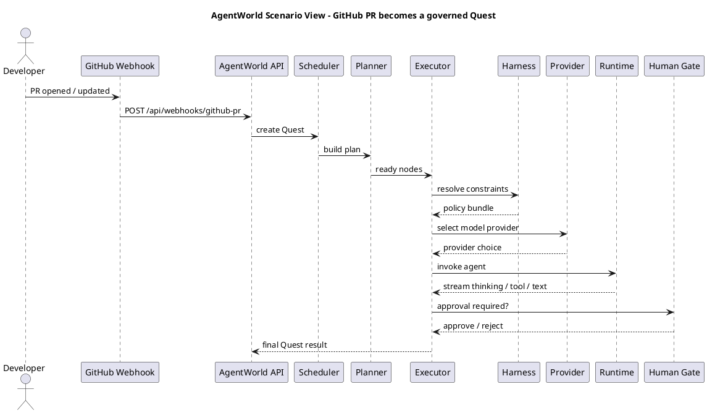
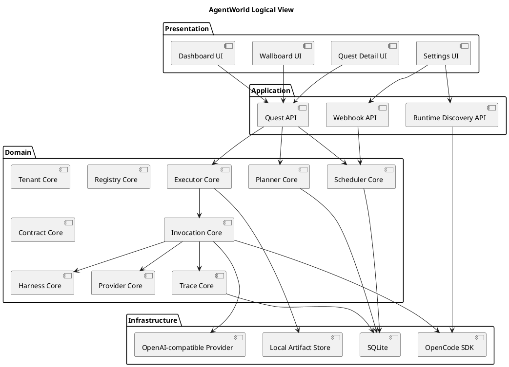
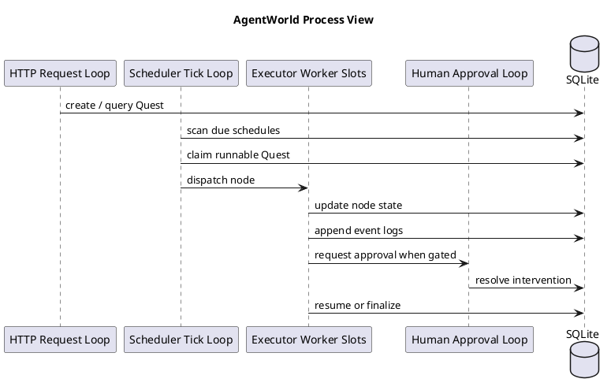
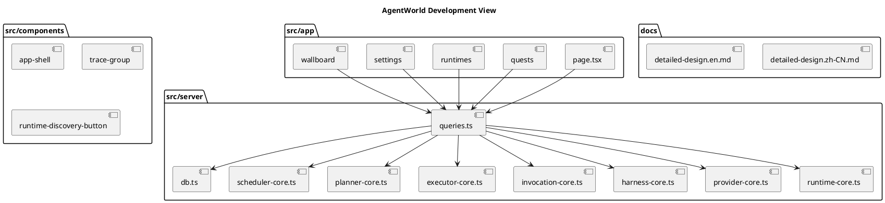
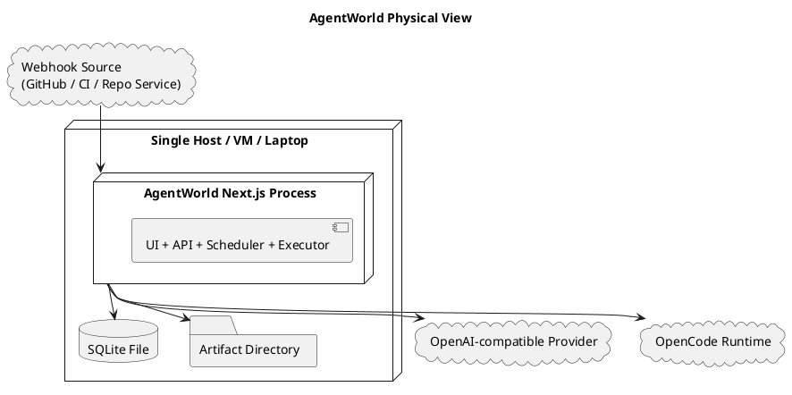
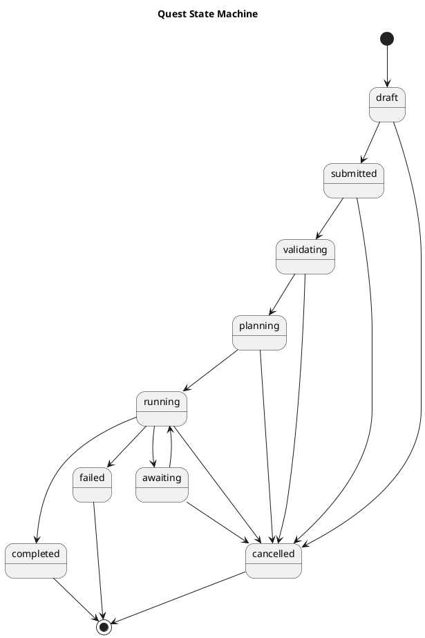
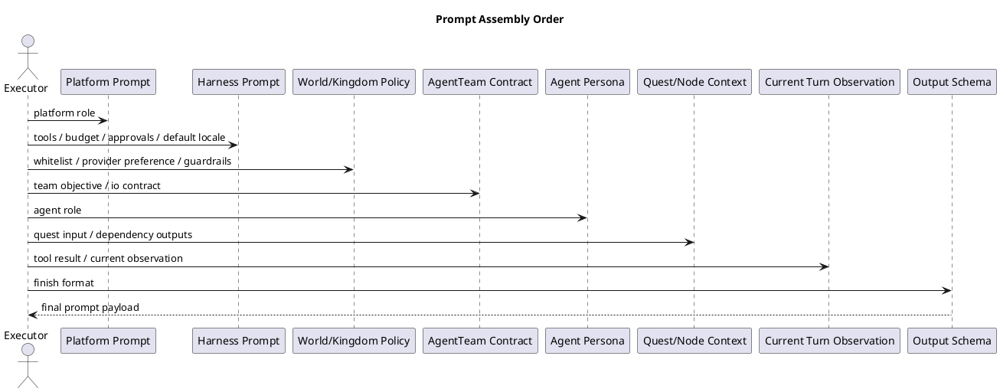
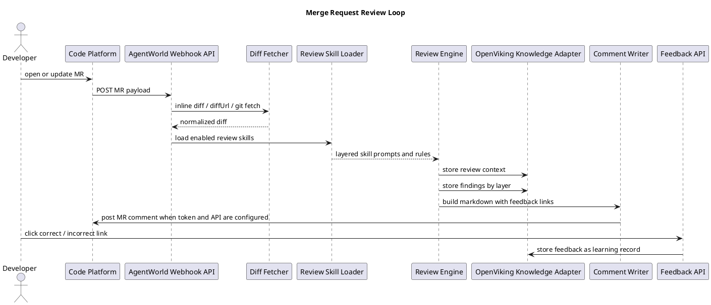
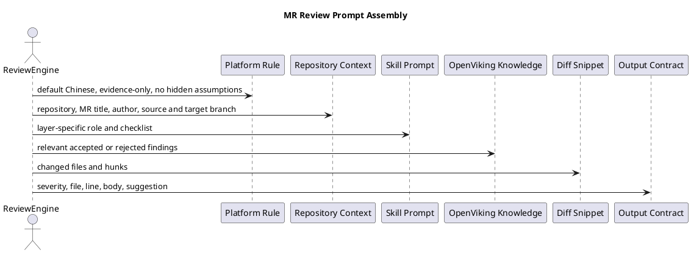

# AgentWorld Detailed Design

This is an implementation-oriented design document for AgentWorld.

The goal is simple:

1. Explain the system in plain language.
2. Make the scheduling, invocation, multi-turn execution, human intervention, and harness constraints explicit.
3. Show why this version is a full TypeScript monolith with an embedded database and no extra middleware.
4. Provide enough detail to guide real development instead of hand-wavy architecture talk.

## 1. One-Sentence Definition

AgentWorld is a multi-tenant, orchestrated, governable, observable agent runtime platform. It is not a chat wrapper. It is a system for operating agents as team capabilities, service units, and execution units.

## 2. What Problem the System Actually Solves

Once agents become part of real team workflows, the hard questions are no longer only about model quality. The hard questions are:

1. Who submitted the task.
2. Which team owns the task.
3. Whether budget, permissions, model policy, and tool policy were checked before execution.
4. Whether the task is handled by one agent or multiple collaborating agents.
5. Whether humans can intervene mid-flight.
6. Whether cross-team calls are truly authorized.
7. How retries, pauses, and resumes work.
8. Whether the full run is visible, including thinking, tool calls, text output, and cost.
9. Whether the platform is friendly to Chinese-first teams by default.
10. Whether the whole system can run locally with one command and no extra infrastructure.

AgentWorld is designed around those ten problems.

## 3. Hard Constraints for This Version

This version intentionally converges on these constraints:

1. Full-stack TypeScript.
2. One Next.js monolithic service.
3. No external orchestration system.
4. No Redis, Kafka, Temporal, PostgreSQL, Milvus, S3, or similar middleware.
5. Embedded SQLite database.
6. Local filesystem for artifacts and attachments.
7. OpenAI-compatible provider integration.
8. External OpenCode runtime discovery support.
9. Chinese-first defaults for UI, output, and formatting.

## 4. Design Conclusion Up Front

### 4.1 Why a TypeScript Monolith

The first risk is not throughput. The first risk is unclear boundaries.

If the execution chain is still fuzzy, splitting into microservices only makes the system harder to reason about. So this version focuses on:

1. One deployable service.
2. One explicit domain model.
3. One in-process scheduler core.
4. One in-process executor core.
5. One database-backed state machine.
6. One visible and auditable harness layer.

### 4.2 Why This Is Not “Another Agent Chat UI”

Because a chat shell does not solve:

1. Scheduled tasks.
2. DAG execution.
3. Cross-team contracts.
4. Human gates.
5. Runtime discovery.
6. Replayable task traces.
7. Cost attribution.
8. Operational wallboards.

AgentWorld is a task execution platform first.

## 5. Core Terms in Plain Language

| Term | Plain meaning | Engineering responsibility |
| --- | --- | --- |
| World | top tenant space | quota, model whitelist, top-level guardrails |
| Kingdom | team space inside a World | balance, tool references, team policy |
| AgentTeam | a service provided by a team | standard input, standard output, internal orchestration |
| Agent | the worker unit | model calls, tool calls, intermediate output |
| Tavern | team capability marketplace | discovery, recruitment, subscription |
| Quest | one real task run | submission, planning, execution, logging, settlement |
| Contract | the legal cross-Kingdom path | access scope, service account, pricing, SLA |
| Harness | the constraint layer | tools, budget, approval, output, scanning |
| Captain Agent | the planner | creates an execution plan or DAG |
| Watcher | platform supervision logic | validation, SLA checks, human gate decisions |

## 6. Requirements

### 6.1 Functional Requirements

1. Support the World, Kingdom, AgentTeam, Agent, Quest, Contract, and Tavern model.
2. Provide Chinese-first defaults for UI and output.
3. Support OpenAI-style provider configuration from the UI.
4. Discover external OpenCode runtimes.
5. Support team-scoped tasks and scheduled tasks.
6. Show the full run process, including thinking, tool calls, and text output, with collapsible sections.
7. Support human approval, interruption, and resume.
8. Provide a wallboard with task status, success state, active agents, active developers, active repositories, and runtime health.
9. Support webhook ingestion as a Quest trigger source.
10. Support cross-Kingdom invocation through Contracts.

### 6.2 Non-Functional Requirements

1. One-command local install and startup.
2. Strong observability.
3. Auditable execution chain.
4. Replayable run history.
5. Safe retry behavior.
6. No dependency on external middleware.
7. Clear module boundaries for later evolution.

### 6.3 Explicit Non-Goals for This Version

1. Distributed multi-node scheduling.
2. A separate vector database cluster.
3. A full container orchestration layer.
4. A full billing platform.
5. Real-time multi-language switching. Chinese-first defaults come first.

## 7. Design Thinking

### 7.1 Make the Task Chain Explicit

The hard engineering problem is not “call a model API.” The hard problem is making this chain explicit:

1. A task enters the system.
2. The task is validated.
3. The task is scheduled.
4. The task is planned.
5. Nodes are executed.
6. Tools may be called.
7. Human approval may be required.
8. Retries may happen.
9. A final result, trace, and cost record must exist.

That is why AgentWorld models the system as an execution pipeline instead of a conversational shell.

### 7.2 Separate Scheduling, Planning, Execution, and Invocation

These concepts are easy to mix up, so the system must keep them separate:

1. Scheduling decides which Quest should run first.
2. Planning decides how the Quest is broken into nodes.
3. Execution decides which node can run now and how failures are handled.
4. Invocation decides how one agent turn is actually composed and executed.

This separation makes the system debuggable and governable.

### 7.3 Treat Harness as a Platform Rule, Not a Prompt Wish

Harness means the platform does not rely on the model to behave well on its own.

AgentWorld constrains agents through:

1. Tool restrictions.
2. External configuration.
3. Internal executor rules.

## 8. Overall Architecture

### 8.1 Logical Layers

Even though deployment is monolithic, the code should remain layered:

1. Presentation layer.
2. Application layer.
3. Domain layer.
4. Infrastructure layer.

### 8.2 Main Modules

| Module | Responsibility |
| --- | --- |
| `tenant-core` | World, Kingdom, quota, tenant boundaries |
| `registry-core` | AgentTeam, Agent, Tavern |
| `contract-core` | Contract scope, service account, access rules |
| `scheduler-core` | due schedules, prioritization, runnable Quest selection |
| `planner-core` | planning mode and DAG summary |
| `executor-core` | node state transitions and execution board |
| `invocation-core` | one agent invocation chain |
| `harness-core` | harness resolution and summary |
| `provider-core` | provider selection and rationale |
| `runtime-core` | runtime health and capability catalog |
| `trace-core` | event grouping and replay basics |
| `queries` | dashboard and page-level aggregation |

### 8.3 Technology Choices

| Layer | Technology |
| --- | --- |
| full-stack app | Next.js + TypeScript |
| UI | React 19 + Server Components |
| database | SQLite |
| validation | Zod |
| runtime discovery | OpenCode SDK |
| provider access | OpenAI-compatible HTTP APIs |
| artifact storage | local filesystem |
| search | SQLite FTS5 |

## 9. Chinese-First Default Design

This is not only a translation task. It is a product behavior rule.

### 9.1 Goals

Chinese-first defaults mean:

1. The UI is Chinese by default.
2. Dates, numbers, and status labels are Chinese by default.
3. Agent output is Chinese by default.
4. Trace viewers and intervention surfaces stay readable for Chinese-speaking teams.

### 9.2 Locale Precedence

The locale resolution order should be:

1. explicit Quest locale
2. AgentTeam default locale
3. Kingdom default locale
4. World default locale
5. platform default `zh-CN`

### 9.3 Where It Lands in the System

Chinese-first behavior lands in five places:

1. HTML `lang` is `zh-CN`.
2. date and number formatters default to `zh-CN`.
3. Harness output policy includes `defaultLocale`.
4. prompt composition injects a Simplified Chinese default rule.
5. the presentation layer maps statuses, workflow types, and trace groups into Chinese labels.

### 9.4 When Non-Chinese Output Is Allowed

Non-Chinese output is allowed when:

1. the user explicitly asks for English,
2. the webhook payload specifies another locale,
3. the downstream repository workflow expects English-only summaries,
4. a Contract requires English-valued structured fields.

The workbench should still keep Chinese labels around the run.

## 10. Domain Model

### 10.1 World

World is the outer governance boundary. It owns:

1. total quota,
2. model whitelist,
3. global guardrails,
4. default Harness.

### 10.2 Kingdom

Kingdom is the team boundary inside a World. It owns:

1. balance and credit limit,
2. private tool references,
3. private memory namespace,
4. team-level provider preference.

### 10.3 AgentTeam

AgentTeam is not just a list of agents. It is a service definition.

It exposes:

1. input contract,
2. output contract,
3. workflow type,
4. concurrency and timeout,
5. default Harness,
6. Tavern visibility.

### 10.4 Agent

Agent is the execution unit. It stores:

1. role,
2. persona prompt,
3. model preference,
4. tool bindings,
5. context window,
6. memory scope.

### 10.5 Quest

Quest is the core runtime record. It must store:

1. source,
2. owning World, Kingdom, and AgentTeam,
3. input and output,
4. state,
5. estimated and actual cost,
6. trace reference,
7. plan and nodes,
8. human intervention records.

### 10.6 Contract

Contract is the only legal cross-Kingdom invocation path. It defines:

1. access scope,
2. service account,
3. pricing model,
4. SLA.

### 10.7 Tavern

Tavern is the marketplace surface, not the execution engine. It is responsible for:

1. presenting team capabilities,
2. showing success rate, latency, and cost,
3. exposing recruitment modes,
4. enabling discovery.

## 11. Quest State Machine

Recommended Quest states:

1. `draft`
2. `submitted`
3. `validating`
4. `planning`
5. `running`
6. `awaiting`
7. `completed`
8. `failed`
9. `cancelled`

They mean:

1. `draft`: not formally submitted.
2. `submitted`: entered the system, waiting for validation.
3. `validating`: budget, permission, Contract, and Harness are being checked.
4. `planning`: a captain agent or rule planner is generating a plan.
5. `running`: at least one node is running.
6. `awaiting`: the run is paused by a human gate.
7. `completed`: finished successfully with a valid result.
8. `failed`: failed and is outside automatic recovery.
9. `cancelled`: cancelled by a user or the system.

## 12. Agent Scheduling Design

This is one of the two most important parts of the design.

### 12.1 A Unified Quest Entry

Every task source must become a Quest first.

There are three entry types:

1. manual submission,
2. scheduled task,
3. webhook event.

Once everything is normalized into a Quest, policy, planning, execution, and replay all become consistent.

### 12.2 How the Scheduler Works in a Monolith

This version uses an in-process scheduler core instead of an external orchestrator.

The scheduler does four things:

1. scans due schedule templates,
2. materializes webhook and manual events into Quests,
3. ranks runnable Quests,
4. claims execution slots.

### 12.3 Scheduler Tick

The scheduler should tick every 1 to 3 seconds.

Each tick:

1. opens a SQLite transaction,
2. selects Quests that can move into validation or planning,
3. selects running Quests with ready nodes,
4. claims a batch according to priority and concurrency limits,
5. commits the transaction.

### 12.4 Priority Formula

Use a small and explainable formula:

```txt
effectivePriority
= basePriority
+ sourceBonus
+ humanResumeBonus
+ deadlineBonus
- retryPenalty
- budgetPressurePenalty
```

Every term should be explainable in the UI. No opaque score.

### 12.5 Why the Scheduler Must Not Invoke Agents Directly

Because scheduling only answers “what should run first.”

Before an agent can run, the system still has to:

1. resolve Harness,
2. validate Contract,
3. pick a provider,
4. pick a runtime,
5. build the prompt,
6. enforce tool gates.

So the scheduler only hands work to the correct execution entry.

## 13. Planning Design

### 13.1 Planning Modes

AgentWorld supports four planning modes:

1. single node,
2. sequential,
3. parallel,
4. DAG.

### 13.2 When to Use a Captain Agent

A captain agent is useful when:

1. the input is complex,
2. the steps cannot be hardcoded safely,
3. the task needs dynamic decomposition.

If the workflow is stable, such as “review PR then prepare write-back,” rule-based planning is usually better.

### 13.3 Planning Output Must Be Stored

Planning is not ephemeral memory. It is platform data.

The plan must store:

1. planning mode,
2. DAG nodes,
3. dependency edges,
4. planning summary,
5. creation time.

That is what makes retries, replay, and human debugging possible.

## 14. Executor Design

### 14.1 The Executor Thinks in Nodes

The scheduler thinks in Quests. The executor thinks in QuestNodes.

It must:

1. find ready nodes,
2. check dependencies,
3. choose the correct Agent,
4. run the invocation,
5. advance downstream nodes.

### 14.2 Node States

Recommended node states:

1. `ready`
2. `running`
3. `awaiting`
4. `completed`
5. `failed`

### 14.3 Retry Rules

Automatic retry is only safe for clearly bounded cases:

1. temporary provider failure,
2. temporary runtime unavailability,
3. tool timeout,
4. schema validation failure when no side effects happened.

If a node already touched a repository, sent an external message, or created another side effect, the system should prefer human review.

## 15. Multi-Turn Agent Invocation Design

This is the second most important part of the design.

### 15.1 Why Invocation Must Be Multi-Turn

Real agent work is usually not “one prompt, one answer.”

It is more like:

1. read the task,
2. think,
3. call a tool,
4. inspect the tool result,
5. think again,
6. maybe call another tool,
7. produce the result.

That is why one node execution must be modeled as a series of turns.

### 15.2 Standard Turn Shape

Each turn should follow six steps:

1. Observe: read current input, memory, and prior results.
2. Think: produce a short reasoning summary.
3. Decide: choose whether to continue, call a tool, or finish.
4. Act: execute the tool call or generate output.
5. Check: enforce Harness, schema, and budget rules.
6. Persist: write the turn result into trace and node state.

### 15.3 Suggested Turn Model

```ts
type AgentTurn = {
  questId: string;
  nodeId: string;
  turnIndex: number;
  observationRef: string[];
  reasoningSummary: string;
  actionType: "tool_call" | "message" | "finish" | "handoff";
  actionName?: string;
  actionPayloadJson?: string;
  resultRef?: string;
  finishReason?: string;
  tokenUsage?: {
    input: number;
    output: number;
  };
  createdAt: string;
};
```

### 15.4 Stop Conditions

The platform, not the model alone, decides when a node is done.

Stop when:

1. a valid final result satisfying schema exists,
2. max steps is reached,
3. max tool calls is reached,
4. max runtime is reached,
5. a human gate is triggered,
6. a non-recoverable error occurs.

### 15.5 How Thinking Should Be Shown

Thinking should be visible, but collapsed by default.

If it is hidden, debugging is weak. If it is always expanded, the UI becomes noisy.

So the workbench should:

1. collapse thinking by default,
2. group tool results separately,
3. group final text output separately,
4. keep human actions visible and open by default.

### 15.6 When to Escalate to a Human

Prefer human intervention when:

1. the node is about to write to a repository,
2. the node is about to send an external message,
3. a high-risk tool is requested,
4. output repeatedly fails validation,
5. budget is close to the limit,
6. Contract scope is unclear.

## 16. Invocation Chain Design

This section explains how one node actually runs.

### 16.1 Standard Invocation Chain

Each invocation should go through this explicit path:

1. assemble invocation context,
2. resolve Harness,
3. validate Contract,
4. choose provider,
5. choose runtime,
6. assemble prompt,
7. call the model,
8. capture tool calls,
9. run Harness pre-checks,
10. execute tools,
11. append trace,
12. decide whether another turn is needed,
13. validate the result,
14. commit node state.

### 16.2 Why Provider and Runtime Are Separate

Because they solve different problems:

1. Provider is where model capability comes from.
2. Runtime is where the agent execution environment comes from.

For example:

1. Provider may be OpenAI or any OpenAI-compatible service.
2. Runtime may be a local OpenCode endpoint or another execution endpoint.

### 16.3 Provider Selection Rules

Provider selection should look at:

1. World model whitelist,
2. Kingdom preference,
3. Agent model preference,
4. enablement state,
5. cost and fallback rules.

### 16.4 Runtime Selection Rules

Runtime selection should look at:

1. Kingdom affinity,
2. health state,
3. current concurrency,
4. capability catalog.

## 17. Prompt Engineering Design

This section must stay practical.

### 17.1 Prompt Is a Stack, Not One String

Recommended prompt stack order:

1. platform prompt,
2. Harness prompt,
3. World and Kingdom policy prompt,
4. AgentTeam contract prompt,
5. Agent persona prompt,
6. Quest and node prompt,
7. current turn observation prompt,
8. output schema prompt.

### 17.2 Platform Prompt

The platform prompt tells the model:

1. you run inside AgentWorld,
2. you must obey tool, budget, approval, and output rules,
3. you cannot self-approve restricted actions,
4. you must not fabricate tool results.

### 17.3 Harness Prompt

The Harness prompt explicitly states:

1. allowed tools,
2. blocked tools,
3. approval-required tools,
4. max steps, max tool calls, max runtime,
5. structured output requirement,
6. default locale.

### 17.4 Chinese Default Prompt Rule

This should be explicit:

```text
Unless the task input explicitly requests another language, use Simplified Chinese by default.
If output must be structured JSON, keep field names stable in English and prefer Simplified Chinese values.
```

### 17.5 AgentTeam Prompt

The AgentTeam layer explains:

1. what this service does,
2. what success means,
3. what the output contract is,
4. when the node should stop.

### 17.6 Agent Persona Prompt

Persona should say:

1. what the agent is responsible for,
2. what it should prioritize,
3. what it must not do.

It should not be mystical or vague.

### 17.7 Prompt Changes Across Turns

Multi-turn execution should not resend the exact same context every time.

Each turn should compose:

1. fixed layers: platform, Harness, World, Kingdom, AgentTeam, Agent,
2. task-fixed layers: Quest input, node goal, dependency outputs,
3. turn-dynamic layers: tool result, prior turn summary, current available actions.

### 17.8 Structured Output Rules

If the AgentTeam defines an output schema, the prompt must state:

1. required fields,
2. optional fields,
3. how to mark missing information,
4. that extra free-form text is not allowed outside the contract.

### 17.9 Retry Prompt

Retry is not “send the same prompt again.”

Retry prompts should include:

1. the failure reason,
2. what already ran,
3. what must not be repeated,
4. what the new recovery strategy is.

### 17.10 Human Handoff Prompt

When work is handed to a human, the platform should generate a human-readable summary:

1. where execution stopped,
2. why it stopped,
3. what decision is required,
4. what will happen after approval.

### 17.11 Recommended Execution Prompt Template

```text
[Platform Role]
You run inside AgentWorld and must obey platform rules for tools, budget, approvals, and output.

[Locale Rule]
Unless another language is explicitly requested, use Simplified Chinese by default.

[Harness Constraints]
Allowed tools: {{allowed_tools}}
Blocked tools: {{blocked_tools}}
Approval-required tools: {{approval_tools}}
Max steps: {{max_steps}}
Max tool calls: {{max_tool_calls}}
Max runtime: {{max_runtime_ms}}

[Service Goal]
AgentTeam: {{team_name}}
Agent: {{agent_name}}
Node objective: {{node_goal}}

[Context]
Quest input: {{quest_input}}
Dependency outputs: {{dependency_outputs}}
Current observation: {{current_observation}}

[Output Rules]
Give a short conclusion first, then call tools if needed.
If you finish, the result must satisfy the schema.
If information is missing, say so clearly and do not invent it.
```

## 18. Harness Engineering Design

Harness is one of the most important governance layers in the system.

### 18.1 Three Types of Constraints

#### 1. Tool Invocation Constraints

The executor enforces:

1. tool allow-lists,
2. tool block-lists,
3. human approval before high-risk tools.

#### 2. External Configuration Constraints

Configured through World, Kingdom, AgentTeam, and HarnessProfile:

1. model whitelist,
2. provider preference,
3. default locale,
4. structured output rules,
5. cost and runtime budgets.

#### 3. Internal Engine Constraints

Hard-enforced inside the platform:

1. max steps,
2. max tool calls,
3. max runtime,
4. retry ceiling,
5. output schema validation,
6. prompt scan and output scan.

### 18.2 Why Harness Must Be Layered

Different layers care about different boundaries:

1. World defines outer limits.
2. Kingdom tightens rules for one team space.
3. AgentTeam defines service-level execution rules.

Lower layers may tighten upper layers, but they must not loosen them.

### 18.3 Merge Rules

Suggested merge rules:

1. tool allow-lists use intersection,
2. tool block-lists use union,
3. approval-required tools use union,
4. budgets use the stricter minimum,
5. output rules choose the stricter side,
6. locale follows the most specific override.

## 19. Data Model and Tables

### 19.1 Core Tables

The first version should at least contain:

1. `worlds`
2. `kingdoms`
3. `harness_profiles`
4. `agent_teams`
5. `agents`
6. `provider_profiles`
7. `runtime_endpoints`
8. `contracts`
9. `tavern_listings`
10. `schedule_templates`
11. `quests`
12. `quest_plans`
13. `quest_nodes`
14. `trace_spans`
15. `event_logs`
16. `quest_interventions`
17. `repository_profiles`
18. `developer_profiles`
19. `webhook_endpoints`

### 19.2 Why Quest Is Split

Quest should not hold everything in one row.

Split it into:

1. `quests` for run headers,
2. `quest_plans` for planning output,
3. `quest_nodes` for execution state.

This keeps list queries lighter and recovery logic cleaner.

### 19.3 Why Trace Deserves Its Own Tables

Trace is not an attachment. It is core product data.

It supports:

1. collapsed thinking display,
2. tool replay,
3. human audit,
4. failure diagnosis,
5. cost attribution.

## 20. API Design

### 20.1 Suggested API Surface

The first version should expose:

1. `POST /api/quests`
2. `POST /api/quests/:id/approve`
3. `POST /api/quests/:id/cancel`
4. `POST /api/runtimes/discover`
5. `POST /api/webhooks/:pathKey`
6. `GET /api/quests/:id/trace`
7. `GET /api/dashboard`
8. `POST /api/providers`
9. `POST /api/contracts`

### 20.2 Webhook Ingestion

The webhook entry should do four things:

1. authenticate,
2. validate the request schema,
3. map the request to a target AgentTeam,
4. create a Quest.

The webhook must not invoke the Agent directly.

## 21. UI Design

### 21.1 Left Navigation

The left navigation should include:

1. Overview
2. World
3. Kingdom
4. AgentTeam
5. Quest
6. Tavern
7. Contract
8. Runtime
9. Harness
10. Wallboard
11. Settings

### 21.2 What the Quest Detail Page Must Show

At minimum:

1. Quest summary,
2. Contract information,
3. Harness information,
4. plan summary and nodes,
5. invocation stages,
6. trace groups,
7. human intervention records.

### 21.3 What the Wallboard Must Show

At minimum:

1. active Quests,
2. runtime health,
3. key AgentTeams,
4. active repositories,
5. active developers.

## 22. Observability Design

### 22.1 Three Observation Levels

The platform should observe:

1. Quest level,
2. node level,
3. turn level.

### 22.2 Event Log Principles

Event logs should be:

1. ordered,
2. grouped,
3. collapsible,
4. replayable,
5. explicit about human actions.

### 22.3 Recommended Event Groups

Recommended groups:

1. `Planning`
2. `Thinking`
3. `Tool Result`
4. `Text Output`
5. `Human Actions`
6. `Final Result`

## 23. Security and Isolation

### 23.1 Multi-Tenant Boundaries

1. World is the tenant boundary.
2. Kingdom is the team boundary.
3. Contract is the cross-boundary access path.
4. Harness is the behavior boundary.

### 23.2 Tool Safety

1. Tool secrets never go into prompts.
2. Harness checks happen before tool execution.
3. High-risk tools require approval.
4. Tool results are recorded in trace.

### 23.3 Output Safety

1. prompt scan,
2. output scan,
3. structured output validation,
4. budget and step ceilings.

## 24. 4+1 Views

### 24.1 Scenario View

This view answers: what happens in a real business flow.



### 24.2 Logical View

This view answers: what major logical parts exist and how they relate.



### 24.3 Process View

This view answers: what in-process roles collaborate at runtime.



### 24.4 Development View

This view answers: how the codebase should be organized.



### 24.5 Physical View

This view answers: how the system is deployed.



## 25. Extra Diagram: Quest State Machine



## 26. Extra Diagram: Prompt Assembly Order



## 27. MVP Delivery Path

### Phase 1

1. core World, Kingdom, AgentTeam, and Quest model,
2. Chinese-first UI defaults,
3. Quest list, Quest detail, and wallboard,
4. runtime discovery,
5. provider configuration.

### Phase 2

1. real Quest submission API,
2. in-process scheduler tick,
3. node transitions and execution flow,
4. human approval loop,
5. basic webhook entry.

### Phase 3

1. fuller prompt composer,
2. persisted multi-turn execution state,
3. Contract invocation loop,
4. Tavern recruitment loop,
5. cost and success-rate reporting.

## 28. Risks and Evolution

### 28.1 Risks in the Current Shape

1. single-process concurrency is limited,
2. SQLite is better for single-node operation than multi-node writes,
3. runtime discovery is still a capability catalog, not a full execution mesh.

### 28.2 Why These Risks Are Acceptable Now

Because the first job is to get the foundations right:

1. normalize the task model,
2. make scheduling and invocation boundaries clear,
3. make governance, audit, and human intervention correct.

Once those are stable, stronger isolation and service splits become much safer.

## 29. Summary

AgentWorld is not a smart chat page.

It is three things combined:

1. an agent task execution engine,
2. a team governance platform,
3. an operable entry point for an agent service marketplace.

The most important design decisions in this version are:

1. use a TypeScript monolith first,
2. use SQLite and local files to lower the install cost,
3. keep scheduling, planning, execution, and invocation explicitly separate,
4. use harness engineering instead of trusting the model to self-govern.

If those four decisions hold, AgentWorld will have a strong base for more advanced runtimes, more teams, and a deeper service marketplace later.

## 30. Merge Request Review Loop

This section describes the first real end-to-end case being implemented in AgentWorld: a code platform sends an MR or PR webhook, AgentWorld fetches the diff, runs layered review skills, generates a review comment, adds feedback links to every finding, and writes feedback back into an OpenViking-style layered knowledge base.

### 30.1 Goal

The first version must do five concrete things:

1. receive MR events from a code platform,
2. acquire the diff from inline payload content, a diff URL, or a git fetch fallback,
3. run review as layered skills instead of one giant prompt,
4. write a review comment with feedback callback links,
5. store feedback in a layered knowledge base so later reviews can improve.

### 30.2 Current Minimal API

The current implementation exposes two API families:

1. `POST /api/webhooks/{pathKey}` receives GitHub, GitLab, or generic MR payloads.
2. `GET /api/review-feedback/{token}?verdict=correct|incorrect|unclear` records feedback for one finding.
3. `POST /api/review-feedback/{token}` records the same feedback using JSON.

The seeded webhook endpoint is `github-pr`, so local testing can call:

```txt
POST /api/webhooks/github-pr
```

### 30.3 Review Flow



### 30.4 Layered Review Skills

The default seed contains four review skills:

| Skill | Layer | Responsibility |
| --- | --- | --- |
| MR Structure Review | `global/code-review` | checks MR size, dependency changes, and missing scope notes |
| Security Sensitive Review | `security` | scans for command execution, dynamic execution, secrets, tokens, and environment files |
| Test Impact Review | `quality/test` | checks whether source changes have tests or validation notes |
| Data and API Contract Review | `contract/data-api` | checks database, API, webhook, and schema changes for compatibility notes |

The reason for this split is practical: code review is not one capability. It is several different lenses. Keeping them as skills makes the system easier to extend by repository, team, language, and framework.

### 30.5 OpenViking Layered Knowledge Base

The current implementation uses OpenViking-style URIs with a local shadow knowledge base:

1. URI format: `viking://agent/resources/code-review/{layer}/{scope}/{id}.md`
2. local files: `data/openviking-shadow/{layer}/{scope}/{id}.md`
3. SQLite index: `openviking_knowledge_entries`
4. remote sync: when `OPENVIKING_BASE_URL` is configured, AgentWorld attempts to sync; otherwise it remains local-only.

Knowledge layers are:

| Layer | Stored content |
| --- | --- |
| `repository/code-review` | MR context, changed files, diff acquisition status |
| `global/code-review` | MR structure findings and lessons |
| `security` | security-sensitive findings and lessons |
| `quality/test` | testing impact findings and lessons |
| `contract/data-api` | data and API contract findings and lessons |
| `feedback/correct` | findings confirmed as correct |
| `feedback/incorrect` | findings confirmed as incorrect |
| `feedback/unclear` | findings that need better explanation |

### 30.6 Feedback Callback Design

Every finding includes feedback links:

1. `This is correct`
2. `This is incorrect`

The callback URLs are simple:

```txt
/api/review-feedback/{token}?verdict=correct
/api/review-feedback/{token}?verdict=incorrect
```

After feedback is received, AgentWorld updates `review_findings.feedback_state` and writes an OpenViking knowledge entry. Later this can support three improvements:

1. identify skills that often produce false positives,
2. learn repository-specific review rules,
3. retrieve accepted findings as prompt context for later reviews.

### 30.7 Prompt Engineering Principles

MR review prompts are intentionally plain:

1. only comment on evidence visible in the diff,
2. do not turn weak signals into certain defects,
3. every finding must include risk, evidence, and a suggestion,
4. when context is missing, say that human confirmation is needed.

Prompt assembly follows this order:



### 30.8 Multi-Turn Agent Review Design

The current version uses rules and skill configuration to complete the loop. Once model-backed review is connected, MR review should become a controlled multi-turn process:

1. first turn: read MR metadata and diff summary, then decide which skills to load,
2. second turn: run each skill independently and emit structured findings,
3. third turn: merge duplicates, reduce false positives, and sort by severity,
4. fourth turn: generate the MR comment with feedback links,
5. fifth turn: after feedback, write the feedback as knowledge and update future skill context.

This avoids letting one agent read the whole MR and improvise. The platform controls each turn's input, output, stop condition, and knowledge write location.

### 30.9 Safety Boundaries

Comment write-back is an external side effect, so the boundary is explicit:

1. without `CODE_PLATFORM_TOKEN`, AgentWorld only generates comment markdown,
2. when `CODE_PLATFORM_WEBHOOK_SECRET` is configured, inbound webhook requests must include `x-agentworld-webhook-secret`,
3. git fetch uses `execFile` and does not build shell commands,
4. the default behavior only writes comments; it does not merge, push, or change branches,
5. without OpenViking remote configuration, knowledge is written only to the local shadow store.

### 30.10 Current Implementation Status

The following pieces are now implemented:

1. `code_review_skills` seeded with four review layers,
2. `merge_request_reviews` for each MR review run,
3. `review_findings` for individual findings and feedback tokens,
4. `review_feedback` for human correctness feedback,
5. `openviking_knowledge_entries` for layered knowledge indexing,
6. `POST /api/webhooks/{pathKey}` for intake, diff acquisition, skill review, and comment generation,
7. `GET/POST /api/review-feedback/{token}` for feedback and knowledge write-back.

## 31. Real OpenViking Integration

The previous version kept OpenViking-style URIs and a local shadow store. This version adds real OpenViking installation and integration so AgentWorld has a runnable, health-checkable, readable, writable, layered knowledge system.

### 31.1 Install and Run

The project now provides three scripts:

```bash
pnpm openviking:install
pnpm openviking:start
pnpm openviking:smoke
```

They do the following:

1. create a local `.venv-openviking`,
2. install `openviking[local-embed]`,
3. generate `data/openviking/ov.conf`,
4. start OpenViking on `127.0.0.1:1933`,
5. verify real REST write and read with a smoke knowledge record.

### 31.2 Why the Local Shadow Store Still Exists

OpenViking is now the primary knowledge base, but AgentWorld still keeps a SQLite index and local markdown shadow files.

The reasons are practical:

1. MR review records must not be lost if OpenViking is temporarily offline,
2. SQLite is better for UI listing, audit, and replay,
3. local markdown files are useful for development debugging,
4. failed remote writes can be retried later.

The write strategy is:

```txt
write SQLite index
write local markdown shadow file
write real OpenViking
if OpenViking fails, record remote_failed_local_shadow
```

### 31.3 Official URI Scopes

The URI shape is now aligned with OpenViking's public scopes instead of the earlier `viking://agent/resources/...` form:

| Scope | AgentWorld usage |
| --- | --- |
| `viking://resources/agentworld/...` | repositories, MR context, global review lessons |
| `viking://agent/skills/agentworld/...` | review skills, prompts, and heuristics |
| `viking://user/memories/agentworld/...` | human feedback, false positive memory, accepted findings |
| `viking://session/...` | future temporary context for a single Quest run |

### 31.4 Knowledge Layer Registry

A new `knowledge_layers` table acts as the knowledge layer registry.

The default layers are:

| Layer Key | Viking Root | Purpose |
| --- | --- | --- |
| `repository/code-review` | `viking://resources/agentworld/code-review/repositories` | MR context |
| `global/code-review` | `viking://resources/agentworld/code-review/global` | global review lessons |
| `security` | `viking://agent/skills/agentworld/code-review/security` | security review knowledge |
| `quality/test` | `viking://agent/skills/agentworld/code-review/quality-test` | test impact knowledge |
| `contract/data-api` | `viking://agent/skills/agentworld/code-review/data-api` | data and API contract knowledge |
| `feedback/correct` | `viking://user/memories/agentworld/code-review/feedback/correct` | accepted feedback |
| `feedback/incorrect` | `viking://user/memories/agentworld/code-review/feedback/incorrect` | false positive feedback |
| `feedback/unclear` | `viking://user/memories/agentworld/code-review/feedback/unclear` | unclear explanation feedback |

### 31.5 OpenViking Three-Level Reads

AgentWorld uses OpenViking's three-level content model:

1. L0 abstract: quickly decide whether a directory or knowledge block is relevant,
2. L1 overview: understand directory structure and topic coverage,
3. L2 full content: read the source text when generating evidence-backed findings.

For multi-turn MR review, the recommended flow is:

```txt
turn 1: read L0 and select relevant layers
turn 2: read L1 and select concrete folders or skills
turn 3: read L2 and generate evidence-backed findings
turn 4: write the generated review finding
turn 5: write user feedback into user memory
```

### 31.6 APIs

New knowledge management APIs:

1. `GET /api/knowledge/layers` returns OpenViking health, knowledge layers, recent entries, and remote tree data.
2. `POST /api/knowledge/sync` writes enabled review skills into OpenViking.
3. `GET /api/knowledge/read?uri=...&level=L0|L1|L2` reads OpenViking content by level.

### 31.7 UI

The new `知识库` page shows:

1. OpenViking connection state,
2. enabled knowledge layers,
3. recently written knowledge entries,
4. the remote OpenViking tree,
5. the L0, L1, and L2 read strategy.

The page exists so teams can see what the agent is learning, which findings were accepted, and which findings were false positives.
