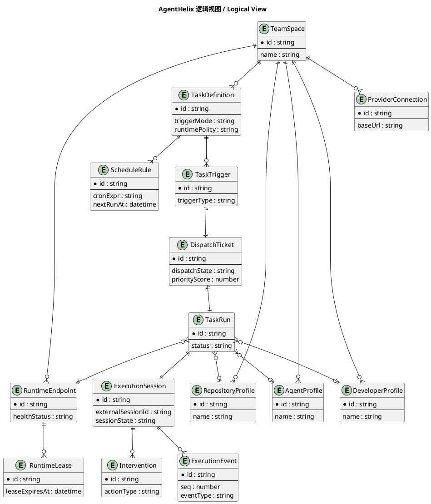
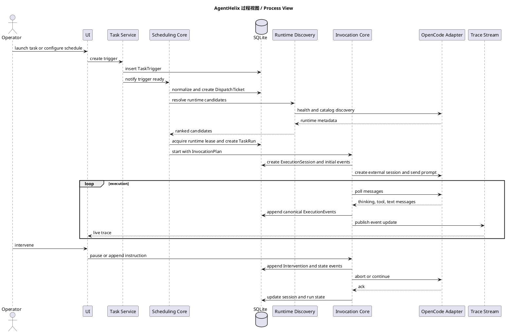
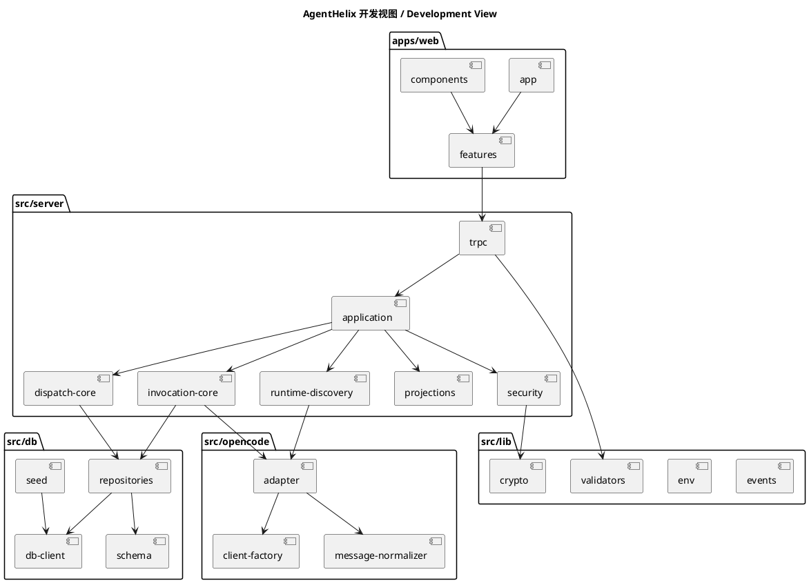
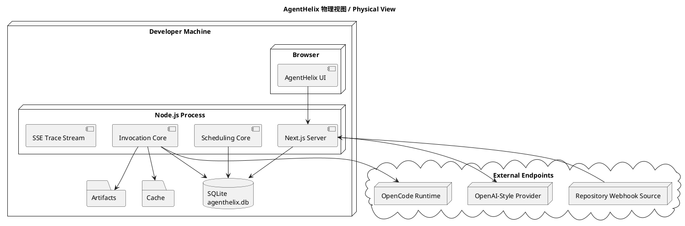
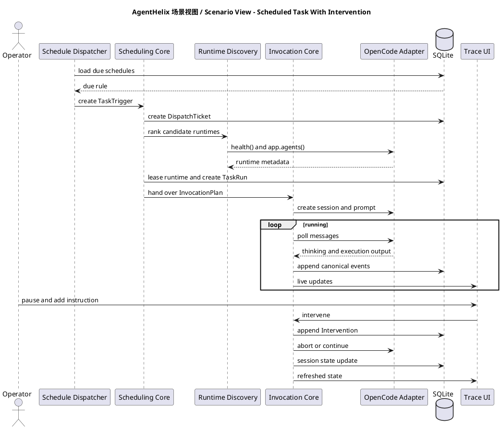
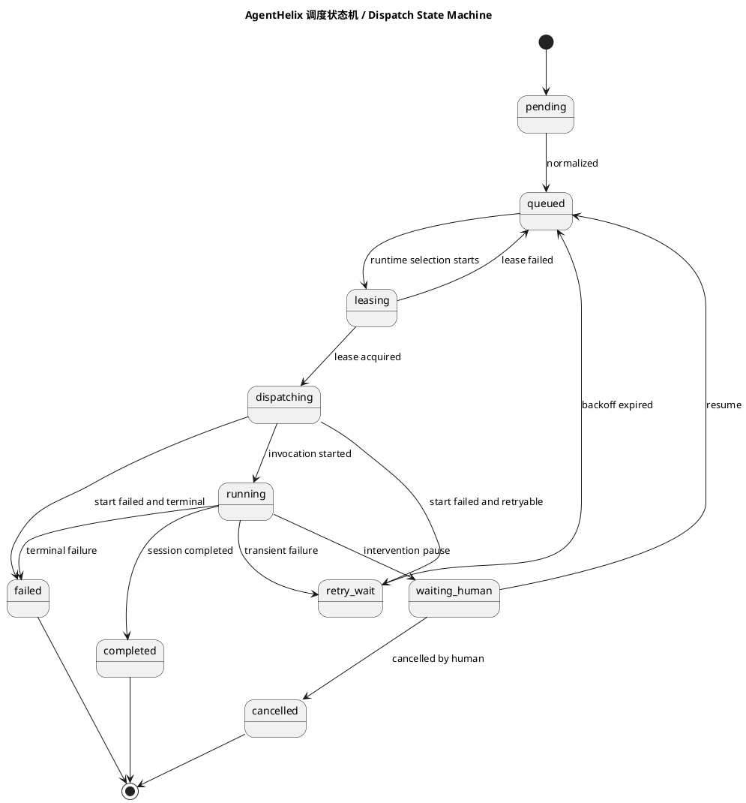
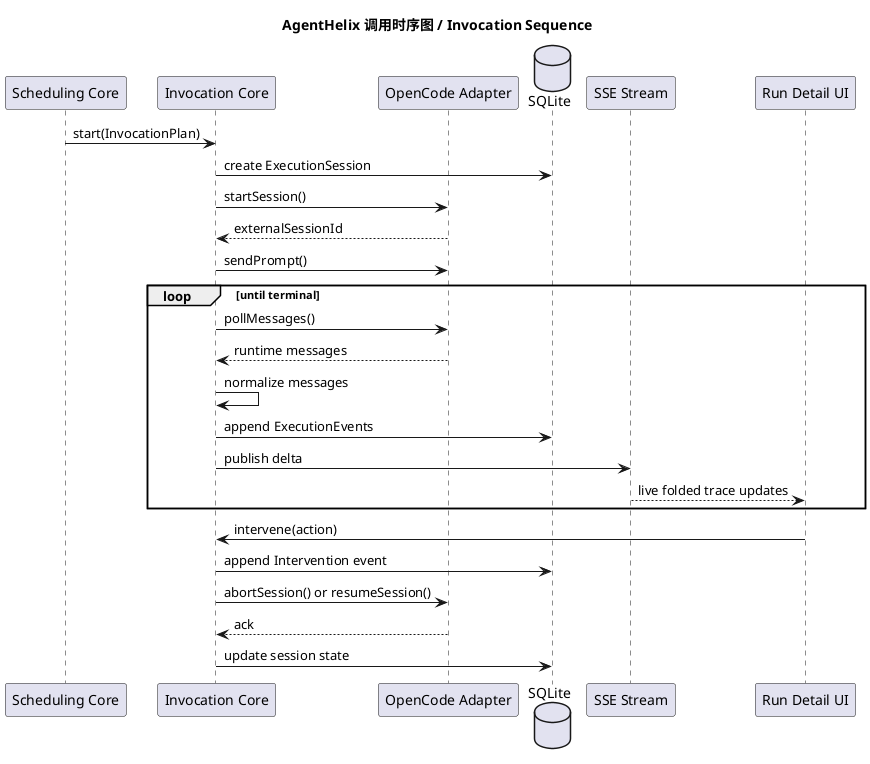

# AgentHelix Detailed Design

## 1. 项目概述 | Project Summary

### 中文

AgentHelix 是一个面向团队的 Agent 平台。它解决的不是“怎么再做一个聊天界面”，而是“怎么让 Agent 真正在团队里跑起来，而且跑得可控、可看、可接管”。

平台会支持这些能力：

- 团队空间隔离
- 手工任务、定时任务、Webhook 触发任务
- OpenCode runtime 发现和调用
- OpenAI 风格模型接口配置
- 运行全过程 trace 展示
- 人工随时介入
- 大屏和运营视图

### English

AgentHelix is an agent platform built for teams. It is not trying to create yet another chat UI. It is trying to make agents actually usable in a real team environment, with clear control, visibility, and human takeover when needed.

The platform supports:

- team-space isolation
- manual tasks, scheduled tasks, and webhook-triggered tasks
- OpenCode runtime discovery and invocation
- OpenAI-style provider configuration
- full execution trace visibility
- human intervention at any point
- wallboard and operational dashboards

## 2. 设计目标 | Design Goals

### 中文

这次设计最重要的目标有五个：

1. 全套 TypeScript 技术栈，避免前后端和调度器是多套语言。
2. 用 SQLite 做嵌入式数据库，做到本地一键安装。
3. 把 Agent 调度和 Agent 调用分开设计，不混在一起。
4. 让执行过程真正可见，不只是最后给一个结果。
5. 让人可以在任何任务中途插手，而不是被动等待。

### English

The most important goals are:

1. Use TypeScript across the whole stack.
2. Use SQLite as the embedded database for fast local setup.
3. Design agent scheduling and agent invocation as separate subsystems.
4. Make execution visible, not just the final answer.
5. Let humans step into any task while it is running.

## 3. 需求清单 | Requirements

### 中文

必须满足的需求：

1. 技术栈全部使用 TypeScript。
2. 使用嵌入式数据库。
3. 支持一键安装和初始化。
4. 基于 OpenCode SDK 做 runtime 集成。
5. 页面上可以发现和查看 runtime。
6. 支持 team space，不同空间有不同任务。
7. 针对定时任务有专门优化。
8. 能看到 thinking、执行过程、文字输出，并支持折叠。
9. 有左侧边栏、任务页面、团队视角、大屏视角。
10. 支持人工干预。
11. 区分活跃 agent、活跃开发者、活跃代码仓。
12. 支持 webhook 自定义入参并绑定任务。
13. 支持 OpenAI 风格接口配置。

### English

Required capabilities:

1. The entire stack must use TypeScript.
2. The platform must use an embedded database.
3. It must support one-command installation and initialization.
4. It must integrate runtimes through the OpenCode SDK.
5. Runtimes must be discoverable from the UI.
6. It must support team spaces with separate tasks per space.
7. Scheduled tasks must have dedicated optimization.
8. It must show thinking, execution steps, and text output with folding.
9. It must provide a left sidebar, task views, team views, and a wallboard.
10. It must support human intervention.
11. It must distinguish active agents, active developers, and active repositories.
12. It must support configurable webhooks and task bindings.
13. It must support OpenAI-style provider configuration.

## 4. 技术选型 | Technology Choices

### 中文

推荐技术栈如下：

- 前端和后端：Next.js App Router
- 语言：TypeScript
- RPC：tRPC
- 校验：Zod
- UI：React、Tailwind CSS、shadcn/ui、Framer Motion
- 状态管理：TanStack Query、Zustand
- 数据库：SQLite
- ORM：Drizzle ORM
- SQLite 驱动：better-sqlite3
- 调度：自研轻量调度循环 + cron-parser
- Runtime 集成：`@opencode-ai/sdk`
- 实时更新：Server-Sent Events

为什么这样选：

- 全栈 TypeScript，开发体验统一。
- SQLite 不需要额外运维，适合一键安装。
- Next.js 前后端一体，适合做管理后台和运营视图。
- OpenCode SDK 直接覆盖 runtime 发现和 session 调用。

### English

Recommended stack:

- Frontend and backend: Next.js App Router
- Language: TypeScript
- RPC: tRPC
- Validation: Zod
- UI: React, Tailwind CSS, shadcn/ui, Framer Motion
- State: TanStack Query, Zustand
- Database: SQLite
- ORM: Drizzle ORM
- SQLite driver: better-sqlite3
- Scheduling: lightweight custom dispatcher loop plus cron-parser
- Runtime integration: `@opencode-ai/sdk`
- Realtime updates: Server-Sent Events

Why this stack:

- full TypeScript end to end
- SQLite keeps installation simple
- Next.js is a good fit for integrated operational software
- OpenCode SDK covers runtime discovery and session calls directly

## 5. 系统整体结构 | System Overview

### 中文

从结构上看，AgentHelix 可以分成四块：

1. 产品界面层
2. 调度层
3. 调用层
4. 存储与投影视图层

最关键的是中间两层：

- 调度层负责决定“这个任务什么时候跑、排给谁跑”
- 调用层负责决定“真正开始跑之后，怎么和 Agent runtime 交互”

### English

At a high level, AgentHelix has four parts:

1. product UI layer
2. scheduling layer
3. invocation layer
4. persistence and projection layer

The middle two are the most important:

- the scheduling layer decides when a task runs and where it should go
- the invocation layer decides how the chosen runtime is actually called and observed

## 6. 核心对象 | Core Objects

### 中文

为了让设计更好理解，下面只保留最关键的对象：

- TeamSpace：团队空间
- TaskDefinition：任务模板
- TaskTrigger：一次触发
- DispatchTicket：进入调度队列后的记录
- TaskRun：给用户看的运行记录
- ExecutionSession：真正的执行会话
- ExecutionEvent：执行过程里的事件
- RuntimeEndpoint：一个 OpenCode runtime 地址
- ScheduleRule：定时规则
- Intervention：人工干预记录
- ProviderConnection：模型接口配置

这里面最容易混的是三个东西：

- TaskTrigger：任务来了
- DispatchTicket：任务开始排队了
- TaskRun：任务真的开始执行了

把这三个分开，系统会清楚很多。

### English

To keep the design easy to follow, these are the most important objects:

- TeamSpace
- TaskDefinition
- TaskTrigger
- DispatchTicket
- TaskRun
- ExecutionSession
- ExecutionEvent
- RuntimeEndpoint
- ScheduleRule
- Intervention
- ProviderConnection

The most important distinction is between:

- TaskTrigger: a task request arrived
- DispatchTicket: the task is now in the scheduling queue
- TaskRun: the task has actually started execution

Keeping these separate makes the system much easier to reason about.

## 7. 最关键设计之一：Agent 调度 | Most Important Part 1: Agent Scheduling

### 7.1 中文：先讲一句人话

调度的本质很简单：

有任务来了，不要立刻调用 Agent。先把任务放进一个可靠的队列记录里，再去决定它应该由哪个 runtime 执行。

为什么不能直接调？

- 你会失去排队可见性
- 失败以后不好重试
- 不知道到底是谁在抢任务
- 大屏和团队视图看不到真实状态
- 人工暂停和恢复会很混乱

所以 AgentHelix 的做法是：

先创建 `DispatchTicket`，再开始真正调度。

### 7.2 English: The plain version

The scheduling idea is simple:

when a task arrives, do not call the agent immediately. First create a durable queue record, then decide which runtime should execute it.

Why not call directly:

- queue state becomes invisible
- retries become messy
- runtime ownership becomes unclear
- dashboards cannot show real queued vs running work
- pause and resume behavior becomes confusing

So AgentHelix creates a `DispatchTicket` first, then schedules from there.

### 7.3 调度流程 | Scheduling Flow

#### 中文

调度流程一共八步：

1. 接收触发
2. 归一化任务输入
3. 计算优先级
4. 创建调度票据
5. 选择候选 runtime
6. 抢占 runtime 空闲槽位
7. 创建 TaskRun 和 ExecutionSession
8. 交给调用层真正执行

这八步里，前六步都属于“调度”，后两步才开始进入“调用”。

#### English

The scheduling flow has eight steps:

1. receive the trigger
2. normalize the input
3. compute priority
4. create a dispatch ticket
5. select candidate runtimes
6. acquire a runtime slot
7. create the TaskRun and ExecutionSession
8. hand off to invocation

The first six steps are scheduling. The last two are the bridge into invocation.

### 7.4 触发来源 | Trigger Sources

#### 中文

任务触发一共有三类：

- 手工触发
- 定时触发
- Webhook 触发

这三类入口虽然来源不同，但进入调度层以后必须走同一条管道。这样才能保证：

- 优先级规则一致
- 重试规则一致
- 状态展示一致

#### English

There are three trigger sources:

- manual launch
- scheduled launch
- webhook launch

Even though they come from different sources, they must go through the same scheduling pipeline so that:

- priority rules stay consistent
- retry behavior stays consistent
- status views stay consistent

### 7.5 Runtime 选择规则 | Runtime Selection Rules

#### 中文

调度器在选 runtime 时，不是“随便挑一个活着的”。

它会按下面顺序过滤和排序：

过滤：

1. 必须属于当前 team space
2. 必须是健康的
3. 必须支持当前任务需要的 Agent 能力
4. 必须还有剩余并发

排序：

1. 任务是否指定了偏好的 runtime
2. 最近同类任务是否在这个 runtime 上成功过
3. 当前空闲槽位是否更多
4. 最近排队等待时间是否更短

这样选出来的 runtime 更稳定，也更容易解释给运营同学看。

#### English

The scheduler does not just pick any runtime that looks alive.

It filters and ranks runtimes in this order:

Filters:

1. it must belong to the current team space
2. it must be healthy
3. it must support the required agent capability
4. it must still have free concurrency

Ranking:

1. explicit task preference
2. recent success for the same kind of task
3. more free capacity
4. shorter recent queue wait

This leads to more stable dispatching and makes the decision explainable.

### 7.6 调度状态 | Scheduling States

#### 中文

调度票据有这些状态：

- `pending`
- `queued`
- `leasing`
- `dispatching`
- `running`
- `waiting_human`
- `retry_wait`
- `completed`
- `failed`
- `cancelled`

最好理解的方法是：

- `queued`：还在排队
- `leasing`：正在抢 runtime 执行名额
- `dispatching`：执行记录已经建好，正准备发起调用
- `waiting_human`：等人来决定

#### English

Dispatch tickets move through these states:

- `pending`
- `queued`
- `leasing`
- `dispatching`
- `running`
- `waiting_human`
- `retry_wait`
- `completed`
- `failed`
- `cancelled`

The easiest way to read them:

- `queued`: waiting in line
- `leasing`: trying to claim runtime capacity
- `dispatching`: execution records exist and invocation is starting
- `waiting_human`: blocked on a person

### 7.7 定时任务为什么要专门优化 | Why Scheduled Tasks Need Special Optimization

#### 中文

很多系统做定时任务时，会给每个任务单独挂一个 timer。这样任务多了以后很容易乱。

AgentHelix 不这么做。

它会把所有定时任务都存到 SQLite 里，只保存一个最重要的字段：

- `nextRunAt`

调度循环每次只查：

- 当前时间之前该执行的任务

这样有三个好处：

1. 不会有成百上千个内存 timer
2. 程序重启以后可以立刻恢复
3. 可以很方便地在大屏上展示“下一批即将执行的任务”

#### English

Many systems create one timer per scheduled task. That becomes messy as task volume grows.

AgentHelix does not do that.

Instead, all schedule rules are stored in SQLite and the most important field is:

- `nextRunAt`

The dispatcher loop only asks:

- which schedules are due now

This gives three benefits:

1. no timer explosion in memory
2. clean recovery after restart
3. easy visibility into upcoming scheduled work

### 7.8 调度失败怎么处理 | How Scheduling Failures Are Handled

#### 中文

调度失败主要分三类：

1. runtime 找不到
2. runtime 满了
3. runtime 不健康

处理方式：

- 找不到或不健康：进入 `retry_wait`
- 满了：回到 `queued`
- 人工取消：直接 `cancelled`

核心原则是：

失败要写进状态，不要藏在日志里。

#### English

Scheduling failures mainly fall into three groups:

1. no runtime found
2. runtime is full
3. runtime is unhealthy

Handling:

- not found or unhealthy: move to `retry_wait`
- full: move back to `queued`
- human cancellation: go to `cancelled`

The key rule is:

failure must be visible in state, not hidden in logs.

## 8. 最关键设计之二：Agent 调用 | Most Important Part 2: Agent Invocation

### 8.1 中文：先讲一句人话

调用层负责的事情也很直接：

调度器已经决定“谁来执行”以后，调用层就要负责：

- 建立会话
- 把任务发给 Agent
- 持续拿回运行消息
- 把消息变成平台自己的 trace
- 支持暂停、继续、取消

### 8.2 English: The plain version

The invocation layer is also straightforward:

once the scheduler has chosen where the work should run, the invocation layer must:

- create the session
- send the task to the agent
- keep reading runtime messages
- convert them into the platform trace
- support pause, resume, and cancel

### 8.3 为什么要单独做调用层 | Why Invocation Is a Separate Subsystem

#### 中文

如果把调用逻辑直接写进调度器里，会出现几个问题：

- runtime 适配逻辑和调度策略混在一起
- UI trace 很难保持稳定
- 以后换 runtime 时改动会很大

所以这里必须单独有一个调用层。

#### English

If invocation logic lives inside the scheduler:

- runtime adapter logic gets mixed with scheduling policy
- the UI trace becomes unstable
- changing runtimes later becomes expensive

That is why invocation must be its own subsystem.

### 8.4 OpenCode 调用流程 | OpenCode Invocation Flow

#### 中文

调用流程如下：

1. 根据 runtime endpoint 创建 OpenCode client
2. 创建外部 session
3. 发送 prompt 和输入
4. 轮询或流式获取消息
5. 把消息转成平台内部事件
6. 写入 ExecutionEvent
7. 推送给前端 trace 页面
8. 结束、失败或等待人工

#### English

The invocation flow is:

1. create an OpenCode client for the selected runtime endpoint
2. create the external session
3. send the prompt and input
4. poll or stream messages
5. convert those messages into internal platform events
6. write them as `ExecutionEvent`
7. push them to the trace UI
8. end, fail, or wait for a human

### 8.5 平台内部事件模型 | Internal Event Model

#### 中文

OpenCode 返回的消息格式是 runtime 自己的格式，但 AgentHelix 的 UI 和分析不能直接依赖它。

所以平台会把它统一转换成这些事件：

- `thinking.delta`
- `thinking.block`
- `tool.started`
- `tool.output`
- `tool.finished`
- `text.output`
- `runtime.status`
- `human.intervention`
- `session.completed`
- `session.failed`

这样做的好处很直接：

- 前端渲染逻辑稳定
- 后续换 runtime 不需要重写 UI
- 统计逻辑也不会绑死在某个 SDK 上

#### English

OpenCode returns runtime-specific message formats, but AgentHelix UI and analytics should not depend on that raw format directly.

So the platform converts them into a stable internal event model:

- `thinking.delta`
- `thinking.block`
- `tool.started`
- `tool.output`
- `tool.finished`
- `text.output`
- `runtime.status`
- `human.intervention`
- `session.completed`
- `session.failed`

The benefit is simple:

- UI rendering stays stable
- future runtime changes do not force a UI rewrite
- analytics remain runtime-independent

### 8.6 Trace 为什么能折叠 | Why the Trace Can Be Folded Cleanly

#### 中文

trace 能不能折叠，关键不在前端，而在事件写入的时候有没有先分组。

AgentHelix 的做法是：

- thinking 合并成一个个思考块
- 工具输出按一次工具调用分组
- 文本输出按连续段落分组
- 人工干预单独高亮

这样前端才能自然地做折叠，而不是拿原始日志硬折。

#### English

Good trace folding is not mainly a frontend problem. It depends on whether events are grouped properly before they are stored.

AgentHelix groups:

- thinking into thought blocks
- tool output by tool call
- text output into continuous text sections
- human interventions as highlighted standalone items

That makes the UI folding natural instead of trying to collapse raw logs after the fact.

### 8.7 人工干预怎么进入调用链路 | How Human Intervention Enters the Invocation Flow

#### 中文

人工干预分三种：

1. 追加说明，继续执行
2. 暂停，等待人决策
3. 终止执行

调用层处理顺序必须是：

1. 先写 Intervention 记录
2. 再写 ExecutionEvent
3. 再向 runtime 发控制指令

为什么要这样？

因为这样才能保证事后回放时，能清楚看见“是谁在什么时刻做了什么决定”。

#### English

There are three main intervention types:

1. append an instruction and continue
2. pause and wait for a decision
3. terminate the run

The invocation layer must always:

1. write the intervention record first
2. write the execution event next
3. send the control command to the runtime last

Why:

because replay should show exactly who made which decision and when.

### 8.8 调用失败怎么处理 | How Invocation Failures Are Handled

#### 中文

调用失败一般分成这些情况：

- session 创建失败
- 消息流断开
- runtime 超时
- runtime 主动终止
- provider 配置错误

处理原则：

- 能重试的交回调度层处理
- 不能重试的直接写失败原因
- 原始错误要保留，但给前端展示时要有易懂摘要

#### English

Invocation failures usually fall into these categories:

- session creation failed
- message stream interrupted
- runtime timeout
- runtime aborted the session
- provider configuration error

Rules:

- retryable failures go back to the scheduler
- non-retryable failures are stored as final failure reasons
- raw diagnostics are preserved, but the UI should show a clear summary

## 9. 调度层和调用层怎么配合 | How Scheduling and Invocation Work Together

### 中文

一句话概括：

- 调度层决定谁来跑
- 调用层决定怎么跑

它们之间只通过一个标准对象交接：

- `InvocationPlan`

这个对象里会带上：

- 任务内容
- 选中的 runtime
- provider 配置引用
- 超时策略
- trace 策略
- 人工干预策略

这样能避免逻辑乱串。

### English

In one sentence:

- scheduling decides who should run the work
- invocation decides how that work is run

They hand off through one standard object:

- `InvocationPlan`

That object carries:

- task content
- selected runtime
- provider configuration reference
- timeout policy
- trace policy
- intervention policy

This keeps the logic clean and separated.

## 10. Runtime 发现设计 | Runtime Discovery Design

### 中文

Runtime 发现有三种方式：

1. 手工添加 endpoint
2. 扫描常见本地地址
3. 定时刷新已登记 runtime

每次刷新要拿回这些信息：

- runtime 是否健康
- runtime 上有哪些 agent
- runtime 上有哪些 provider
- 最近延迟怎么样

### English

Runtime discovery has three modes:

1. manually add an endpoint
2. probe common local addresses
3. periodically refresh registered runtimes

Each refresh should fetch:

- runtime health
- available agents
- available providers
- recent latency

## 11. Webhook 设计 | Webhook Design

### 中文

Webhook 的作用不是“直接执行业务逻辑”，而是“把外部事件转换成一个标准任务触发”。

处理流程：

1. 校验签名或密钥
2. 校验 headers 和 body
3. 转换成 TaskTrigger
4. 交给调度层

这样 webhook 不会成为一条特殊通道，而是平台统一任务入口的一部分。

### English

The webhook layer should not execute business logic directly. Its job is to turn an external event into a standard task trigger.

Flow:

1. verify signature or secret
2. validate headers and body
3. convert into a TaskTrigger
4. hand it to the scheduler

That keeps webhooks as part of the standard task intake path.

## 12. OpenAI 风格接口配置 | OpenAI-Style Provider Configuration

### 中文

每个 team space 可以单独配置自己的模型接口：

- base URL
- API key
- 默认模型
- 模型列表

API key 只会加密后存到 SQLite，中途不会回传给浏览器。

### English

Each team space can configure its own model endpoint:

- base URL
- API key
- default model
- model list

The API key is stored only as encrypted data in SQLite and is never returned to the browser after save.

## 13. 界面设计 | UI Design

### 中文

界面风格要求是：

- 清爽
- 易懂
- 不要太多卡片噪音
- 有一点 Anthropic 风格的克制感

主界面结构：

- 左侧边栏
- 顶部团队切换和搜索
- 中间主工作区
- 右侧详情区只在需要时出现

左侧边栏建议包括：

- Overview
- Team Spaces
- Tasks
- Schedules
- Runs
- Runtimes
- Agents
- Developers
- Repositories
- Webhooks
- Wallboard
- Settings

### English

The UI should be:

- clean
- easy to understand
- low on dashboard noise
- slightly inspired by the restraint seen in Anthropic products

Main layout:

- left sidebar
- top team switcher and search
- central workspace
- optional right-side detail panel

Suggested sidebar structure:

- Overview
- Team Spaces
- Tasks
- Schedules
- Runs
- Runtimes
- Agents
- Developers
- Repositories
- Webhooks
- Wallboard
- Settings

## 14. 数据统计设计 | Analytics Design

### 中文

平台里要明确区分三类活跃度：

- Active Agents：最近正在运行或最近成功完成任务的 agent
- Active Developers：最近创建任务、审批、干预、处理异常的人
- Active Repositories：最近被 webhook 触发、被任务引用、任务运行较多的代码仓

这样大屏才有真正的业务意义，而不是只看一个总数。

### English

The platform needs to distinguish three activity categories:

- Active Agents: agents currently running work or recently completing work
- Active Developers: humans creating tasks, approving, intervening, or handling exceptions
- Active Repositories: repositories with recent webhook activity, task references, or high run volume

That makes the wallboard meaningful instead of showing one generic activity number.

## 15. 4+1 视图与关键图 | 4+1 Views and Key Diagrams

### 中文

这一节把图直接放进设计文档里，阅读时不用在多个文件之间跳转。

### English

This section keeps the diagrams directly inside the design document so readers do not need to jump across many files.

### 15.1 逻辑视图 | Logical View

#### 中文

这张图说明系统里最关键的数据对象，以及它们之间的关系。

#### English

This diagram shows the most important data objects and their relationships.

### 15.2 过程视图 | Process View

#### 中文

这张图说明从任务进入，到调度，再到调用和 trace 回传的过程。

#### English

This diagram shows the flow from task intake to scheduling, invocation, and trace updates.

### 15.3 开发视图 | Development View

#### 中文

这张图说明代码仓里的主要模块如何划分。

#### English

This diagram shows how the codebase is split into major modules.

### 15.4 物理视图 | Physical View

#### 中文

这张图说明单机部署时，浏览器、Node.js 进程、SQLite 和外部服务的关系。

#### English

This diagram shows the relationship between the browser, Node.js process, SQLite, and external services in a single-node deployment.

### 15.5 场景视图 | Scenario View

#### 中文

这张图说明一个定时任务从触发到人工介入的完整场景。

#### English

This diagram shows a complete scenario where a scheduled task runs and then reaches a human intervention point.

### 15.6 调度状态机 | Dispatch State Machine

#### 中文

这张图帮助开发时明确调度状态怎么流转。

#### English

This diagram helps the implementation team reason about dispatch state transitions.

### 15.7 调用时序图 | Invocation Sequence

#### 中文

这张图专门说明调度层和调用层交接以后，调用层内部怎么工作。

#### English

This diagram explains what happens inside the invocation layer after the scheduler hands work over.

## 16. 实施顺序 | Implementation Plan

### 中文

建议按下面顺序实现：

1. 先把 SQLite schema、team space、task、runtime、run 跑通
2. 再做调度层
3. 再做 OpenCode 调用层
4. 再做 trace UI
5. 再做人工干预、webhook、wallboard

这个顺序的好处是：

- 先把数据骨架立住
- 再把最关键的调度和调用打稳
- 最后再做复杂的产品功能

### English

Recommended implementation order:

1. build the SQLite schema and core entities first
2. implement the scheduling layer next
3. implement the OpenCode invocation layer after that
4. build the trace UI
5. finish intervention, webhook, and wallboard features last

This order works well because:

- the data foundation comes first
- the core scheduling and invocation logic becomes stable early
- richer product features can then build on a solid base

## 17. 最后总结 | Final Summary

### 中文

如果只记住一句话，这份设计最重要的点就是：

任务来了以后，不要直接调 Agent；先进入清晰的调度状态，再通过清晰的调用链路执行。

这样 AgentHelix 才能同时做到：

- 好部署
- 好理解
- 好排查
- 好协作

### English

If there is one thing to remember from this design, it is this:

when work arrives, do not call the agent directly; let it pass through a clear scheduling state, then run it through a clear invocation path.

That is what allows AgentHelix to stay:

- easy to install
- easy to understand
- easy to debug
- easy to collaborate with
