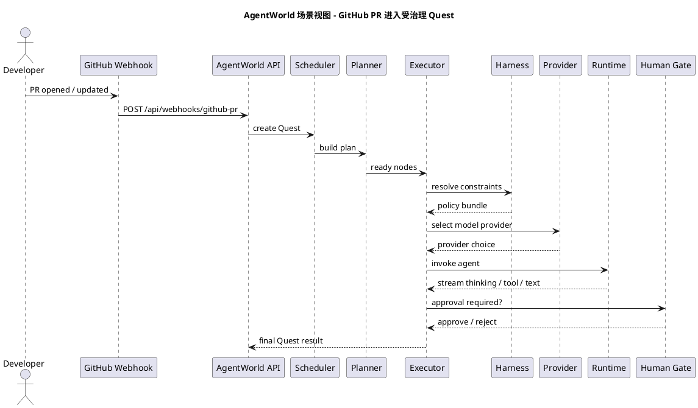
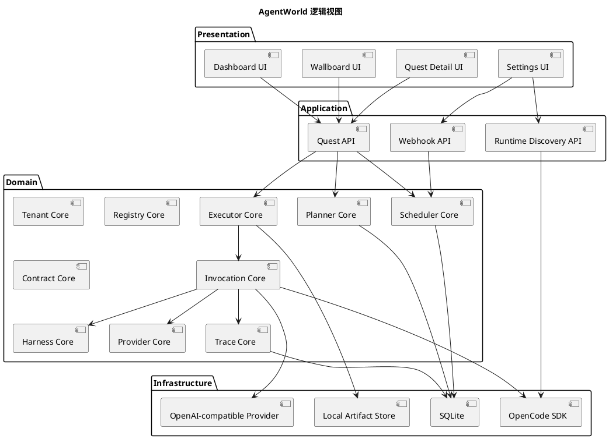
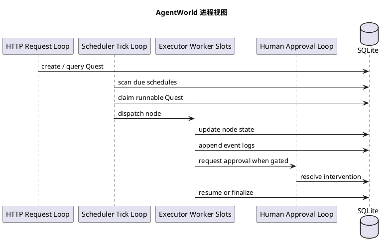
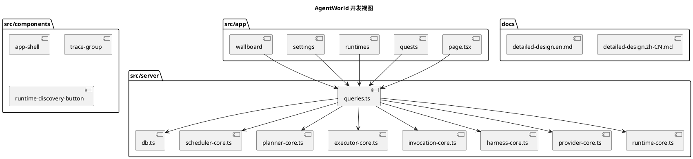
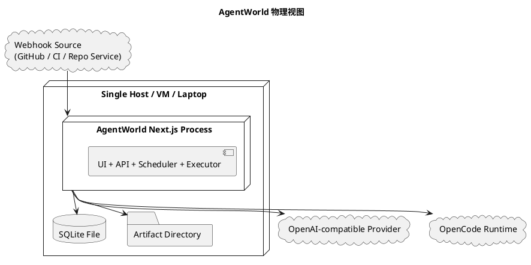
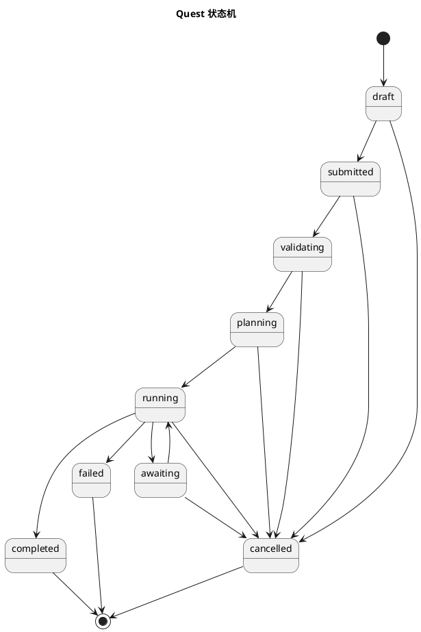
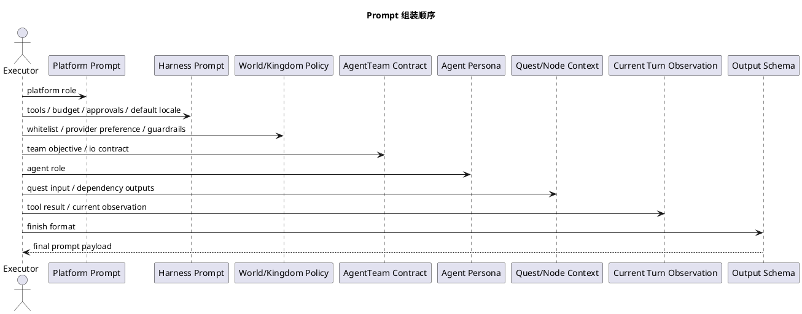
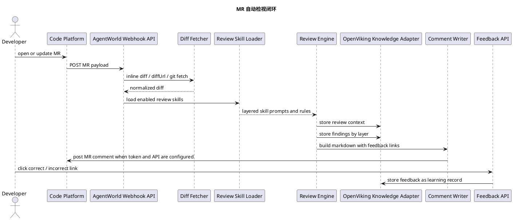
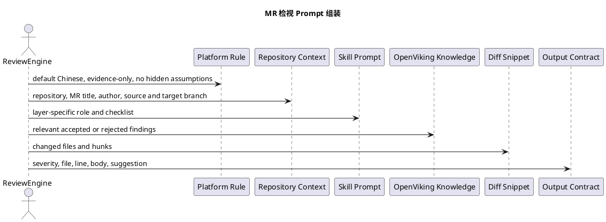

# AgentWorld 详细设计

这是一份面向开发落地的详细设计，不是概念稿。

文档的目标很直接：

1. 用正常人能看懂的话，把 AgentWorld 到底要做成什么讲清楚。
2. 把最关键的 Agent 调度、Agent 调用、多轮执行、人工干预和 Harness 约束讲清楚。
3. 明确为什么本项目采用全栈 TypeScript 单体服务、嵌入式数据库、零额外中间件依赖。
4. 给出可直接指导开发的模块划分、数据模型、状态机、提示词工程和 4+1 视图。

## 1. 一句话定义

AgentWorld 是一个多租户、可编排、可治理、可观测的 Agent 运行平台。它不是聊天框壳子，而是把 Agent 当成团队能力、服务单元和执行单元来运营的系统。

## 2. 这套系统到底解决什么问题

当 Agent 真正进入团队日常工作后，问题很快不再是“模型够不够聪明”，而是下面这些工程问题：

1. 谁可以提交任务。
2. 任务属于哪个团队。
3. 任务执行前有没有预算、权限、模型白名单、工具权限校验。
4. 任务是单 Agent 处理，还是多个 Agent 协同处理。
5. 执行到一半能不能人工接管。
6. 跨团队调用到底有没有授权。
7. 失败了怎么重试，暂停了怎么恢复。
8. 整个过程能不能看见 thinking、工具调用、文字输出和成本。
9. 平台默认是不是中文友好，而不是到处冒英文。
10. 本地能不能一键启动，不靠 Redis、Kafka、Temporal、PostgreSQL 这类额外基础设施。

AgentWorld 就是围绕这十个问题设计的。

## 3. 本版设计的硬约束

这次设计优化后，明确采用下面这些工程边界：

1. 全栈 TypeScript。
2. Next.js 单体服务，前后端一体。
3. 不依赖额外编排系统。
4. 不依赖 Redis、Kafka、Temporal、PostgreSQL、Milvus、S3 等中间件。
5. 数据库使用嵌入式 SQLite。
6. 文件产物、附件、导出结果走本地文件系统。
7. 允许接入 OpenAI 风格模型接口。
8. 允许发现外部 OpenCode runtime，但平台本体不拆成微服务网格。
9. 默认中文界面、默认中文输出、默认中文时间和数字格式。

## 4. 设计结论先说清楚

### 4.1 为什么是单体 TypeScript

因为当前最大风险不是吞吐不够，而是边界不清。

在边界还没清楚之前，先拆微服务、先接编排系统，只会把一条本来就复杂的调用链再切碎。这样一来，调试会更慢，定位问题更难，人工干预也更难做。

所以本版设计收敛成：

1. 一个 Next.js 应用。
2. 一套明确的领域模型。
3. 一个进程内调度核。
4. 一个进程内执行核。
5. 一份数据库状态机。
6. 一套可解释的 Harness 约束体系。

### 4.2 为什么不是“再包一层聊天页面”

因为聊天 UI 解决不了下面这些事：

1. 定时任务。
2. DAG 执行。
3. 跨团队合约。
4. 人工门禁。
5. 运行时发现。
6. 任务回放。
7. 成本归集。
8. 可运营的大屏。

AgentWorld 的重点不是“对话”，而是“任务执行系统”。

## 5. 核心概念，用人话解释

| 术语 | 用人话解释 | 工程职责 |
| --- | --- | --- |
| World | 顶层租户空间 | 负责配额、模型白名单、全局治理规则 |
| Kingdom | World 内的团队空间 | 负责预算、工具引用、团队私有配置 |
| AgentTeam | 团队提供的一项服务能力 | 接受标准输入，产出标准结果，内部可以编排多个 Agent |
| Agent | 真正干活的执行单元 | 调用模型、调用工具、产出阶段结果 |
| Tavern | AgentTeam 市场 | 展示、招募、订阅、托管 |
| Quest | 一次真实任务 | 被提交、被调度、被规划、被执行、被记录、被结算 |
| Contract | 跨 Kingdom 调用协议 | 规定谁可以调用谁、能做什么、多少钱、SLA 是多少 |
| Harness | Agent 约束层 | 通过工具限制、外部配置、预算、审批和输出规则约束 Agent |
| Captain Agent | 负责任务规划的 Agent | 用于生成执行计划或 DAG |
| Watcher | 平台监督逻辑 | 做输出校验、成功率判断、SLA 检查和人工门禁触发 |

## 6. 需求整理

### 6.1 功能需求

1. 支持 World、Kingdom、AgentTeam、Agent、Quest、Contract、Tavern 这套领域模型。
2. 支持默认中文界面和默认中文输出。
3. 支持接入 OpenAI 风格模型接口，并在界面中配置。
4. 支持发现外部 OpenCode runtime。
5. 支持同一团队下的多任务管理和定时任务。
6. 支持查看完整任务过程，包括 thinking、工具调用、文本输出，并可折叠。
7. 支持人工批准、人工打断、人工恢复。
8. 支持大屏视图，展示任务执行状态、成功率、活跃 Agent、活跃开发者、活跃代码仓、runtime 健康度。
9. 支持 webhook 入站，作为 Quest 的触发来源。
10. 支持跨 Kingdom 的 Contract 调用。

### 6.2 非功能需求

1. 本地一键安装、一键启动。
2. 平台可观测。
3. 调用链可审计。
4. 数据可回放。
5. 失败可重试。
6. 不依赖额外中间件。
7. 代码结构清晰，后续可拆分。

### 6.3 当前版本不做的事

1. 不做真正的分布式多节点调度。
2. 不做复杂的向量数据库集群。
3. 不做强隔离的容器编排平台。
4. 不做全自动财务计费系统。
5. 不做多语言实时切换，先把默认中文做好。

## 7. 设计思路

### 7.1 先把任务链路做通，再谈大规模拆分

任务系统真正难的地方，不在于“调一个模型 API”，而在于把下面这条链路做完整：

1. 任务进来。
2. 任务被校验。
3. 任务被排队。
4. 任务被规划。
5. 节点被执行。
6. 过程中可能调用工具。
7. 可能触发人工门禁。
8. 可能重试。
9. 最终有结果、有日志、有成本、有结论。

所以 AgentWorld 的设计重点是把这条链做成“显式可见的工程流水线”。

### 7.2 把调度、规划、执行、调用拆开

这些概念容易混，但必须拆开：

1. 调度：决定哪个 Quest 先执行。
2. 规划：决定这个 Quest 应该拆成几个节点、按什么依赖关系执行。
3. 执行：决定哪个节点现在可以跑、失败怎么处理、完成后怎么推进后继节点。
4. 调用：决定单个 Agent 这一轮怎么组装 prompt、怎么选模型、怎么调工具、怎么记录 trace。

拆开以后，系统才容易观察，也容易人工接管。

### 7.3 把 Harness 当成平台级约束，而不是一句提示词

Harness 的核心意思是：不要把安全、预算、工具权限、输出规范寄希望于模型“自己自觉”。

AgentWorld 里，Harness 至少通过三种方式约束 Agent：

1. 工具调用约束。
2. 外部配置约束。
3. 内部执行器约束。

后面会专门展开。

## 8. 总体架构

### 8.1 逻辑分层

虽然是单体服务，但内部仍然按职责分层：

1. 展示层：页面、表单、列表、大屏、Quest 详情、trace 展示。
2. 应用层：提交 Quest、批准人工门禁、刷新 runtime、配置 provider。
3. 领域层：World、Kingdom、AgentTeam、Quest、Contract、Harness、Scheduler、Planner、Executor。
4. 基础设施层：SQLite、文件系统、OpenCode SDK、OpenAI 风格 HTTP 接口、Webhook 入站。

### 8.2 当前代码模块

| 模块 | 作用 |
| --- | --- |
| `tenant-core` | World、Kingdom 及配额边界 |
| `registry-core` | AgentTeam、Agent、Tavern |
| `contract-core` | Contract、服务账号、授权范围 |
| `scheduler-core` | 调度评估、优先级排序、到点任务识别 |
| `planner-core` | 规划模式、DAG 摘要 |
| `executor-core` | 节点状态汇总、执行看板 |
| `invocation-core` | 单次 Agent 调用链设计 |
| `harness-core` | Harness 解析与摘要 |
| `provider-core` | Provider 选择和说明 |
| `runtime-core` | runtime 能力目录和状态 |
| `trace-core` | 事件分组和回放基础 |
| `queries` | 工作台和页面查询聚合 |

### 8.3 技术选型

| 层 | 技术 |
| --- | --- |
| 前后端一体 | Next.js + TypeScript |
| UI | React 19 + Server Components |
| 数据库 | SQLite |
| 校验 | Zod |
| Runtime 发现 | OpenCode SDK |
| Provider | OpenAI 风格 HTTP 接口 |
| Artifact | 本地文件系统 |
| 搜索 | SQLite FTS5 |

## 9. 默认中文能力设计

这部分必须单独说，因为它不是“把页面翻译一下”那么简单。

### 9.1 默认中文的目标

默认中文能力包含四层：

1. 界面默认中文。
2. 时间、数字、状态标签默认中文。
3. Agent 默认中文输出。
4. Trace、人工门禁、任务详情默认中文展示。

### 9.2 语言优先级

默认语言的覆盖顺序如下：

1. Quest 显式指定的 `locale`
2. AgentTeam 的语言配置
3. Kingdom 的默认语言
4. World 的默认语言
5. 平台默认语言 `zh-CN`

也就是说，平台默认是中文，但任务可以按需覆盖成英文。

### 9.3 平台层落点

默认中文能力在平台里落到五个点：

1. HTML `lang` 默认 `zh-CN`。
2. 日期、数字、百分比格式默认使用 `zh-CN`。
3. Harness 输出策略里包含 `defaultLocale`。
4. Prompt 组装时会注入“默认使用简体中文输出”的语言规则。
5. 页面显示层把状态、工作流、招募模式、事件分组映射成中文。

### 9.4 什么时候允许不是中文

下面几种情况可以合法输出非中文：

1. 用户明确要求英文。
2. 外部 webhook 指定英文。
3. 目标代码仓要求固定英文摘要。
4. 调用下游 Contract 的接口文档要求英文结构化字段。

这时 Agent 仍然要在 trace 里保留中文说明标签，避免工作台变成中英混杂。

## 10. 领域模型

### 10.1 World

World 是平台最外层治理边界，负责：

1. 总配额。
2. 模型白名单。
3. 全局风控规则。
4. 默认 Harness。

### 10.2 Kingdom

Kingdom 是 World 内的团队边界，负责：

1. 团队余额和信用额度。
2. 私有工具引用。
3. 团队私有记忆命名空间。
4. 团队偏好的 Provider。

### 10.3 AgentTeam

AgentTeam 不是“Agent 列表”，而是一项服务。

它对外暴露：

1. 输入约定。
2. 输出约定。
3. 工作流类型。
4. 并发和超时。
5. 默认 Harness。
6. 是否公开到 Tavern。

### 10.4 Agent

Agent 是执行单元，保存：

1. 角色设定。
2. persona prompt。
3. 模型偏好。
4. 工具绑定。
5. 短期上下文窗口。
6. 记忆范围。

### 10.5 Quest

Quest 是任务实例，是系统最核心的记录对象。

它必须保存：

1. 来源。
2. 所属 World、Kingdom、AgentTeam。
3. 输入输出。
4. 状态。
5. 成本预估和实际成本。
6. 关联 trace。
7. 计划和节点。
8. 人工干预记录。

### 10.6 Contract

Contract 是跨 Kingdom 调用的唯一合法入口，负责：

1. 访问范围。
2. 服务账号。
3. 定价规则。
4. SLA 约束。

### 10.7 Tavern

Tavern 是 AgentTeam 的市场视图，而不是执行引擎。

它负责：

1. 展示团队能力。
2. 展示成功率、耗时、成本。
3. 提供招募模式。
4. 提供公开发现能力。

## 11. Quest 状态机

推荐状态如下：

1. `draft`
2. `submitted`
3. `validating`
4. `planning`
5. `running`
6. `awaiting`
7. `completed`
8. `failed`
9. `cancelled`

状态解释：

1. `draft`：草稿，还没有正式提交。
2. `submitted`：任务进入系统，等待校验。
3. `validating`：预算、权限、Contract、Harness 正在检查。
4. `planning`：Captain Agent 或规则规划器正在生成计划。
5. `running`：至少有一个节点在运行。
6. `awaiting`：任务被人工门禁暂停。
7. `completed`：任务结束且结果有效。
8. `failed`：任务失败，且超出自动恢复范围。
9. `cancelled`：被用户或系统取消。

## 12. Agent 调度设计

这一节是整份设计里最关键的部分之一。

### 12.1 Quest 的统一入口

不管任务来自哪里，在调度器看来都必须先变成 Quest。

统一入口有三类：

1. 手动提交。
2. 定时任务。
3. Webhook 事件。

统一成 Quest 之后，后面的预算、权限、规划、执行、回放才有一致模型。

### 12.2 调度器在单体里怎么工作

本版不引入外部编排系统，而是采用进程内调度核。

调度器定时做四件事：

1. 扫描到点的 schedule template。
2. 把 webhook 或手动提交的任务写成 Quest。
3. 按优先级排序可运行 Quest。
4. 为 Quest 认领执行槽位。

### 12.3 调度周期

调度器建议每 1 到 3 秒 tick 一次。

每次 tick 做下面这些动作：

1. 打开 SQLite 事务。
2. 查询可进入 `validating` 或 `planning` 的 Quest。
3. 查询已经 `running` 但有可执行节点的 Quest。
4. 基于优先级和并发限制认领一批工作。
5. 提交事务。

### 12.4 优先级公式

推荐使用简单可解释的公式：

```txt
effectivePriority
= basePriority
+ sourceBonus
+ humanResumeBonus
+ deadlineBonus
- retryPenalty
- budgetPressurePenalty
```

每一项都必须可解释，不能只给模型一个黑箱分值。

### 12.5 为什么调度器不能直接调 Agent

因为调度器只负责“谁先跑”，不负责“怎么跑”。

真正调用 Agent 之前，还要经过：

1. Harness 解析。
2. Contract 校验。
3. Provider 选择。
4. Runtime 选择。
5. Prompt 组装。
6. 工具调用门禁。

所以调度器只把 Quest 送到正确的执行入口。

## 13. 任务规划设计

### 13.1 规划模式

AgentWorld 支持四类规划模式：

1. 单节点。
2. 串行。
3. 并行。
4. DAG。

### 13.2 什么时候用 Captain Agent

Captain Agent 适合下面这类任务：

1. 输入复杂，无法固定成死板流程。
2. 需要根据上下文动态拆步骤。
3. 需要先研究，再分析，再写总结。

如果任务本身是稳定流程，例如“PR 评审后再回写”，完全可以直接用规则规划，不需要每次都让模型重新发明 DAG。

### 13.3 规划结果必须落库

规划不是临时内存对象，而是平台数据。

规划结果至少包含：

1. 规划模式。
2. DAG 节点。
3. 依赖边。
4. 规划摘要。
5. 规划时间。

这样失败、重试、人工查看时，才能知道系统原本打算怎么做。

## 14. 执行器设计

### 14.1 执行器只关心节点

调度器关心 Quest，执行器关心 QuestNode。

执行器要做的事：

1. 找出当前 ready 的节点。
2. 判断依赖是否满足。
3. 选择合适的 Agent。
4. 启动单次调用。
5. 根据结果推进后继节点。

### 14.2 节点状态

推荐节点状态：

1. `ready`
2. `running`
3. `awaiting`
4. `completed`
5. `failed`

### 14.3 节点重试

自动重试只能在明确安全的场景发生，例如：

1. Provider 暂时失败。
2. runtime 短时不可用。
3. 工具超时。
4. 输出结构校验失败，但没有副作用动作发生。

如果节点已经触发写代码、发消息、回写仓库这类副作用动作，必须更谨慎，通常要转人工确认。

## 15. 多轮 Agent 调用设计

这是第二个最关键的部分。

### 15.1 为什么一定是多轮

Agent 真正干活时，通常不是“一次提示词，一次回答”。

更常见的真实过程是：

1. 先看任务。
2. 想下一步。
3. 调一个工具。
4. 看工具结果。
5. 再想下一步。
6. 可能继续调工具。
7. 最后产出结果。

所以平台必须把一次 Agent 执行理解成“多轮状态推进”。

### 15.2 单轮内部结构

每一轮建议固定成下面六步：

1. Observe：读取当前输入、上下文、上轮结果。
2. Think：形成简短推理摘要。
3. Decide：决定下一步是继续思考、调工具还是结束。
4. Act：执行工具或生成文本输出。
5. Check：做 Harness、结构化输出、预算检查。
6. Persist：把本轮结果写入 trace 和节点状态。

### 15.3 单轮数据结构

建议抽象为下面这种结构：

```ts
type AgentTurn = {
  questId: string;
  nodeId: string;
  turnIndex: number;
  observationRef: string[];
  reasoningSummary: string;
  actionType: "tool_call" | "message" | "finish" | "handoff";
  actionName?: string;
  actionPayloadJson?: string;
  resultRef?: string;
  finishReason?: string;
  tokenUsage?: {
    input: number;
    output: number;
  };
  createdAt: string;
};
```

### 15.4 多轮停止条件

一轮 QuestNode 何时结束，必须由平台判断，不能只靠模型说“我觉得结束了”。

停止条件建议包含：

1. 已产出满足 schema 的最终结果。
2. 达到最大步数。
3. 达到最大工具调用次数。
4. 达到最大运行时长。
5. 命中人工门禁。
6. 进入不可恢复错误。

### 15.5 thinking 怎么展示

thinking 需要可见，但默认折叠。

原因很简单：

1. 不可见，团队很难诊断问题。
2. 全展开，界面会非常吵。

所以工作台里：

1. thinking 默认折叠。
2. tool result 单独分组。
3. 最终文字输出单独分组。
4. 人工门禁单独分组并默认展开。

### 15.6 什么时候中断转人工

下面几种情况必须优先考虑人工介入：

1. 需要写代码仓。
2. 需要发送外部消息。
3. 需要调用高风险工具。
4. 输出和 schema 连续多次不匹配。
5. 预算即将超限。
6. Contract 范围不明确。

## 16. Agent 调用链设计

这一节讲单个节点是怎么真正跑起来的。

### 16.1 单次调用的标准链路

每次 Agent 调用都必须走下面这条显式链路：

1. 组装调用上下文。
2. 解析 Harness。
3. 校验 Contract。
4. 选择 Provider。
5. 选择 runtime。
6. 组装 Prompt。
7. 发起模型调用。
8. 捕获 tool call。
9. 做 Harness 前置校验。
10. 执行工具。
11. 写入 trace。
12. 判断是否继续下一轮。
13. 校验结果。
14. 提交节点状态。

### 16.2 为什么要把 Provider 和 runtime 分开

因为这两个概念不是一回事：

1. Provider 决定模型能力从哪来。
2. runtime 决定 Agent 运行环境从哪来。

例如：

1. Provider 可以是 OpenAI 或任意 OpenAI 风格兼容服务。
2. runtime 可以是本地 OpenCode 实例，也可以是别的外部执行端点。

### 16.3 选择 Provider 的原则

Provider 选择至少要看：

1. World 模型白名单。
2. Kingdom 偏好。
3. Agent 模型偏好。
4. Provider 是否启用。
5. 成本与 fallback 规则。

### 16.4 选择 runtime 的原则

runtime 选择至少要看：

1. 是否归属于当前 Kingdom。
2. 是否健康。
3. 当前并发是否够。
4. 是否具备当前 Agent 需要的能力目录。

## 17. 提示词工程设计

这部分不能写虚的，必须写得能实现。

### 17.1 Prompt 不是一段字符串，而是一叠分层约束

推荐的 Prompt Stack 顺序如下：

1. 平台层提示。
2. Harness 约束层提示。
3. World / Kingdom 治理层提示。
4. AgentTeam 服务层提示。
5. Agent persona 层提示。
6. Quest / Node 任务层提示。
7. 当前轮观察结果层提示。
8. 输出格式层提示。

### 17.2 平台层提示

平台层提示负责告诉模型：

1. 你运行在 AgentWorld。
2. 你必须遵守工具权限、预算和人工门禁。
3. 你不能自己跳过审批。
4. 你必须如实暴露失败，不要伪造工具结果。

### 17.3 Harness 层提示

Harness 层提示负责告诉模型：

1. 允许什么工具。
2. 禁止什么工具。
3. 什么操作必须人工批准。
4. 最大步数、最大工具调用数、最大运行时长。
5. 输出是否必须结构化。
6. 默认语言是什么。

### 17.4 默认中文提示

默认中文能力在 Prompt 里必须明确，而不是暗示。

建议固定加入一条：

```text
除非任务输入明确要求其他语言，否则默认使用简体中文输出。
如果需要输出结构化 JSON，字段名保持英文稳定，字段值优先使用简体中文。
```

### 17.5 AgentTeam 层提示

AgentTeam 层提示要说明：

1. 这项服务是干什么的。
2. 成功标准是什么。
3. 输出结构是什么。
4. 什么时候应该停止。

### 17.6 Agent persona 层提示

Agent persona 不是“写得越玄越好”，而是要明确：

1. 这个 Agent 负责什么角色。
2. 它优先关注什么。
3. 它不应该越权做什么。

### 17.7 多轮执行时的 Prompt 变化

多轮调用不能每轮都塞一模一样的上下文。

每一轮 Prompt 应该按下面顺序增量构造：

1. 固定层：平台、Harness、World、Kingdom、AgentTeam、Agent。
2. 本任务固定层：Quest 输入、节点目标、依赖结果。
3. 本轮动态层：上轮工具结果、上轮总结、当前可用动作。

### 17.8 结构化输出规则

如果 AgentTeam 定义了输出 schema，那么 Prompt 里必须明确：

1. 输出字段有哪些。
2. 哪些是必填。
3. 缺失信息时怎么标记。
4. 不要额外输出 schema 之外的自由文本。

### 17.9 失败重试 Prompt

重试不是把原 prompt 再发一遍。

重试 Prompt 里必须附加：

1. 上次失败原因。
2. 哪些动作已经做过。
3. 哪些动作不能重复做。
4. 本轮只允许尝试什么修复策略。

### 17.10 人工接力 Prompt

如果任务从 Agent 转人工，平台需要生成一段人能看懂的摘要：

1. 当前做到了哪一步。
2. 为什么暂停。
3. 需要人决定什么。
4. 如果批准，后续会做什么。

### 17.11 推荐 Prompt 模板

下面是一份建议的执行 Prompt 模板：

```text
[平台角色]
你运行在 AgentWorld 中，必须遵守平台的工具、预算、审批和输出规则。

[语言规则]
除非任务明确指定其他语言，否则默认使用简体中文输出。

[Harness 约束]
允许工具：{{allowed_tools}}
禁止工具：{{blocked_tools}}
需人工批准的工具：{{approval_tools}}
最大步数：{{max_steps}}
最大工具调用数：{{max_tool_calls}}
最大运行时长：{{max_runtime_ms}}

[服务目标]
当前 AgentTeam：{{team_name}}
当前 Agent：{{agent_name}}
当前节点目标：{{node_goal}}

[上下文]
任务输入：{{quest_input}}
依赖节点结果：{{dependency_outputs}}
当前轮观察：{{current_observation}}

[输出要求]
先给出简短结论，再根据需要调用工具。
如果要结束，必须输出满足 schema 的结果。
如果信息不够，请明确说明缺口，不要编造。
```

## 18. Harness 工程设计

Harness 是本平台最重要的治理层之一。

### 18.1 Harness 的三类约束

#### 1. 工具调用约束

平台在执行器里硬限制：

1. 只允许白名单工具。
2. 阻断黑名单工具。
3. 命中高风险工具时先转人工。

#### 2. 外部配置约束

通过 World、Kingdom、AgentTeam、HarnessProfile 配置：

1. 模型白名单。
2. Provider 偏好。
3. 默认语言。
4. 输出结构化要求。
5. 成本与时长预算。

#### 3. 内部执行器约束

通过平台内核硬执行：

1. 最大步数。
2. 最大工具调用数。
3. 最大运行时长。
4. 节点重试上限。
5. 结构化输出校验。
6. Prompt scan 和 output scan。

### 18.2 为什么 Harness 必须是多层继承

因为平台里不同层次的治理目标不同：

1. World 负责“最外层不能突破什么”。
2. Kingdom 负责“这个团队额外要收紧什么”。
3. AgentTeam 负责“这项服务自己的执行规则是什么”。

最终合成规则时，只允许越收越紧，不允许下层放松上层限制。

### 18.3 Harness 合成原则

建议的合成规则：

1. 工具白名单取交集。
2. 工具黑名单取并集。
3. 人工门禁工具取并集。
4. 预算取最小值。
5. 输出规则取更严格的一侧。
6. 默认语言按最具体层覆盖。

## 19. 数据模型与表设计

### 19.1 核心表

第一版至少需要下面这些表：

1. `worlds`
2. `kingdoms`
3. `harness_profiles`
4. `agent_teams`
5. `agents`
6. `provider_profiles`
7. `runtime_endpoints`
8. `contracts`
9. `tavern_listings`
10. `schedule_templates`
11. `quests`
12. `quest_plans`
13. `quest_nodes`
14. `trace_spans`
15. `event_logs`
16. `quest_interventions`
17. `repository_profiles`
18. `developer_profiles`
19. `webhook_endpoints`

### 19.2 Quest 为什么拆三张表

Quest 本身只描述任务头信息，不适合把一切都堆进去。

所以推荐拆成：

1. `quests`：任务头。
2. `quest_plans`：规划结果。
3. `quest_nodes`：节点执行状态。

这样：

1. 查询列表更轻。
2. 查看详情更清楚。
3. DAG 恢复更容易。

### 19.3 Trace 为什么单独建表

因为 trace 不是“日志附件”，而是核心产品功能。

它要支撑：

1. thinking 折叠展示。
2. 工具调用回放。
3. 人工审计。
4. 故障诊断。
5. 成本归因。

## 20. API 设计

### 20.1 推荐 API 入口

第一版建议提供下面这些接口：

1. `POST /api/quests`
2. `POST /api/quests/:id/approve`
3. `POST /api/quests/:id/cancel`
4. `POST /api/runtimes/discover`
5. `POST /api/webhooks/:pathKey`
6. `GET /api/quests/:id/trace`
7. `GET /api/dashboard`
8. `POST /api/providers`
9. `POST /api/contracts`

### 20.2 webhook 入站

Webhook 接口要做四件事：

1. 鉴权。
2. 校验请求 schema。
3. 映射到目标 AgentTeam。
4. 生成 Quest。

Webhook 自己不直接调 Agent。

## 21. UI 设计

### 21.1 左侧导航

左侧导航建议包含：

1. 总览
2. World
3. Kingdom
4. AgentTeam
5. Quest
6. Tavern
7. Contract
8. Runtime
9. Harness
10. 大屏
11. 设置

### 21.2 Quest 详情页必须展示什么

Quest 详情页必须至少展示：

1. 任务概览。
2. Contract 信息。
3. Harness 信息。
4. 计划摘要和节点。
5. 调用阶段。
6. Trace 分组。
7. 人工干预记录。

### 21.3 大屏必须展示什么

大屏至少展示：

1. 活跃 Quest。
2. runtime 健康度。
3. 核心 AgentTeam。
4. 活跃代码仓。
5. 活跃开发者。

## 22. 可观测性设计

### 22.1 三层观察对象

平台需要同时观察三层：

1. Quest 层。
2. 节点层。
3. 单轮调用层。

### 22.2 Event Log 设计原则

Event Log 必须满足：

1. 有顺序。
2. 有分组。
3. 能折叠。
4. 能回放。
5. 能标出人工动作。

### 22.3 推荐事件分组

推荐分组：

1. `Planning`
2. `Thinking`
3. `Tool Result`
4. `Text Output`
5. `Human Actions`
6. `Final Result`

## 23. 安全与隔离

### 23.1 多租户边界

1. World 是租户边界。
2. Kingdom 是团队边界。
3. Contract 是跨边界调用边界。
4. Harness 是行为边界。

### 23.2 工具安全

1. 工具密钥不落到 Agent prompt。
2. 工具执行前做 Harness 校验。
3. 高风险工具必须人工批准。
4. 工具返回值要被 trace 记录。

### 23.3 输出安全

1. Prompt scan。
2. Output scan。
3. 结构化输出校验。
4. 预算和步数硬限制。

## 24. 4+1 视图

### 24.1 场景视图

这个视图回答：一个真实业务场景里，系统到底怎么流转。



### 24.2 逻辑视图

这个视图回答：系统内部有哪些核心逻辑块，它们怎么分工。



### 24.3 进程视图

这个视图回答：运行时有哪些进程内角色，它们怎么协作。



### 24.4 开发视图

这个视图回答：代码仓里应该怎么组织。



### 24.5 物理视图

这个视图回答：系统最终怎么部署。



## 25. 补充图：Quest 状态机



## 26. 补充图：Prompt 组装顺序



## 27. MVP 开发路径

### Phase 1

1. World / Kingdom / AgentTeam / Quest 基础模型。
2. 默认中文界面。
3. Quest 列表、详情、大屏。
4. runtime 发现。
5. provider 配置。

### Phase 2

1. 真正的 Quest 提交 API。
2. 进程内调度 tick。
3. 节点推进和状态变更。
4. 人工批准闭环。
5. 基础 webhook 入口。

### Phase 3

1. 更完整的 Prompt 组装器。
2. 多轮 Agent 调用状态持久化。
3. Contract 调用闭环。
4. Tavern 招募流程。
5. 成本与成功率统计。

## 28. 风险与后续演进

### 28.1 当前方案的风险

1. 单进程并发上限有限。
2. SQLite 更适合单机，不适合一开始就多机并发写。
3. 外部 runtime 发现目前更像能力目录，不是完整执行网格。

### 28.2 为什么这些风险当前可接受

因为当前最重要的是：

1. 把任务模型跑通。
2. 把调度和调用边界讲清楚。
3. 把治理、审计、人工介入做对。

这些事做对之后，再拆服务、再增强隔离，才不会把系统拆坏。

## 29. 最后总结

AgentWorld 不是一个“会聊天的网页”。

它本质上是三件东西合在一起：

1. 一个 Agent 任务执行引擎。
2. 一个团队级治理平台。
3. 一个可被运营的 Agent 服务市场入口。

本版设计最重要的收敛有四点：

1. 用单体 TypeScript 先把链路做通。
2. 用 SQLite 和本地文件系统降低部署门槛。
3. 把调度、规划、执行、调用明确拆开。
4. 用 Harness 工程原则约束 Agent，而不是靠模型“自觉”。

如果这四点稳定下来，AgentWorld 后面不管走向更强的 runtime、更多的团队协作，还是更复杂的服务市场，都会有非常清晰的底座。

## 30. MR 自动检视闭环设计

这一节描述当前已经开始落地的第一个真实业务闭环：代码平台通过 webhook 把 MR 或 PR 推给 AgentWorld，AgentWorld 拉取 diff，按多层检视技能执行，生成评论，评论里带反馈链接，用户反馈后再写回 OpenViking 分层知识库。

### 30.1 目标

这条链路要先做到五件事：

1. 代码平台有 MR 事件时能触发 AgentWorld。
2. AgentWorld 能拿到 diff，优先用 payload 里的 diff，其次用 diffUrl，最后尝试用 git clone 和分支拉取生成 diff。
3. 检视不是一个大提示词，而是按不同 skill 分层执行。
4. 检视意见可以回写到 MR 评论，且每条意见都带反馈链接。
5. 反馈结果写入 OpenViking 风格的分层知识库，后续检视可以复用。

### 30.2 当前最小可用接口

当前先提供两个接口：

1. `POST /api/webhooks/{pathKey}`：接收 GitHub、GitLab 或通用 MR payload。
2. `GET /api/review-feedback/{token}?verdict=correct|incorrect|unclear`：记录某条检视意见是否正确。
3. `POST /api/review-feedback/{token}`：用 JSON 方式提交反馈，适合集成到页面或代码平台插件。

默认种子里已有 `github-pr` webhook，所以本地可以直接调用：

```txt
POST /api/webhooks/github-pr
```

### 30.3 MR 检视流程



### 30.4 分层检视 Skill

当前默认有四层 skill：

| Skill | 层级 | 主要职责 |
| --- | --- | --- |
| MR 结构检视 | `global/code-review` | 看 MR 是否过大、是否改了依赖、是否缺少范围说明 |
| 安全敏感检视 | `security` | 看是否新增命令执行、动态执行、密钥、token、环境文件等风险信号 |
| 测试影响检视 | `quality/test` | 看源码变化是否缺少对应测试或验证说明 |
| 数据与接口契约检视 | `contract/data-api` | 看数据库、API、Webhook、schema 变化是否有兼容和回滚说明 |

这样设计的原因很简单：代码检视不是一种能力，而是多种视角。把它拆成 skill 后，后续可以按仓库、团队、语言、框架继续扩展，而不是把所有判断塞进一个难维护的大提示词。

### 30.5 OpenViking 分层知识库

当前实现采用 OpenViking 风格 URI 和本地影子知识库：

1. URI 形态：`viking://agent/resources/code-review/{layer}/{scope}/{id}.md`
2. 本地落盘：`data/openviking-shadow/{layer}/{scope}/{id}.md`
3. SQLite 索引：`openviking_knowledge_entries`
4. 远端同步：配置 `OPENVIKING_BASE_URL` 后尝试同步；未配置时只走本地影子知识库。

知识分层如下：

| 层级 | 存什么 |
| --- | --- |
| `repository/code-review` | MR 上下文、文件列表、diff 获取方式 |
| `global/code-review` | MR 结构类经验 |
| `security` | 安全敏感类经验 |
| `quality/test` | 测试影响类经验 |
| `contract/data-api` | 数据和接口契约类经验 |
| `feedback/correct` | 被用户确认正确的意见 |
| `feedback/incorrect` | 被用户确认不正确的意见 |
| `feedback/unclear` | 用户认为还需要解释的意见 |

### 30.6 评论反馈设计

每条评论都会带两个反馈链接：

1. `这条正确`
2. `这条不正确`

链接本质上是一次回调：

```txt
/api/review-feedback/{token}?verdict=correct
/api/review-feedback/{token}?verdict=incorrect
```

反馈写入后，系统会更新 `review_findings.feedback_state`，并把反馈内容写成一条 OpenViking 知识记录。这样以后可以做三件事：

1. 找出经常误报的 skill。
2. 找出某个仓库的特殊检视规则。
3. 把“正确意见”沉淀成后续 prompt 的检索上下文。

### 30.7 提示词工程原则

MR 检视的提示词不追求花哨，遵守四条原则：

1. 只对 diff 中有证据的内容给意见。
2. 不把“可能需要关注”包装成确定缺陷。
3. 每条意见必须说明风险、证据和建议。
4. 如果缺少上下文，明确说需要人工确认，不假装知道。

实际 prompt 会按这个顺序组装：



### 30.8 多轮 Agent 检视设计

当前先用规则和 skill 配置打通闭环。后续接入真实模型后，MR 检视会按多轮执行：

1. 第一轮：读取 MR 元信息和 diff 摘要，决定需要加载哪些 skill。
2. 第二轮：每个 skill 独立检视，输出结构化 finding。
3. 第三轮：合并重复意见，降低误报，按严重级别排序。
4. 第四轮：生成 MR 评论，附带反馈链接。
5. 第五轮：收到反馈后，把反馈写成知识，并更新 skill 的提示上下文。

这个设计避免了“一个 Agent 一次性看完整个 MR 然后自由发挥”。平台会控制每轮输入、输出、停止条件和知识写入位置。

### 30.9 安全边界

这条链路里，写评论属于外部副作用动作，所以必须有明确边界：

1. 未配置 `CODE_PLATFORM_TOKEN` 时，只生成评论内容，不真实回写。
2. 配置 `CODE_PLATFORM_WEBHOOK_SECRET` 后，入站 webhook 必须带 `x-agentworld-webhook-secret`。
3. git 拉取使用 `execFile`，不通过 shell 拼接命令。
4. 默认只写 MR 评论，不合并、不推代码、不改分支。
5. OpenViking 远端未配置时，只写本地影子知识库。

### 30.10 当前落地状态

当前已经落到代码里的内容：

1. `code_review_skills` 默认四层 skill 种子。
2. `merge_request_reviews` 记录每次 MR 检视。
3. `review_findings` 记录每条检视意见和反馈 token。
4. `review_feedback` 记录用户反馈。
5. `openviking_knowledge_entries` 记录分层知识索引。
6. `POST /api/webhooks/{pathKey}` 打通入站、diff 获取、skill 检视、评论生成。
7. `GET/POST /api/review-feedback/{token}` 打通反馈和知识回写。

## 31. 真实 OpenViking 集成设计

上一版只是保留了 OpenViking 风格 URI 和本地影子知识库。本版把真实 OpenViking 安装和接入补上，目标是让 AgentWorld 有一个可运行、可探活、可读写、可分层管理的知识系统。

### 31.1 安装与启动

项目提供三个脚本：

```bash
pnpm openviking:install
pnpm openviking:start
pnpm openviking:smoke
```

它们分别负责：

1. 在项目本地创建 `.venv-openviking`。
2. 安装 `openviking[local-embed]`，包含真实 OpenViking 服务和本地 embedding 依赖。
3. 生成 `data/openviking/ov.conf`。
4. 以 `127.0.0.1:1933` 启动 OpenViking。
5. 通过 REST 写入和读回一条 smoke 知识。

### 31.2 为什么仍然保留本地影子库

真实 OpenViking 是主知识库，但 AgentWorld 仍然保留 SQLite 索引和本地 markdown 影子文件。

原因很直接：

1. OpenViking 临时未启动时，AgentWorld 不能丢失检视记录。
2. SQLite 索引用来做页面列表、审计和回放更方便。
3. 本地 markdown 便于开发环境排查。
4. 当 OpenViking 恢复后，可以重新同步。

所以写入策略是：

```txt
写 SQLite 索引
写本地 markdown 影子文件
写真实 OpenViking
如果 OpenViking 失败，记录 remote_failed_local_shadow
```

### 31.3 官方 URI 作用域

本版修正了 URI 形态，不再使用早期的 `viking://agent/resources/...`，而是使用 OpenViking 官方作用域：

| 作用域 | AgentWorld 用途 |
| --- | --- |
| `viking://resources/agentworld/...` | 仓库、MR 上下文、全局检视经验 |
| `viking://agent/skills/agentworld/...` | 检视 skill、提示词、启发式规则 |
| `viking://user/memories/agentworld/...` | 人工反馈、误报记忆、正确意见沉淀 |
| `viking://session/...` | 后续用于单次 Quest 运行的临时上下文 |

### 31.4 知识层配置

新增 `knowledge_layers` 表作为知识层注册表。

当前默认层如下：

| Layer Key | Viking Root | 用途 |
| --- | --- | --- |
| `repository/code-review` | `viking://resources/agentworld/code-review/repositories` | MR 上下文 |
| `global/code-review` | `viking://resources/agentworld/code-review/global` | 全局检视经验 |
| `security` | `viking://agent/skills/agentworld/code-review/security` | 安全检视知识 |
| `quality/test` | `viking://agent/skills/agentworld/code-review/quality-test` | 测试影响知识 |
| `contract/data-api` | `viking://agent/skills/agentworld/code-review/data-api` | 数据和接口契约知识 |
| `feedback/correct` | `viking://user/memories/agentworld/code-review/feedback/correct` | 正确反馈 |
| `feedback/incorrect` | `viking://user/memories/agentworld/code-review/feedback/incorrect` | 误报反馈 |
| `feedback/unclear` | `viking://user/memories/agentworld/code-review/feedback/unclear` | 解释不足反馈 |

### 31.5 OpenViking 三层读取

AgentWorld 使用 OpenViking 的三层内容模型：

1. L0 abstract：快速判断某个目录或知识块是否相关。
2. L1 overview：理解目录结构和主题覆盖范围。
3. L2 full content：真正生成检视意见时读取原文。

多轮 Agent 检视时建议这样使用：

```txt
第一轮：读取 L0，决定哪些知识层可能相关
第二轮：读取 L1，选择具体目录或 skill
第三轮：读取 L2，生成有证据的 finding
第四轮：评论生成后写入新的 finding
第五轮：收到反馈后写入 user memory
```

### 31.6 API

新增知识管理 API：

1. `GET /api/knowledge/layers`：查看 OpenViking 健康状态、知识层、最近条目和远端树。
2. `POST /api/knowledge/sync`：把当前启用的 review skills 写入 OpenViking。
3. `GET /api/knowledge/read?uri=...&level=L0|L1|L2`：按层读取 OpenViking 内容。

### 31.7 页面

新增 `知识库` 页面，展示：

1. OpenViking 是否连接。
2. 已启用知识层。
3. 最近写入的知识条目。
4. OpenViking 远端树。
5. L0、L1、L2 的使用策略。

这个页面不是花架子，它的目标是让团队能看见 Agent 正在学什么、哪些意见被确认、哪些意见是误报。
