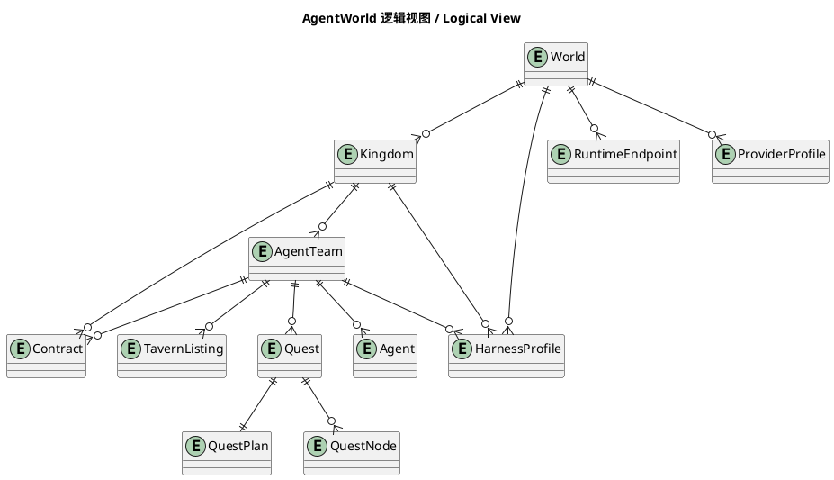
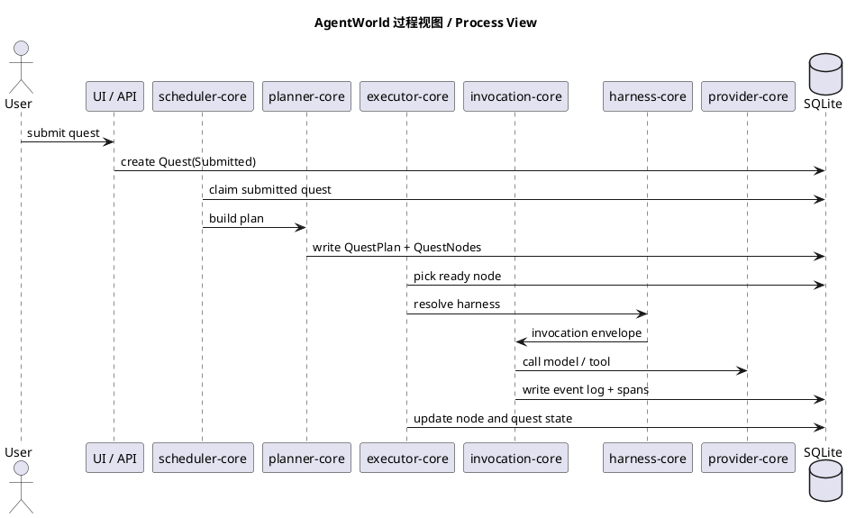
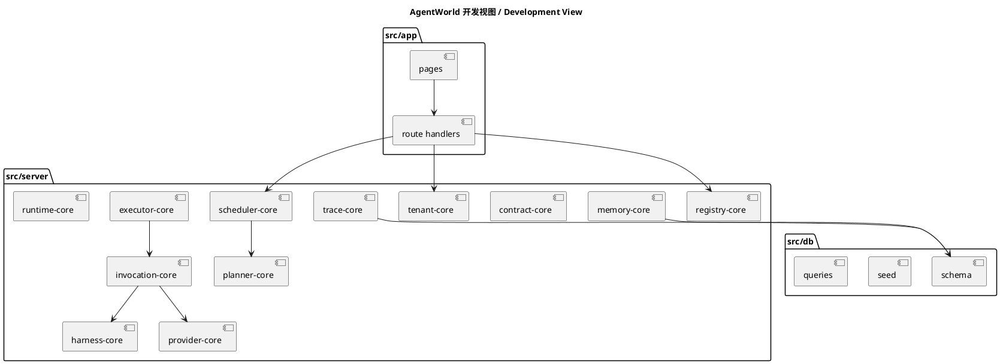
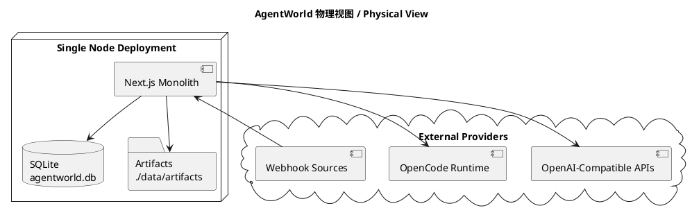
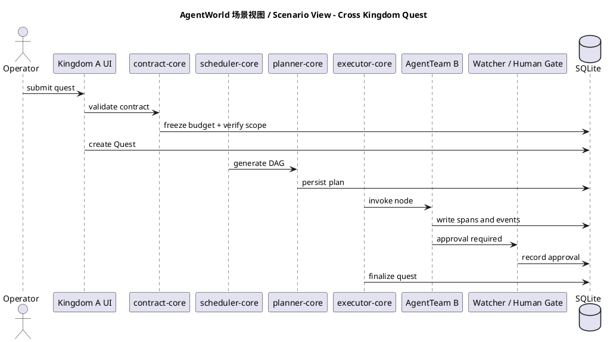
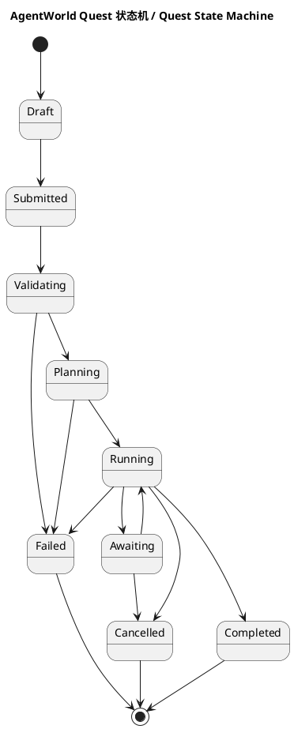
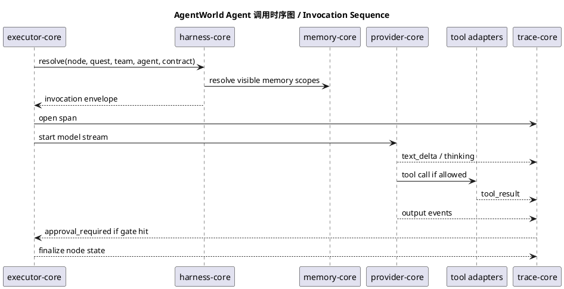

# AgentWorld 详细设计

这份文档是 AgentWorld 的中文详细设计。

它不是概念稿，而是一个面向开发和落地的工程设计。目标很明确：把你提出的 World、Kingdom、AgentTeam、Agent、Tavern、Quest、Contract 这套模型，收敛成一个可以用全栈 TypeScript、单体服务、嵌入式数据库快速实现并持续演进的平台。

## 0. 文档目标

这份设计重点回答六个问题：

1. AgentWorld 到底是什么系统
2. 为什么最终选择单体 TypeScript，而不是再拆一堆服务
3. Quest 的调度、规划、执行、人工干预到底怎么串起来
4. Agent 调用链路怎么被 Harness 工程原则约束
5. World / Kingdom / AgentTeam / Contract / Tavern 这些概念如何落到数据库和 API
6. 第一版代码应该先做哪些部分

## 1. 系统总体定位

### 1.1 一句话定义

AgentWorld 是一个多租户、可编排、可治理、可观察的 AI Agent Runtime 平台，支持跨团队 Agent 服务市场和协同执行。

### 1.2 用人话解释

AgentWorld 不是一个聊天工具。

它也不是一个“接上模型、做几个工具调用”的轻量 Agent 页面。

它更像一个组织操作台：

- World 是顶层租户空间
- Kingdom 是 World 内部的团队空间
- AgentTeam 是团队对外提供能力的服务单元
- Agent 是真正执行步骤的单元
- Quest 是一次被提交、被调度、被执行、被结算的任务
- Tavern 是 AgentTeam 的注册中心和市场
- Contract 是跨 Kingdom 调用的服务合约

## 2. 设计收敛原则

### 2.1 本次设计优化后的硬约束

本项目明确采用下面这组工程边界：

- 全栈 TypeScript
- 单体服务
- 不依赖 Redis、Kafka、Temporal、PostgreSQL、Milvus、S3、Knative 之类额外中间件
- 数据库必须是嵌入式
- 可以一键本地安装和启动
- 允许对接外部 OpenAI 风格模型服务
- 允许发现外部 OpenCode runtime，但平台自身不是一个微服务网格

### 2.2 与原始方案相比，做了哪些收敛

| 原始方向 | 优化后方案 | 原因 |
| --- | --- | --- |
| Control Plane + Runtime Plane 分布式拆分 | 单体服务内的逻辑分层 | 先把领域闭环做通，再决定是否拆分 |
| Quest Scheduler 独立服务 | 进程内调度核 | 调度逻辑本质上是数据库状态机，不需要先上编排系统 |
| Serverless Agent Executor | 进程内 worker slots | MVP 阶段更容易控制成本、日志和人工干预 |
| Redis 短期上下文 | SQLite 表 + 内存缓存 | 嵌入式部署更简单 |
| VectorDB | SQLite FTS5 + 可选 embedding 字段 | 先做够用的检索，不强依赖向量库 |
| S3 | 本地文件系统 artifact store | 单机部署更直接 |
| Docker / WASM Sandbox | Harness 约束 + 受控工具适配器 + 进程级隔离 | 先保证治理，再逐步增强隔离强度 |

### 2.3 这不代表设计退化

收敛成单体不是降级，而是让系统先拥有三件真正重要的能力：

- 明确的领域模型
- 稳定的调度和执行状态机
- 可解释、可审计、可人工介入的调用链

只要这三件事做扎实，后续不管是拆服务还是增加隔离层，都有清晰边界。

## 3. 核心术语

| 术语 | 含义 | 在系统中的职责 |
| --- | --- | --- |
| World | 顶层租户空间 | 隔离配额、策略、模型白名单、顶层风控 |
| Kingdom | World 内部团队 | 团队预算、私有工具引用、私有知识空间 |
| AgentTeam | 服务单元 | 接受输入、编排 Agent、产出标准结果 |
| Agent | 执行单元 | 执行单个步骤、调用模型和工具 |
| Tavern | 市场与注册中心 | 公开展示 AgentTeam，支持招募和订阅 |
| Quest | 任务实例 | 一次真实执行，包含计划、节点、结果和成本 |
| Contract | 服务调用协议 | 约束跨 Kingdom 调用权限、范围、定价和 SLA |
| Harness | 约束层 | 通过工具约束、外部配置和内部策略限制 Agent 行为 |
| Captain Agent | 规划代理 | 生成 Quest DAG 或执行计划 |
| Watcher | 监督组件 | 做输出校验、SLA 检查、成功率判断和人工门禁 |

## 4. 总体架构

### 4.1 总体形态

AgentWorld 使用一个 Next.js 单体服务承载前后端：

- UI 负责工作台、配置页、大屏、任务视图
- Route Handlers 提供 API
- Server Components 直接读取服务层
- 服务层内部按领域拆模块
- SQLite 是唯一持久化数据库
- 本地文件系统保存 artifact、导出文件、附件和运行快照

### 4.2 逻辑分层

虽然是单体服务，但内部仍然分四层：

1. Presentation Layer
2. Application Layer
3. Domain Layer
4. Infrastructure Layer

对应职责如下：

| 分层 | 职责 |
| --- | --- |
| Presentation | 页面、表单、SSE trace 流、管理台、wallboard |
| Application | 用例编排，处理提交 Quest、批准人工门禁、发现 runtime |
| Domain | World、Kingdom、Quest、Contract、Tavern、Harness、Scheduler、Executor 规则 |
| Infrastructure | SQLite、文件系统、OpenCode SDK、OpenAI 接口、Webhook 入站 |

### 4.3 主要模块

| 模块 | 作用 |
| --- | --- |
| tenant-core | 管理 World、Kingdom 及配额和边界 |
| registry-core | 管理 AgentTeam、Agent、Tavern listing |
| contract-core | 管理跨 Kingdom 合约、服务账号和授权 |
| scheduler-core | 负责 schedule tick、排序、抢占、生成待执行 Quest |
| planner-core | 由 Captain Agent 或规则规划器生成 DAG |
| executor-core | 驱动 DAG 节点执行、重试、恢复 |
| invocation-core | 负责单个 Agent 的模型调用、工具调用和流式输出 |
| harness-core | 统一管理提示词、工具、预算、输出和人工门禁约束 |
| memory-core | 管理短期上下文、工作记忆、检索记忆 |
| trace-core | 记录 event log、span、cost、audit log |
| provider-core | 管理 OpenAI 风格 provider、模型路由和限额 |
| runtime-core | 发现 OpenCode runtime，保存健康状态和能力目录 |

## 5. 技术栈

### 5.1 选型

| 层 | 技术 |
| --- | --- |
| 前后端一体 | Next.js + TypeScript |
| UI | React 19 + Server Components |
| API | Next.js Route Handlers |
| 数据库 | SQLite（`node:sqlite`） |
| 校验 | Zod |
| Runtime 发现 | OpenCode SDK |
| LLM 对接 | OpenAI 风格 HTTP 接口 |
| Artifact | 本地文件系统 |
| 搜索 / Memory | SQLite FTS5 |

### 5.2 为什么不引入额外中间件

因为这个项目第一阶段最大风险不是吞吐，而是边界不清。

在边界没有清楚之前，先上 Redis、消息队列、编排系统、向量库，只会让调试和交付更慢。

## 6. 领域模型设计

这一节只写会进入第一版数据库的核心对象。

### 6.1 World

```ts
type World = {
  id: string;
  slug: string;
  name: string;
  ownerUserId: string;
  status: "active" | "suspended" | "archived";
  quotaLimitJson: string;
  modelWhitelistJson: string;
  globalGuardrailsJson: string;
  defaultHarnessId: string | null;
  createdAt: string;
};
```

约束：

- World 是最外层治理边界
- World 级别可以限制模型白名单和总配额
- World 级别 guardrails 会被所有 Kingdom 继承

### 6.2 Kingdom

```ts
type Kingdom = {
  id: string;
  worldId: string;
  slug: string;
  name: string;
  lordUserId: string;
  status: "active" | "suspended" | "archived";
  balance: number;
  creditLimit: number;
  privateToolRefsJson: string;
  privateMemoryNamespace: string;
  policyJson: string;
  createdAt: string;
};
```

约束：

- Kingdom 不能绕过 World 的模型白名单
- privateToolRefs 只保存引用，不存明文 secret
- Kingdom 有独立成本归集和信用额度

### 6.3 AgentTeam

```ts
type AgentTeam = {
  id: string;
  kingdomId: string;
  slug: string;
  name: string;
  description: string;
  captainAgentId: string | null;
  workflowType: "single" | "sequential" | "parallel" | "dag";
  inputSchemaJson: string;
  outputSchemaJson: string;
  maxConcurrency: number;
  timeoutMs: number;
  successRateThreshold: number;
  pricingModelJson: string;
  visibility: "private" | "public";
  defaultHarnessId: string | null;
  createdAt: string;
};
```

约束：

- AgentTeam 是平台对外暴露的服务接口
- 一个 AgentTeam 可以包含多个 Agent
- 如果 visibility 为 public，它才允许进 Tavern

### 6.4 Agent

```ts
type Agent = {
  id: string;
  teamId: string;
  slug: string;
  name: string;
  role: string;
  personaPrompt: string;
  model: string;
  shortTermWindow: number;
  ragConfigJson: string;
  toolBindingsJson: string;
  memoryScope: "private" | "team_shared";
  safetyPolicyJson: string;
  status: "active" | "disabled";
  createdAt: string;
};
```

约束：

- Agent 不直接拥有跨 Kingdom 权限
- Agent 的工具可见性必须经过 Harness 和 Contract 双重校验

### 6.5 Quest

```ts
type Quest = {
  id: string;
  worldId: string;
  kingdomId: string;
  teamId: string;
  sourceType: "manual" | "schedule" | "webhook" | "contract";
  sourceRef: string | null;
  status:
    | "draft"
    | "submitted"
    | "validating"
    | "planning"
    | "running"
    | "awaiting"
    | "completed"
    | "failed"
    | "cancelled";
  priority: number;
  inputPayloadJson: string;
  outputPayloadJson: string | null;
  costEstimate: number;
  costActual: number;
  traceId: string;
  createdAt: string;
  completedAt: string | null;
};
```

### 6.6 QuestPlan 与 QuestNode

```ts
type QuestPlan = {
  id: string;
  questId: string;
  plannerMode: "rule" | "captain_agent";
  dagJson: string;
  summary: string;
  createdAt: string;
};

type QuestNode = {
  id: string;
  questId: string;
  planId: string;
  nodeKey: string;
  agentId: string;
  dependsOnJson: string;
  inputJson: string;
  outputJson: string | null;
  status: "pending" | "ready" | "running" | "awaiting" | "completed" | "failed" | "cancelled";
  attemptCount: number;
  maxAttempts: number;
  startedAt: string | null;
  completedAt: string | null;
};
```

### 6.7 Contract

```ts
type Contract = {
  id: string;
  providerTeamId: string;
  consumerKingdomId: string;
  pricingModelJson: string;
  slaJson: string;
  accessScopeJson: string;
  serviceAccountRef: string;
  status: "draft" | "active" | "suspended" | "expired";
  createdAt: string;
};
```

### 6.8 TavernListing

```ts
type TavernListing = {
  id: string;
  teamId: string;
  resumeJson: string;
  recruitmentMode: "copy" | "subscribe" | "dedicated";
  tagsJson: string;
  status: "listed" | "hidden" | "suspended";
  createdAt: string;
};
```

### 6.9 HarnessProfile

```ts
type HarnessProfile = {
  id: string;
  worldId: string | null;
  kingdomId: string | null;
  teamId: string | null;
  name: string;
  systemInstruction: string;
  toolPolicyJson: string;
  approvalPolicyJson: string;
  budgetPolicyJson: string;
  outputPolicyJson: string;
  securityPolicyJson: string;
  createdAt: string;
};
```

### 6.10 Trace 与 Audit

```ts
type TraceSpan = {
  id: string;
  traceId: string;
  parentSpanId: string | null;
  questId: string;
  nodeId: string | null;
  kind: "quest" | "planning" | "agent" | "tool" | "approval" | "contract";
  status: "open" | "ok" | "error";
  startedAt: string;
  endedAt: string | null;
  attributesJson: string;
};

type EventLog = {
  id: string;
  traceId: string;
  questId: string;
  nodeId: string | null;
  seq: number;
  phase: string;
  foldGroup: string;
  title: string;
  content: string;
  metadataJson: string;
  createdAt: string;
};
```

## 7. Quest 状态机

### 7.1 顶层状态

| 状态 | 含义 |
| --- | --- |
| Draft | 草稿，尚未真正提交 |
| Submitted | 已提交，等待进入校验 |
| Validating | 正在做权限、预算、contract 和 harness 预检 |
| Planning | 正在生成 DAG 或执行计划 |
| Running | 正在执行节点 |
| Awaiting | 等待人工批准或补充输入 |
| Completed | 成功完成 |
| Failed | 执行失败 |
| Cancelled | 被取消 |

### 7.2 关键原则

- Quest 的真实状态以数据库为准，不以内存对象为准
- 每次状态变化都写入 event log
- 人工干预不是旁路，而是正式状态跃迁

## 8. 调度设计

这是平台最重要的部分之一。

### 8.1 为什么不依赖外部编排系统

因为 Quest 调度在第一阶段主要做四件事：

1. 找到到期任务
2. 抢占执行权
3. 生成 Quest
4. 驱动 Quest 从一个稳定状态走向下一个稳定状态

这本质上是数据库状态机，不需要先引入额外 orchestrator。

### 8.2 调度对象

调度核处理三类对象：

- ScheduleTemplate：周期任务模板
- Quest：顶层任务实例
- QuestNode：Quest 内部 DAG 节点

### 8.3 调度循环

单体服务内启动两个轻量循环：

- Schedule Tick：每 5 秒扫描到期 schedule
- Executor Tick：每 1 秒扫描可运行 Quest 与 QuestNode

### 8.4 Schedule Tick 算法

1. 查询 `next_run_at <= now` 的 schedule template
2. 按 World、Kingdom、priority、SLA 排序
3. 用 SQLite 更新语句抢占 lease
4. 生成 Quest
5. 回写下次执行时间

### 8.5 Executor Tick 算法

1. 选择 `status in (submitted, validating, planning, running, awaiting)` 的 Quest
2. 根据当前状态分派到对应处理器
3. 如果 Quest 已经进入 Running，则寻找 `ready` 的 QuestNode
4. 根据 team 的 `max_concurrency` 和 runtime 空闲情况启动节点

### 8.6 优先级

最终优先级由以下因素组成：

- Quest.priority
- Kingdom 是否 VIP
- Contract SLA 等级
- 是否已经等待过人工
- 是否接近超时

## 9. 规划与 DAG 设计

### 9.1 规划入口

每个 Quest 在进入 Running 之前，必须先拥有一个 QuestPlan。

### 9.2 两种规划模式

| 模式 | 使用场景 |
| --- | --- |
| rule | 简单、固定流程 |
| captain_agent | 复杂任务，需要根据输入动态生成 DAG |

### 9.3 Captain Agent 的职责

Captain Agent 只负责三件事：

- 根据输入生成 DAG
- 说明每个节点的目标和依赖
- 给出预估成本和风险提示

Captain Agent 不直接执行重型工具。

### 9.4 DAG 约束

DAG 生成后会经过结构校验：

- 必须无环
- 节点数不能超过 team 的限制
- 每个节点必须绑定明确的 Agent
- 输出必须能映射到 team 的 output schema

### 9.5 节点恢复

如果某个节点失败：

- 可重试节点进入重试队列
- 不可重试节点会让 Quest 进入 Failed 或 Awaiting
- 已完成节点不会被重复执行

## 10. Agent 调用设计

这是另一个最关键的部分。

### 10.1 调用目标

Agent 调用不是一句 prompt 丢给模型这么简单。

在 AgentWorld 里，一次调用是一个受控管线：

1. 构造 InvocationEnvelope
2. 合并 World / Kingdom / Team / Agent Harness
3. 裁剪可见工具和 memory
4. 校验 Contract 范围
5. 选择 provider 和 model
6. 流式执行并写 trace
7. 碰到人工门禁时暂停
8. 做输出校验并回写节点结果

### 10.2 InvocationEnvelope

```ts
type InvocationEnvelope = {
  questId: string;
  nodeId: string;
  worldId: string;
  kingdomId: string;
  teamId: string;
  agentId: string;
  inputJson: string;
  contractId: string | null;
  visibleToolsJson: string;
  visibleMemoryScopesJson: string;
  providerPolicyJson: string;
  harnessProfileId: string;
};
```

### 10.3 为什么调用前要先做 Harness Resolve

因为 Agent 不能自己决定它能做什么。

AgentWorld 采用 Harness 工程思路，把约束前置到调用前：

- 哪些工具可见
- 哪些工具需要人工批准
- 哪些模型允许被使用
- 最大 token、最大步骤数、最大耗时是多少
- 输出是否必须结构化

### 10.4 工具调用链

工具调用会经过四层判断：

1. Agent 自身是否绑定该工具
2. Harness 是否允许
3. Contract 是否允许该访问范围
4. Runtime 安全策略是否允许实际执行

只要有一层不通过，就阻断。

### 10.5 模型调用链

provider-core 会根据下面规则挑选模型：

- World 模型白名单
- Kingdom 成本策略
- Team 默认模型策略
- Agent 指定模型
- fallback 策略

### 10.6 流式输出

所有 Agent 调用都必须产生可观察事件：

- `thinking`
- `tool_call`
- `tool_result`
- `text_delta`
- `approval_required`
- `output_validated`
- `node_completed`

这些事件统一进入 event log，前端用折叠组展示。

## 11. Harness 工程设计

### 11.1 Harness 在 AgentWorld 里的位置

Harness 不是一个可选配置项，而是平台约束层。

所有 Quest 在真正调用 Agent 之前，都要先经过 HarnessResolve。

### 11.2 Harness 的三类约束来源

#### 1. 工具调用约束

- allow list
- block list
- approval-required list
- 每种工具的最大调用次数

#### 2. 外部配置约束

- World 模型白名单
- Kingdom 预算和 credit limit
- Contract access scope
- runtime 健康状态

#### 3. 内部策略约束

- 最大耗时
- 最大 token
- 最大步骤数
- 输出结构校验
- prompt scan / output scan

### 11.3 Harness 解析顺序

最终策略按以下顺序叠加：

1. World Harness
2. Kingdom Harness
3. AgentTeam Harness
4. Agent Safety Policy
5. Contract 附加限制
6. 运行时安全补丁

后面的策略只能收紧，不能放宽。

### 11.4 Harness Preview

在 UI 中，用户可以在真正提交前看到：

- 当前会用哪个 model
- 可见工具有哪些
- 哪些工具会触发人工门禁
- 预算上限是多少
- 任务大概会在哪些地方被阻断

## 12. Tavern 设计

### 12.1 Tavern 的本质

Tavern 不是“聊天应用列表”，而是 AgentTeam 市场。

它展示的是可被别的 Kingdom 招募、订阅或托管的服务单元。

### 12.2 Hero Resume 自动生成

系统会根据 Quest 历史自动计算：

- success_rate
- avg_latency
- avg_cost
- top_tasks
- domain_tags
- recent_failures

### 12.3 招募模式

| 模式 | 含义 |
| --- | --- |
| Copy | 复制一份 team 配置到当前 Kingdom |
| Subscribe | 通过 Contract 调用对方服务 |
| Dedicated | 对方为当前 Kingdom 提供专属托管实例 |

### 12.4 Tavern Sandbox

Tavern 模式下默认强制：

- 禁止写入高风险工具
- 禁止访问 provider 侧密钥明文
- 禁止访问对方 Kingdom 的私有 memory
- 禁止提升模型权限

## 13. Contract 设计

### 13.1 Contract 的作用

Contract 是跨 Kingdom 调用的唯一正式入口。

没有 Contract，就不存在合法跨 Kingdom 服务访问。

### 13.2 调用链

Consumer Kingdom
-> Contract Validate
-> Service Account Scope
-> Provider AgentTeam

### 13.3 Contract 至少定义四件事

- 谁可以调用
- 能调用什么输入输出接口
- 成本怎么算
- SLA 怎么承诺

### 13.4 安全边界

Contract 不会授予下面这些权限：

- 访问对方 Kingdom 的原始 secret
- 访问对方私有 memory 原文
- 访问对方本地文件系统
- 绕过 Tavern Sandbox 直接调用高风险工具

## 14. Memory、Artifact 与 Trace

### 14.1 Memory

第一版不做外部向量库，改为：

- SQLite 短期上下文表
- SQLite FTS5 文本索引
- memory summary 表
- 可选 embedding JSON 字段

### 14.2 Artifact

artifact 保存到本地目录：

- run transcript
- tool output
- exported report
- uploaded attachment

数据库只存 metadata，不把大文件塞进 SQLite。

### 14.3 Trace

Trace 有两层：

- span 适合算耗时、父子关系、成本
- event log 适合展示 thinking、tool call、文本输出

## 15. API 与 UI 设计

### 15.1 左侧导航

第一版建议包含：

- Overview
- Worlds
- Kingdoms
- AgentTeams
- Quests
- Tavern
- Contracts
- Runtimes
- Harness
- Wallboard
- Settings

### 15.2 核心页面

| 页面 | 作用 |
| --- | --- |
| Overview | 总览状态、成本、成功率、待处理 Quest |
| World Detail | World 级配额、模型白名单、治理策略 |
| Kingdom Detail | 团队预算、tool refs、私有任务视图 |
| Quest List | 可筛选的任务列表 |
| Quest Detail | DAG、trace、人工干预、artifact |
| Tavern | 浏览和招募 AgentTeam |
| Contract Center | 查看合约、SLA、费用和权限 |
| Runtime Center | 发现 OpenCode runtime 和健康状态 |
| Harness Center | 查看和预演约束效果 |
| Wallboard | 大屏，展示活跃 agent、开发者、代码仓、Quest 成功率 |

### 15.3 Webhook

Webhook 由单体服务直接暴露：

- path 可配置
- method 可配置
- request schema 可配置
- 目标 AgentTeam 可配置

Webhook 进入系统后先变成 Quest，不直接触发内部执行器。

## 16. 安全与隔离

### 16.1 隔离模型

| 层级 | 第一版实现 |
| --- | --- |
| World | 租户字段隔离，支持后续按 World 拆独立 SQLite 文件 |
| Kingdom | namespace 隔离、预算隔离、工具引用隔离 |
| Agent | memory scope、tool scope、harness scope |
| Contract | API 级范围隔离 |

### 16.2 工具安全

第一版不承诺强 OS 沙箱，而是做到：

- 工具适配器白名单
- cwd allowlist
- 参数 schema 校验
- 网络访问白名单
- 高风险工具人工批准
- 每次调用写审计日志

### 16.3 风控

- prompt scan
- output scan
- PII redaction
- 成本阈值阻断
- 重复失败熔断

## 17. 可观测性与成本

### 17.1 指标

至少统计：

- World cost
- Kingdom cost
- Team cost
- Agent success rate
- Quest latency
- Node retry count
- Human intervention count

### 17.2 成本结算

一次 Quest 的成本至少拆成：

- model token cost
- tool execution cost
- platform fee
- contract revenue share

## 18. 安装与部署

### 18.1 本地启动

1. `pnpm install`
2. `pnpm bootstrap`
3. `pnpm dev`

### 18.2 生产部署

第一版就是一个 Node 服务：

- 一个 Next.js 进程
- 一个 SQLite 文件
- 一个 artifacts 目录

如果后续增长，可以先把 SQLite 文件和 artifact 目录放到稳定磁盘，再考虑拆模块。

## 19. MVP 开发顺序

### Phase 1

- World / Kingdom
- AgentTeam / Agent
- Quest 基本流程
- Harness 核心约束
- 单节点执行
- Trace 页面

### Phase 2

- Captain Agent 规划
- DAG 执行
- Tavern
- Contract
- Wallboard

### Phase 3

- 成本系统
- 更强的 tool 安全隔离
- 每个 World 的独立数据文件
- 更精细的 memory 检索

## 20. 4+1 视图与关键图

下面的图直接内嵌在文档中。

### 20.1 逻辑视图



### 20.2 过程视图



### 20.3 开发视图



### 20.4 物理视图



### 20.5 场景视图



### 20.6 Quest 状态机



### 20.7 Agent 调用时序图



## 21. 结论

AgentWorld 的关键不是把名词堆多，而是把下面这条链路做扎实：

Quest 提交
-> 权限和预算校验
-> 规划 DAG
-> 调度节点
-> 调用 Agent
-> 用 Harness 约束过程
-> 把 trace、成本、人工干预完整记录下来

只要这条链路是清楚的，这个平台就不是一个“会聊天的 demo”，而是一个真正能被团队运营起来的 Agent 系统。
