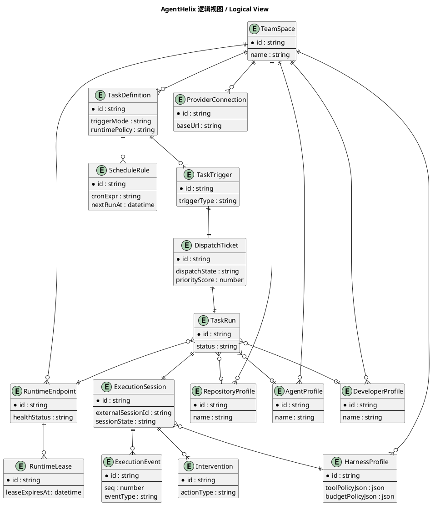
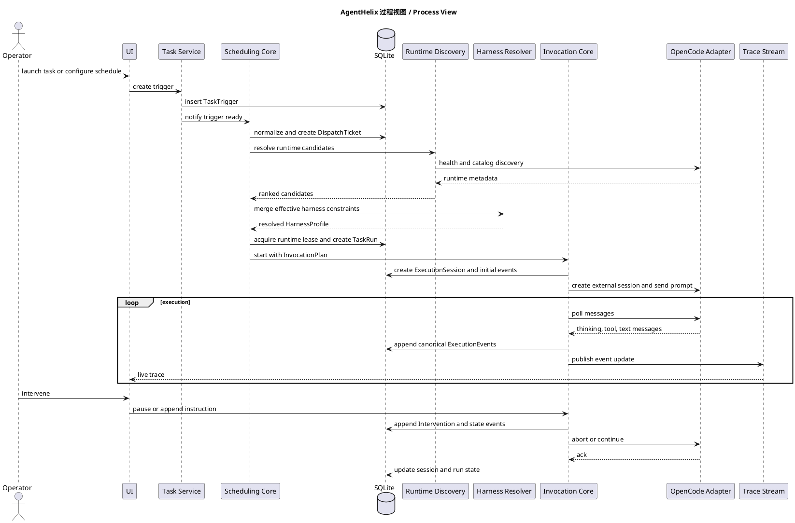
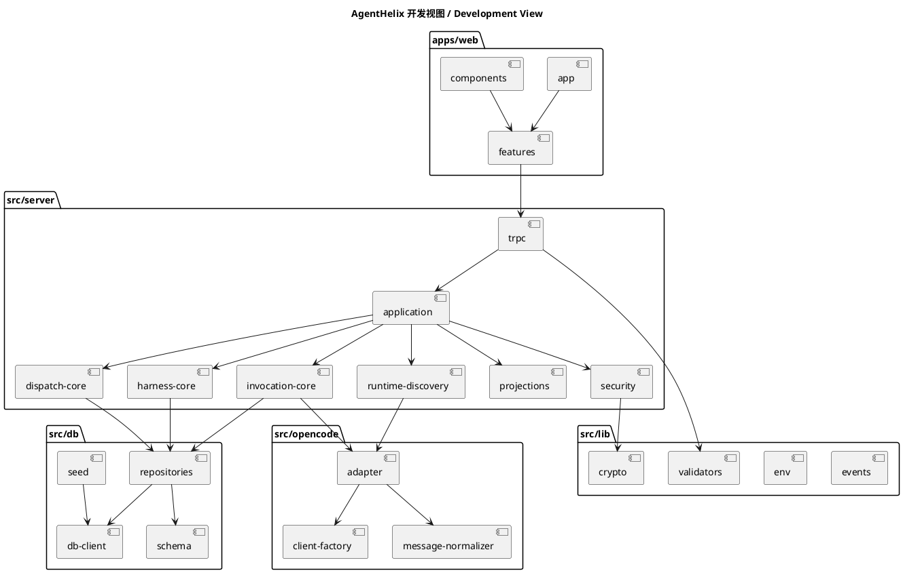
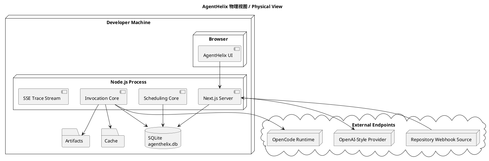
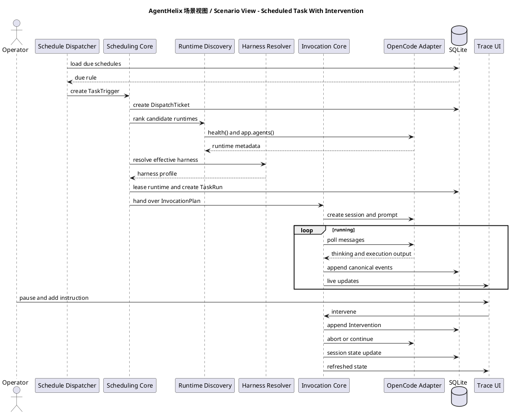
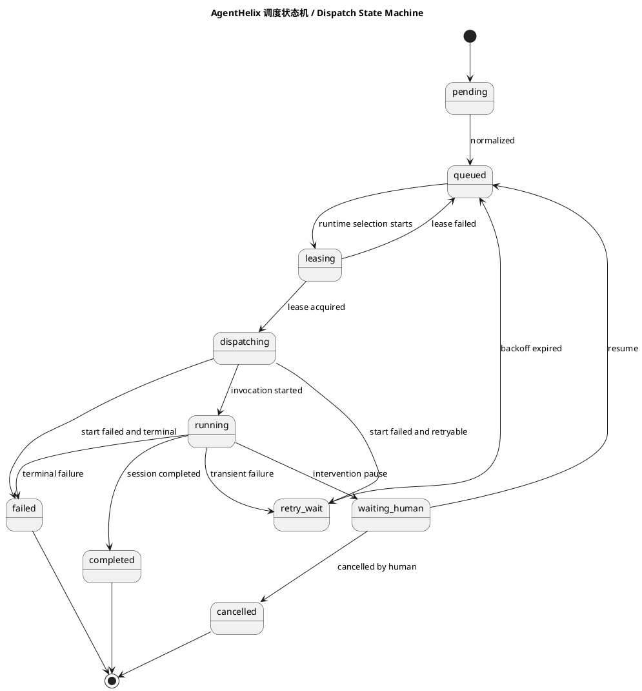
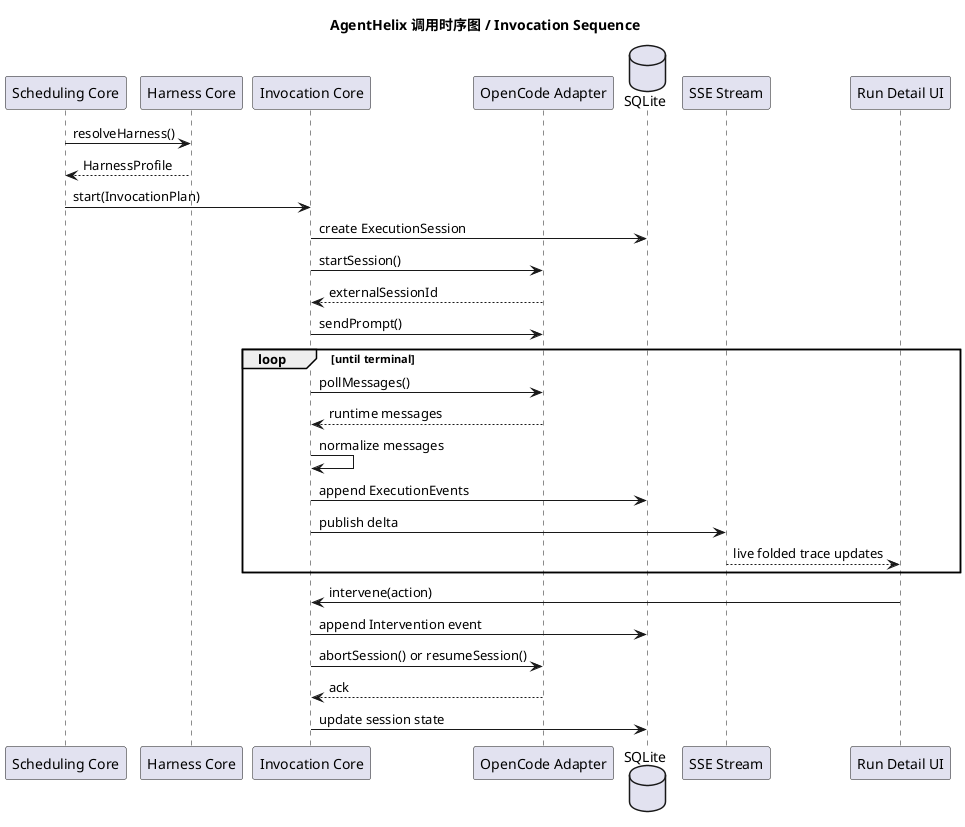

# AgentHelix 详细设计

## 1. 文档目的

这份文档是 AgentHelix 的中文详细设计说明。

目标很明确：

- 把产品要做什么讲清楚
- 把系统怎么分层讲清楚
- 把 Agent 调度怎么做讲清楚
- 把 Agent 调用怎么做讲清楚
- 把数据库、接口、页面、异常处理和人工介入讲清楚

这不是概念性介绍，而是后续真正落代码时可以直接参考的设计文档。

## 2. 项目定位

AgentHelix 是一个给团队使用的 Agent 平台。

它不是单纯的聊天产品，也不是只会定时跑脚本的任务平台。它的目标是让团队把 Agent 当成一种“可调度、可观察、可接管”的执行能力来使用。

平台最终要解决的是下面这些非常实际的问题：

- 不同团队怎么管理自己的任务和配置
- 定时任务怎么稳定执行
- Agent runtime 怎么发现和选择
- 一次任务到底经历了什么
- 任务跑到一半时人怎么接手
- 出问题时如何看清楚是调度问题还是调用问题

## 3. 目标能力

### 3.1 产品能力

- 支持 Team Space
- 支持任务模板和任务运行记录
- 支持手工触发、定时触发、Webhook 触发
- 支持 OpenCode runtime 发现
- 支持 OpenAI 风格接口配置
- 支持 trace 页面查看 thinking、执行过程、文本输出
- 支持人工暂停、继续、取消、补充指令
- 支持团队视角和大屏视角
- 支持活跃 agent、活跃开发者、活跃仓库三类统计

### 3.2 技术约束

- 技术栈必须全部是 TypeScript
- 数据库必须是嵌入式数据库
- 前后端必须一体化
- 安装必须简单，最好一条命令就能初始化

## 4. 设计原则

### 4.1 先把状态做清楚，再去做调用

任务来了以后，不能马上就调用 Agent。必须先形成清晰的调度状态，否则后面会很难排查。

### 4.2 调度和调用必须分开

调度负责决定“谁来跑”，调用负责决定“怎么跑”。两者不能混在一个模块里。

### 4.3 所有重要动作都要留痕

任务进入队列、选中 runtime、开始执行、人工介入、调用失败，这些都必须形成结构化记录。

### 4.4 UI 要像操作台，而不是展示页

界面需要清晰、克制、好扫读，有一点 Anthropic 的克制感，但本质上是运营控制台，不是品牌官网。

### 4.5 Harness 是平台约束层，不是单独一段 Prompt

在 AgentHelix 里，Harness 不只是 system prompt，也不只是“让模型听话一点”的经验技巧。

它是平台用来约束 Agent 行为的正式机制，至少覆盖三类东西：

- 工具调用边界
- 外部配置输入
- 内部策略限制

换句话说，AgentHelix 不是把模型接进来就让它自由发挥，而是用 Harness 把它包在一个可控边界里。

## 5. 技术栈

### 5.1 应用层

- Next.js App Router
- React
- TypeScript
- tRPC
- Zod
- TanStack Query
- Zustand
- Tailwind CSS
- shadcn/ui
- Framer Motion

### 5.2 数据层

- SQLite
- better-sqlite3
- Drizzle ORM
- drizzle-kit

### 5.3 调度与调用层

- cron-parser
- `@opencode-ai/sdk`
- Server-Sent Events

### 5.4 为什么这样选

这样选主要是因为：

- TypeScript 全栈一致，开发和维护成本低
- SQLite 不需要单独部署服务，适合一键安装
- Next.js 可以把 UI、接口和服务逻辑放在一个工程里
- OpenCode SDK 能直接覆盖 runtime 发现和 session 调用

## 6. 系统分层

系统分成四层：

1. 产品界面层
2. 应用服务层
3. 调度与调用核心层
4. 基础设施层

### 6.1 产品界面层

负责：

- 左侧导航
- 团队空间切换
- 任务列表
- 运行列表
- runtime 页面
- Webhook 页面
- 设置页面
- Wallboard 大屏
- trace 详情页

### 6.2 应用服务层

负责：

- 创建任务
- 管理 team space
- 接收 webhook
- 管理 schedule
- 管理 provider 配置
- 提供 dashboard 和大屏查询

### 6.3 调度与调用核心层

这是最重要的一层，拆成两块：

- 调度核心
- 调用核心

调度核心只负责：

- 接任务
- 排队
- 选 runtime
- 分配并发
- 决定重试或等待人工

调用核心只负责：

- 建立 OpenCode session
- 发起 prompt
- 获取消息
- 归一化事件
- 写 trace
- 处理暂停、继续、取消

### 6.4 基础设施层

负责：

- SQLite 持久化
- 文件存储
- provider 密钥加密
- SSE 推送
- OpenCode SDK 连接

## 7. 核心数据对象

这部分尽量不用过多术语，只保留真正关键的对象。

### 7.1 TeamSpace

表示一个团队空间。

作用：

- 隔离任务
- 隔离 runtime
- 隔离 provider 配置
- 隔离 webhook
- 隔离 dashboard 统计

### 7.2 TaskDefinition

表示一个任务模板。

它定义：

- 任务名称
- 任务说明
- 触发方式
- 输入结构
- 默认优先级
- 运行策略

### 7.3 TaskTrigger

表示“一次任务触发”。

来源可以是：

- 用户手工点击执行
- schedule 到点触发
- webhook 请求触发

### 7.4 DispatchTicket

这是调度层里最关键的对象。

它的意义是：

- 一次任务已经进入调度队列
- 系统还没真正开始调用 runtime
- 可以在这里做排队、选 runtime、重试、等待人工

如果没有这个对象，系统很快就会把“任务请求”和“任务执行”混在一起。

### 7.5 TaskRun

表示用户看到的一次运行记录。

它是面向产品的对象，用于：

- 运行列表展示
- 团队视图展示
- 大屏统计

### 7.6 ExecutionSession

表示真正的执行会话。

它会关联：

- TaskRun
- 选中的 runtime
- 外部 OpenCode session id
- 当前调用状态

### 7.7 ExecutionEvent

表示执行过程里的一个事件。

事件可能是：

- thinking 片段
- 工具调用开始
- 工具输出
- 工具结束
- 文字输出
- 人工干预
- 系统状态变化

### 7.8 RuntimeEndpoint

表示一个可用的 OpenCode runtime 地址。

它要保存：

- base URL
- 健康状态
- 可用 agent 列表
- 可用 provider 列表
- 并发限制

### 7.9 ScheduleRule

表示定时规则。

最关键的字段不是 cron 本身，而是：

- `nextRunAt`

因为真正调度时，系统查的是“现在有哪些任务到点了”。

### 7.10 Intervention

表示一次人工介入。

介入动作包括：

- 补充说明
- 暂停
- 继续
- 取消
- 审批
- 驳回

### 7.11 ProviderConnection

表示一个 OpenAI 风格模型配置。

关键字段：

- base URL
- API key
- 默认模型
- 模型列表

### 7.12 HarnessProfile

这是 AgentHelix 为了落实 Harness 工程原则而引入的关键对象。

它表示某一次任务运行时，平台最终生效的约束集合。

建议至少包含：

- systemInstruction
- toolPolicyJson
- approvalPolicyJson
- budgetPolicyJson
- outputPolicyJson
- contextPolicyJson

HarnessProfile 不是只来自一个地方，而是多层合并结果：

1. 平台默认基线
2. Team Space 级别约束
3. TaskDefinition 级别约束
4. Runtime 自身能力交集

### 7.13 Harness 约束如何作用到系统

Harness 约束分三层：

第一层是工具调用约束：

- 哪些工具允许调用
- 哪些工具需要审批
- 哪些工具完全禁止
- 工具参数 schema
- 工具调用次数限制

第二层是外部配置约束：

- 当前 team space 绑定的 provider
- task definition 的 runtime policy
- webhook 输入映射
- 仓库和上下文绑定关系

第三层是内部策略约束：

- 最大运行时长
- 最大 step 数
- 最大重试次数
- 最大并发
- 强制人工中断点
- trace 输出大小限制

这三层约束最后会合并成一个 HarnessProfile，并进入调度和调用流程。

## 8. 最关键部分一：Agent 调度设计

这一部分是整个系统的核心。

### 8.1 调度到底要解决什么问题

调度不是“拿到任务就去调 Agent”。

调度要解决的是：

- 一个任务什么时候进入执行
- 这个任务应该交给哪个 runtime
- runtime 没空怎么办
- runtime 不健康怎么办
- 定时任务怎么避免重复触发
- 人工暂停以后如何恢复
- 某次失败到底是要重试还是直接失败

### 8.2 为什么必须有调度票据

AgentHelix 明确要求所有任务先变成 `DispatchTicket` 再进入运行。

原因很直接：

1. 可以看到排队状态
2. 可以明确记录重试次数
3. 可以在调度阶段做人工操作
4. 可以把“排队问题”和“调用问题”分开

### 8.3 调度流程

完整流程如下：

1. 接收触发
2. 归一化输入
3. 计算优先级
4. 创建 DispatchTicket
5. 选择候选 runtime
6. 抢占 runtime 槽位
7. 创建 TaskRun 和 ExecutionSession
8. 生成 InvocationPlan
9. 交给调用核心

### 8.4 触发归一化

触发来源虽然有三种，但进入调度层之后必须变成统一格式。

归一化后至少包含：

- teamSpaceId
- taskDefinitionId
- triggerType
- 有效输入 payload
- 请求人信息
- 优先级基础值

这样后续调度逻辑就不需要再关心它是从按钮点出来的，还是从 webhook 打进来的。

### 8.5 优先级计算

优先级不建议做得太复杂，但必须有规则。

推荐计算方式：

- 任务默认优先级
- 触发方式加权
- 延迟时间加权
- 人工升级加权
- 重试惩罚

一个简单可解释的公式可以是：

`priority = base + triggerWeight + latenessWeight + escalationWeight - retryPenalty`

重点不是公式多复杂，而是：

- 结果可解释
- 日志可追溯
- 大屏能说明白

### 8.6 Runtime 选择策略

runtime 选择分两步：

第一步过滤：

1. 必须属于当前 team space
2. 必须启用
3. 必须健康
4. 必须支持任务需要的 agent 能力
5. 必须还有空余并发

第二步排序：

1. 是否命中任务偏好的 runtime
2. 最近同类任务在该 runtime 是否成功过
3. 当前剩余并发是否更多
4. 最近延迟是否更低
5. 最近失败率是否更低

除此之外，还必须额外检查一条：

6. 这个 runtime 是否满足当前 HarnessProfile 对工具、审批和预算的要求

### 8.7 为什么需要 runtime 槽位和租约

如果 runtime 并发是 4，那么同一时刻最多只能有 4 个任务占用它。

所以系统不能只记录“选中了哪个 runtime”，还要记录：

- 有没有成功占到一个执行槽位
- 这个槽位占用多久
- 如果进程异常退出，这个槽位什么时候自动释放

这就是租约的作用。

租约需要保存：

- runtimeId
- taskRunId
- leaseToken
- leaseExpiresAt

### 8.8 调度状态机

推荐状态如下：

- `pending`
- `queued`
- `leasing`
- `dispatching`
- `running`
- `waiting_human`
- `retry_wait`
- `completed`
- `failed`
- `cancelled`

核心理解：

- `pending`：任务刚进入系统
- `queued`：可以排队等待
- `leasing`：正在申请 runtime 槽位
- `dispatching`：已经准备执行，正在和调用层交接
- `running`：已经执行中
- `waiting_human`：被人工动作阻塞
- `retry_wait`：等待下次重试

### 8.9 定时任务的专门优化

这块必须单独强调。

AgentHelix 不会给每条 schedule 启一个独立 timer。这样做在数量一多时会非常乱。

正确做法是：

- 所有 schedule 存进 SQLite
- 每条 schedule 保存 `nextRunAt`
- 调度循环按时间窗口扫描到点任务
- 每次触发后再计算下一次 `nextRunAt`

这样有四个好处：

1. 重启以后可以直接恢复
2. 不需要维护大量内存 timer
3. 可以方便做大屏和列表展示
4. 可以很清楚地处理重复触发和租约过期

### 8.10 定时任务如何避免重复触发

避免重复触发的关键是：

- schedule 自己也要有 lease

处理流程：

1. 调度循环找到到点的 schedule
2. 先尝试给 schedule 加租约
3. 加租约成功，才创建 TaskTrigger
4. 创建成功后，更新 `nextRunAt`

这样即使进程崩溃，也可以通过租约过期来恢复。

### 8.11 调度失败分类

调度失败大致分四类：

1. 找不到可用 runtime
2. runtime 都满了
3. runtime 不健康
4. 调度本身的数据异常

建议处理策略：

| 失败类型 | 处理方式 |
|---|---|
| 找不到 runtime | 进入 `retry_wait` |
| runtime 满了 | 回到 `queued` |
| runtime 不健康 | 进入 `retry_wait` 并降权 |
| 数据异常 | 直接失败并报警 |

### 8.12 人工介入如何影响调度

人工介入不是 UI 附带动作，而是会改变调度状态。

例如：

- 手工暂停：`running -> waiting_human`
- 手工继续：`waiting_human -> queued`
- 手工取消：`running -> cancelled`

只有这样，调度状态和 trace 才能保持一致。

## 9. 最关键部分二：Agent 调用设计

### 9.1 调用层的职责

调度层把任务交给调用层以后，调用层负责：

- 建立 OpenCode client
- 创建 session
- 发送 prompt
- 拉取消息
- 转换为内部事件
- 推送给前端
- 支持暂停、恢复、终止

### 9.2 为什么调用层不能写在调度器里

如果把调用逻辑写在调度器里，会有几个问题：

- runtime 适配逻辑和调度逻辑混在一起
- trace 逻辑无法独立演进
- 将来换 runtime 时改动面太大

所以这里必须有单独的调用核心。

### 9.3 InvocationPlan

调度层交给调用层的，不应该是一堆散参数，而应该是一个标准对象。

建议叫 `InvocationPlan`。

里面至少包括：

- taskRunId
- sessionId
- runtimeEndpoint
- instruction
- payload
- providerRef
- harnessProfile
- timeoutPolicy
- interventionPolicy
- tracePolicy

这样调用层只做执行，不重新做调度判断。

### 9.4 OpenCode 调用步骤

实际调用分成以下步骤：

1. 根据 runtime endpoint 创建 OpenCode client
2. 创建外部 session
3. 把任务说明和输入发给 session
4. 轮询或流式获取 session 消息
5. 将消息转换成 AgentHelix 内部事件
6. 事件落库
7. 通过 SSE 推送给前端
8. 更新 session 和 run 状态

### 9.5 内部事件为什么要做归一化

OpenCode 的返回格式是 runtime 自己的格式。

如果前端直接依赖这个格式，就会出现两个问题：

1. 一旦 SDK 升级，前端可能要跟着改
2. 将来接第二种 runtime 时，前端没法复用

所以 AgentHelix 需要自己的内部事件模型。

推荐事件类型：

- `thinking.delta`
- `thinking.block`
- `tool.started`
- `tool.output`
- `tool.finished`
- `text.output`
- `runtime.status`
- `human.intervention`
- `session.completed`
- `session.failed`

### 9.6 thinking、执行、文本输出如何分组

为了让 trace 能好看地折叠，事件不能只是原样保存。

保存前就要先按业务语义分组：

- thinking 连续片段合并成思考块
- 一次工具调用合并成一个执行块
- 连续文本输出合并成一个输出块
- 人工动作单独作为高亮块

这样前端只需要按组渲染，不需要临时猜测怎么折叠。

### 9.7 调用状态

ExecutionSession 建议使用这些状态：

- `bootstrapping`
- `invoking`
- `streaming`
- `paused`
- `completed`
- `failed`
- `aborted`

调度状态和调用状态不要混成一个字段。

原因：

- 调度状态描述的是排队和调度过程
- 调用状态描述的是 session 执行过程

### 9.8 人工介入如何进入调用链路

人工动作分三类：

1. 追加说明并继续
2. 暂停等待
3. 终止执行

处理顺序必须固定：

1. 先写 Intervention 记录
2. 再写 ExecutionEvent
3. 再向 runtime 发控制命令

这样事后回放时顺序才不会乱。

### 9.9 调用失败分类

调用失败至少要分成这些情况：

- session 创建失败
- prompt 发送失败
- 消息流中断
- runtime 超时
- runtime 主动终止
- provider 配置错误

每种失败都要保存四类信息：

- failureType
- retryable
- summary
- rawPayload

### 9.10 调用恢复设计

恢复有两层：

1. 平台内部恢复
2. 外部 runtime 恢复

如果 OpenCode session 还能继续，就直接继续。

如果 OpenCode session 不能继续，也不能让整个平台失去恢复能力。此时应该：

- 根据历史事件和 checkpoint 重新生成一个简短上下文
- 重新创建外部 session
- 继续执行

这就是“平台 session 要独立于 runtime session”的原因。

### 9.11 Harness 在调用链路里怎么落地

Harness 在调用层里不能只是一个抽象概念，必须真正落到执行点上。

至少要落到下面四个位置：

1. Prompt 约束
   - systemInstruction
   - 任务上下文边界
   - 输出格式要求
2. Tool 约束
   - allowedTools
   - blockedTools
   - approvalRequiredTools
3. Budget 约束
   - maxRuntimeMs
   - maxSteps
   - maxToolCalls
4. Human Gate
   - 哪些动作必须停下来等人
   - 哪些动作允许继续

这样才能保证 Harness 不是“写在文档里”，而是真的进入调用控制面。

## 10. 数据库设计

这里不把所有字段写得过细，但把关键表明确下来。

### 10.1 表清单

- `team_spaces`
- `task_definitions`
- `task_triggers`
- `dispatch_tickets`
- `task_runs`
- `execution_sessions`
- `execution_events`
- `runtime_endpoints`
- `runtime_leases`
- `schedule_rules`
- `interventions`
- `provider_connections`
- `harness_profiles`
- `repository_profiles`
- `agent_profiles`
- `developer_profiles`
- `webhook_endpoints`

### 10.2 最关键的索引

- `schedule_rules(next_run_at, is_paused)`
- `dispatch_tickets(dispatch_state, next_attempt_at, priority_score)`
- `execution_events(session_id, seq)`
- `runtime_endpoints(team_space_id, health_status)`
- `task_runs(team_space_id, started_at desc)`

### 10.3 为什么 execution_events 要单独成表

因为 trace 数据增长会很快。

如果把 trace 直接塞到 `task_runs` 或 `execution_sessions` 一条 JSON 里，会很难做：

- 分页
- 折叠
- 局部加载
- 实时更新

### 10.4 为什么 harness_profiles 也要落库

只在 TaskDefinition 上存一份 Harness 模板是不够的。

运行时还应该保存一份“实际生效版本”，原因有三个：

1. 便于审计
2. 便于回放
3. 便于比较不同 Harness 配置下的运行结果

## 11. API 设计

### 11.1 页面查询接口

- `teamSpaces.list`
- `tasks.list`
- `runs.list`
- `runs.detail`
- `runtimes.list`
- `wallboard.summary`
- `providers.list`
- `webhooks.list`

### 11.2 命令接口

- `tasks.trigger`
- `tasks.pause`
- `tasks.resume`
- `tasks.cancel`
- `runtimes.discover`
- `harness.preview`
- `schedules.save`
- `providers.save`
- `webhooks.save`

### 11.3 SSE 接口

- `GET /api/runs/:id/stream`

用于实时向 trace 页面推送新增事件。

## 12. 页面设计

### 12.1 总体布局

- 左侧边栏
- 顶部团队切换和搜索
- 主工作区
- 右侧详情区按需出现

### 12.2 左侧边栏

建议菜单：

- Overview
- Team Spaces
- Tasks
- Schedules
- Runs
- Runtimes
- Agents
- Developers
- Repositories
- Webhooks
- Wallboard
- Harness
- Settings

### 12.3 任务页

任务页要能看见：

- 任务模板
- 最近运行
- 当前状态
- 触发方式
- 下一次 schedule

### 12.4 运行详情页

这是最重要的页面之一。

必须能看见：

- 当前状态
- 所属 team space
- 所选 runtime
- 调度状态
- 调用状态
- thinking
- execution
- text output
- human actions
- 当前 HarnessProfile 摘要
- 当前允许工具集合
- 当前预算消耗

### 12.5 大屏 Wallboard

大屏建议展示：

- 当前运行数
- 今日成功率
- 即将触发的 schedule
- runtime 健康度
- 活跃 agent
- 活跃开发者
- 活跃仓库

## 13. Webhook 设计

Webhook 的作用不是直接执行业务逻辑，而是把外部事件变成统一的 `TaskTrigger`。

处理流程：

1. 校验签名或密钥
2. 校验请求 schema
3. 转换输入
4. 创建 TaskTrigger
5. 交给调度层

这样 webhook 不会变成平台里的“特殊旁路”。

## 14. Provider 配置设计

每个 team space 可以配置自己的 OpenAI 风格接口。

配置项包括：

- name
- baseUrl
- apiKey
- defaultModel
- modelsJson

安全要求：

- apiKey 加密后存 SQLite
- 保存后不再回显
- 只有 server 端可以解密使用

## 15. 安全与异常处理

### 15.1 安全要求

- provider key 不回传前端
- webhook secret 不明文返回
- 人工介入动作必须留痕
- 任务取消、审批、恢复都要写事件
- Harness 规则变更必须留版本

### 15.2 常见异常

- runtime 离线
- OpenCode session 创建失败
- provider 不可用
- SSE 中断
- SQLite 被长事务阻塞
- 工具调用超出 Harness 预算
- runtime 返回不符合约束的输出

### 15.3 处理策略

- runtime 离线：任务回到调度等待或失败
- provider 不可用：快速失败
- SSE 中断：前端重连，后端按 seq 增量补发
- SQLite 长事务：缩短写事务，事件按批次写入
- 超出 Harness 预算：立即暂停或失败
- 违反 Harness 约束：写审计事件并阻断继续执行

## 16. 安装与部署

### 16.1 本地安装目标

用户希望尽量简单，所以安装流程建议是：

1. `pnpm install`
2. `pnpm bootstrap`
3. `pnpm dev`

### 16.2 pnpm bootstrap 要做什么

- 复制 `.env.example` 到 `.env.local`
- 生成本地加密 master key
- 初始化 SQLite
- 执行 migration
- 插入演示数据

## 17. 4+1 视图与关键图

下面的图直接嵌在文档里，阅读时不用再跳文件。

### 17.1 逻辑视图

### 17.2 过程视图

### 17.3 开发视图

### 17.4 物理视图

### 17.5 场景视图

### 17.6 调度状态机

### 17.7 调用时序图

## 18. 实施顺序

建议按下面顺序落地：

1. 先做 SQLite schema 和基础实体
2. 再做调度核心
3. 再做 OpenCode 调用核心
4. 再做 trace UI
5. 再做人工干预、Webhook、Wallboard

这个顺序的理由是：

- 调度和调用是最核心的能力
- UI 可以建立在稳定的数据和状态之上
- 后续功能扩展不会反复推翻底层结构

## 19. 总结

如果只记住一句话，这份设计最重要的意思就是：

任务来了，不要直接调 Agent；先把调度状态做清楚，再把调用链路做清楚。

只有这样，AgentHelix 才能做到：

- 好安装
- 好理解
- 好排查
- 好协作
- 好扩展

## 20. Harness 设计参考

这版设计特别参考了 Harness 工程的一些核心原则：

- session、harness、runtime 要解耦
- 工具调用必须被明确约束
- 外部配置不能游离在运行时之外
- 内部预算和审批点必须是硬规则

落到 AgentHelix 上，结论就是：

- Harness 要变成平台对象
- Harness 要同时进入调度和调用
- Harness 要能被记录、被审计、被回放
