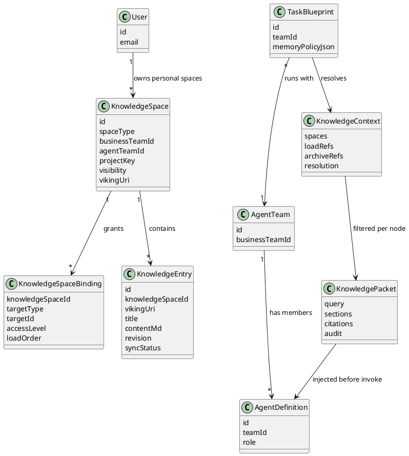
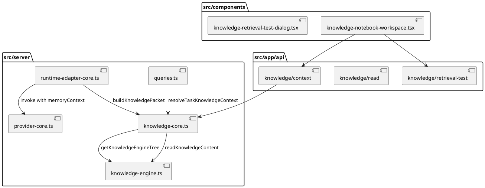
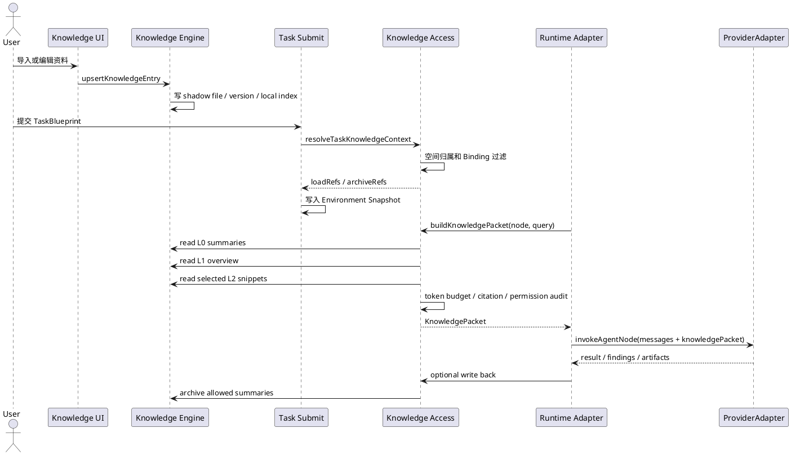
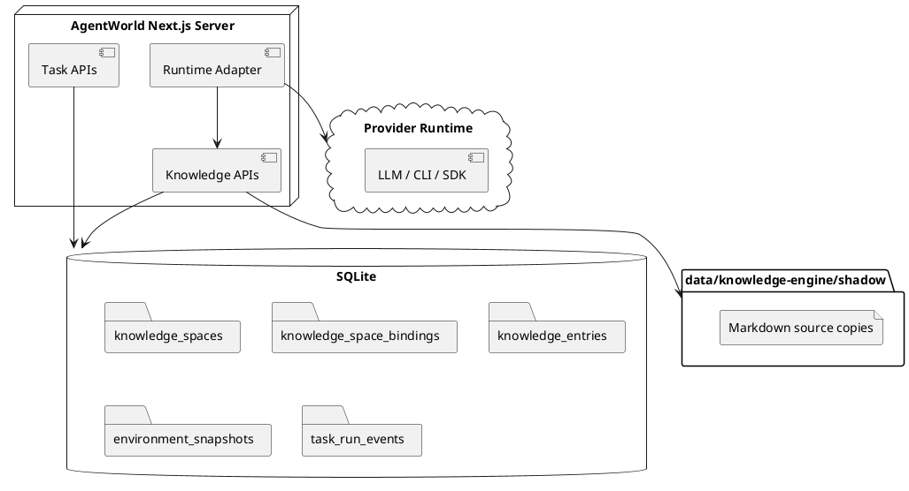

# Agent 知识访问设计

## 1. 定位

Agent 知识访问层负责回答一个问题：用户沉淀在知识库里的资料，如何被 Agent 在任务运行时可靠、可审计、可授权地读取。

该层不等同于知识库 UI，也不等同于模型 Prompt 拼接。知识库 UI 负责创建、编辑和预览知识；知识访问层负责在 TaskRun、Runtime Session 和 ProviderAdapter 调用前生成受控的 Knowledge Context，并把允许读取的知识片段注入 Agent 调用上下文。

当前项目已有以下基础能力：

- 知识使用 `agentworld://knowledge/` URI 作为稳定地址。
- Knowledge Space 支持 `global`、`team`、`project`、`agent_team` 四类空间。
- `resolveTaskKnowledgeContext()` 会在任务提交时解析可加载空间、写入 Environment Snapshot，并记录 `memory.context_resolved` 事件。
- `readKnowledgeContent(uri, level)` 支持 L0、L1、L2 三层读取。
- `runKnowledgeRetrievalTest()` 已能按空间执行 L0 / L1 / L2 检索测试。

当前仍需补齐的关键能力：

- 个人知识空间和显式授权模型。
- Agent 调用前的标准 Knowledge Packet 生成器。
- ProviderAdapter 输入中的知识引用、摘录和引用审计。
- Agent 输出到知识库的受控写回闭环。

## 2. 设计目标

- 用户知识默认不被所有 Agent 直接读取，必须通过空间归属、绑定或显式授权进入可读范围。
- Agent 在运行时先读取摘要和结构，再按需读取原文，避免把整个知识库塞进 Prompt。
- 每次知识读取都能追踪到 TaskRun、节点、Agent、URI、层级、版本和权限决策。
- 支持团队知识、项目知识、Agent Team Skill 和个人记忆统一检索。
- 支持知识持续更新，Agent 读取时能感知 revision 和 source mutation policy。
- 支持未来多 Provider、多 Agent 协作时的最小必要上下文传递。

## 3. 核心概念

### 3.1 Knowledge Space

Knowledge Space 是知识授权和检索的最小运营单元。

现有类型：

- `global`：全局知识。默认可作为只读背景知识进入任务。
- `team`：业务团队知识。默认同业务团队 Agent Team 可读，同团队拥有写权限。
- `project`：项目知识。通过 `project_key`、仓库或任务输入匹配。
- `agent_team`：Agent Team 专属 Skill、方法论和输出规范。

建议新增类型：

- `personal`：个人知识或用户记忆。默认私有，只能由创建人和显式授权的 Agent、Agent Team 或 Task Blueprint 读取。

### 3.2 Knowledge Binding

Knowledge Binding 定义一个知识空间可以被谁读取或写入。

现有绑定目标：

- `business_team`
- `agent_team`
- `task_blueprint`
- `agent_definition`
- `project`

建议新增绑定目标：

- `user`
- `runtime_session`

访问级别：

- `read`：允许作为上下文读取。
- `write`：允许写回、修订或沉淀任务总结。
- `archive`：允许归档运行输出，但不默认读取。

### 3.3 Knowledge Context

Knowledge Context 是任务实例化后生成的不可变知识解析结果。它应进入 Environment Snapshot，而不是在每个节点临时重新猜测。

```yaml
knowledgeContext:
  policy:
    retrievalMode: scoped-layered
    maxL0Spaces: 8
    maxL1Items: 12
    maxL2Chars: 12000
  spaces:
    - id: space_llm_wiki
      source: team
      name: LLM Wiki
      vikingUri: agentworld://knowledge/resources/teams/global/default/discovery-url
      accessLevel: write
      loadOrder: 40
  loadRefs:
    - name: LLM Wiki
      vikingUri: agentworld://knowledge/resources/teams/global/default/discovery-url
      accessLevel: read
      loadOrder: 40
  archiveRefs:
    - name: 运行总结
      vikingUri: agentworld://knowledge/user/memories/agentworld/task-feedback
      accessLevel: archive
      loadOrder: 180
  resolution:
    teamId: agent_team_x
    businessTeamId: business_team_y
    blueprintId: blueprint_z
    environmentId: env_a
    projectKey: repo_or_project
    resolvedAt: 2026-06-07T00:00:00.000Z
```

### 3.4 Knowledge Packet

Knowledge Packet 是传给单个 Agent 节点的知识上下文包。它由 Knowledge Context 生成，但会按节点角色、Agent 权限、查询意图和 token 预算进一步裁剪。

```yaml
knowledgePacket:
  taskRunId: run_001
  nodeId: node_research
  agentId: agent_researcher
  query: "如何按 LLM Wiki 方式维护知识库"
  citations:
    - uri: agentworld://knowledge/resources/teams/global/default/discovery-url/e7b146...
      level: L2
      revision: 3
      title: LLM Wiki
  sections:
    - title: 空间摘要
      level: L0
      content: "该空间包含 LLM Wiki 方法论、知识更新策略和资料导入记录。"
    - title: 结构概览
      level: L1
      content: "核心概念 / persistent wiki / source ingestion / update policy"
    - title: 原文摘录
      level: L2
      content: "The idea here is different..."
  audit:
    permissionDecision: allow
    maxCharsApplied: 12000
    generatedAt: 2026-06-07T00:00:00.000Z
```

## 4. 4+1 视图

### 4.1 逻辑视图



### 4.2 开发视图



需要新增或补强的模块：

- `src/server/knowledge-access.ts`：封装权限过滤、检索计划、Knowledge Packet 生成。
- `src/server/knowledge-audit.ts`：记录 `knowledge.read`、`knowledge.injected`、`knowledge.write_requested` 事件。
- `src/app/api/knowledge/access-preview`：给 UI 展示“某个 Agent 为什么能读这些知识”。
- `src/components/agent-knowledge-access-panel.tsx`：在 Agent、Agent Team、Task Blueprint 里展示知识来源和授权状态。

### 4.3 进程视图



### 4.4 物理视图



### 4.5 场景视图

场景：用户把 Karpathy 的 LLM Wiki 导入知识库，另一个 Agent 要在任务中使用它。

1. 用户通过 URL 导入，系统创建 `KnowledgeEntry`，写入 `knowledge_entries`，同时写入本地 shadow Markdown。
2. 该条知识属于某个 Knowledge Space，例如团队空间 `agentworld://knowledge/resources/teams/global/default/discovery-url`。
3. 某个 Task Blueprint 使用 Agent Team 执行任务。
4. 任务提交时，`resolveTaskKnowledgeContext()` 根据以下规则收集空间：
   - global 空间。
   - 与 Agent Team 相同业务团队的 team 空间。
   - 与输入 `project_key` 或仓库匹配的 project 空间。
   - 绑定到 Agent Team、Task Blueprint 或 project 的空间。
   - Environment `memoryLayerRefsJson` 和 Blueprint `memoryPolicyJson` 中声明的 URI。
5. 调用层为具体节点生成查询，例如“如何建设 LLM Wiki 工作台”。
6. Knowledge Access 先读取 L0 摘要判断空间相关性，再用 L1 概览理解结构，最后读取 L2 原文摘录。
7. ProviderAdapter 收到的是裁剪后的 Knowledge Packet，而不是整个知识库。
8. Agent 输出中引用知识时，必须带上 URI、level、revision。
9. 如果任务输出需要沉淀，写入 `archiveRefs`，或在权限为 ask 时等待人工确认。

## 5. 权限规则

### 5.1 默认读权限

| 空间类型 | 默认可读对象 | 默认可写对象 |
| --- | --- | --- |
| global | 所有已授权租户内 Agent | 管理员或显式 write binding |
| team | 同业务团队 Agent Team | 同业务团队拥有者或 write binding |
| project | 匹配项目或仓库的任务 | 项目 owner 或 write binding |
| agent_team | 绑定的 Agent Team | Agent Team owner 或 write binding |
| personal | 仅创建人 | 创建人 |

### 5.2 显式授权

一个 Agent 能读取某条知识，必须满足至少一条：

- 知识所在空间为 global，且租户策略允许全局读。
- Agent 所属 Agent Team 与空间业务团队一致。
- 空间绑定到了该 Agent Team。
- 空间绑定到了 Task Blueprint。
- 空间绑定到了具体 Agent Definition。
- 空间绑定到了项目，且任务输入携带匹配的 `project_key`、`repo_id` 或仓库标识。
- 用户个人知识显式授权给该 Agent、Agent Team、Task Blueprint 或 Runtime Session。

一个 Agent 不能因为“用户当前能看到知识库页面”就自动读取用户全部知识。

### 5.3 个人知识授权

个人知识建议采用两级授权：

```yaml
personalKnowledge:
  defaultVisibility: private
  grants:
    - targetType: agent_team
      targetId: agent_team_research
      accessLevel: read
      expiresAt: null
    - targetType: runtime_session
      targetId: session_001
      accessLevel: read
      expiresAt: 2026-06-08T00:00:00.000Z
```

长期授权适合 Agent Team；短期授权适合一次性 Runtime Session。

## 6. 检索策略

### 6.1 三层读取

- L0：空间摘要。用于判断哪些空间值得进入候选集。短、便宜、可批量读取。
- L1：结构概览。用于理解目录、标题、主题关系和 rerank。
- L2：原文。用于回答需要细节、引用或执行步骤的问题。

Agent 调用不应默认读取所有 L2 原文。默认流程为：

```text
query -> L0 recall -> L1 rerank -> L2 selective read -> Knowledge Packet
```

### 6.2 检索请求

```yaml
knowledgeRetrievalRequest:
  taskRunId: run_001
  nodeId: node_research
  agentId: agent_researcher
  query: "LLM Wiki 如何更新知识"
  allowedRefs:
    - agentworld://knowledge/resources/teams/global/default/discovery-url
  levels:
    - L0
    - L1
    - L2
  limits:
    maxSpaces: 8
    maxEntries: 12
    maxChars: 12000
  requireCitations: true
```

### 6.3 输出格式

```yaml
knowledgeRetrievalResult:
  used:
    - uri: agentworld://knowledge/resources/teams/global/default/discovery-url/e7b146
      title: LLM Wiki
      level: L2
      revision: 3
      score: 18
      excerpt: "persistent wiki..."
  skipped:
    - uri: agentworld://knowledge/user/memories/private
      reason: permission_denied
  degraded: false
```

## 7. ProviderAdapter 注入协议

ProviderAdapter 输入中的 `memoryContext` 应扩展为：

```yaml
memoryContext:
  policy:
    requireCitations: true
    allowRawL2: true
  packet:
    query: "..."
    sections: []
    citations: []
  readAudit:
    - uri: agentworld://knowledge/resources/teams/global/default/discovery-url/e7b146
      level: L2
      revision: 3
      decision: allow
```

ProviderAdapter 构造 Prompt 时必须遵守：

- 只注入 Knowledge Packet，不自行遍历知识库。
- 原文引用必须包含 URI 和 revision。
- 超过 token 预算时优先保留 L0/L1，压缩 L2。
- 对未授权 URI 不得请求或猜测内容。
- Provider 输出如果引用知识，应保留 citation id，方便 UI 展示来源。

## 8. 审计事件

必须新增或标准化以下事件：

- `knowledge.context_resolved`：任务提交时解析出的 loadRefs 和 archiveRefs。
- `knowledge.read_requested`：节点请求读取知识。
- `knowledge.permission_decided`：allow / ask / deny 结果。
- `knowledge.packet_built`：实际注入的 Knowledge Packet 摘要。
- `knowledge.citation_used`：Agent 输出引用了哪些知识。
- `knowledge.write_requested`：节点希望写回知识。
- `knowledge.write_completed`：知识写回成功。
- `knowledge.write_degraded`：写回进入本地待同步或失败。

事件 payload 不记录完整私密原文，只记录 URI、标题、revision、hash、字符数和摘录摘要。

## 9. 写回闭环

Agent 生成的内容有三类写回：

- 任务总结：写入 team 或 project 空间。
- Skill 改进：写入 agent_team 或 agent/skills 空间。
- 用户偏好和人工反馈：写入 personal 或 user/memories 空间。

写回策略：

```text
node output -> classify write target -> permission allow/ask/deny -> upsertKnowledgeEntry -> version -> index -> event
```

默认规则：

- 自动写回只能写摘要、结论、引用和人工确认过的信息。
- 不自动写入 Secret、完整私钥、访问令牌、未脱敏客户数据。
- 用户个人记忆的写入默认 ask，除非用户给 Agent Team 明确长期授权。

## 10. UI 设计要求

知识库页面需要展示：

- 当前空间被哪些 Agent、Agent Team、Task Blueprint 使用。
- 当前知识最近被哪些任务读取。
- 每次读取使用的层级：L0、L1 或 L2。
- 个人知识是否私有、已授权、短期会话授权或团队共享。

Agent / Agent Team 页面需要展示：

- 该 Agent 默认能读取哪些知识空间。
- 这些空间来自 global、team、project、agent_team、personal 中的哪一类。
- 哪些知识需要运行时 ask。
- 最近一次任务实际注入了哪些 Knowledge Packet。

Task Blueprint 页面需要展示：

- `memoryPolicyJson` 的可视化编辑。
- requiredSpaces、skillSpaces、archiveOutputTo。
- 提交前的知识访问预览。

## 11. API 设计

### 11.1 访问预览

```http
GET /api/knowledge/access-preview?agentTeamId=...&blueprintId=...&projectKey=...
```

响应：

```json
{
  "ok": true,
  "context": {
    "loadRefs": [],
    "archiveRefs": []
  },
  "explain": [
    {
      "spaceId": "space_1",
      "reason": "same_business_team",
      "accessLevel": "write"
    }
  ]
}
```

### 11.2 节点检索

```http
POST /api/knowledge/retrieve
```

请求：

```json
{
  "taskRunId": "run_001",
  "nodeId": "node_research",
  "agentId": "agent_researcher",
  "query": "如何建设 LLM Wiki 工作台",
  "levels": ["L0", "L1", "L2"]
}
```

响应：

```json
{
  "ok": true,
  "packet": {
    "kind": "taskRun",
    "query": "如何建设 LLM Wiki 工作台",
    "refs": [],
    "totalRefs": 1,
    "search": {
      "query": "如何建设 LLM Wiki 工作台",
      "scope": {
        "knowledgeSpaceIds": [],
        "scopeUris": []
      },
      "totalEntries": 8,
      "totalCandidates": 3,
      "hits": []
    },
    "health": {
      "ok": true,
      "baseUrl": "local://agentworld-knowledge"
    },
    "degraded": false
  },
  "context": {
    "taskRunId": "run_001",
    "nodeId": "node_research",
    "agentId": "agent_researcher",
    "query": "如何建设 LLM Wiki 工作台"
  }
}
```

### 11.3 授权管理

```http
POST /api/knowledge/grants
DELETE /api/knowledge/grants/:id
```

授权必须进入审计日志，并支持过期时间。

## 12. 分阶段实施

### P0：修正当前可见问题

- 修正空间摘要变量插值。
- 在浏览器验证 L0 空间摘要不再出现 `{folderCount}` 和 `{entryCount}`。

### P1：让现有 Agent 读取链路可解释

- 新增 `knowledge-access.ts`。
- 将 `resolveTaskKnowledgeContext()` 的解释结果提供给 UI。
- 在任务详情页展示 Environment Snapshot 中的 knowledgeContext。
- 在事件流展示 `knowledge.context_resolved` 的 loadRef 明细。

### P2：标准 Knowledge Packet

- 为 TaskRunNode 构建 `buildKnowledgePacket()`。
- 接入 Runtime Adapter 的 `invokeAgentNode()`。
- ProviderAdapter 输入扩展 `memoryContext.packet`。
- 所有 Agent 输出引用知识时保留 citation。

### P3：个人知识授权

- Knowledge Space 新增 `personal` 类型或新增 owner user 字段。
- Knowledge Binding 支持 `user` 和 `runtime_session`。
- UI 增加个人知识授权面板。
- 默认个人知识不可被团队 Agent 读取，必须显式授权。

### P4：写回闭环

- 增加 `knowledge.write_requested` 和 `knowledge.write_completed` 事件。
- 支持任务总结、人工反馈、Skill 改进写回不同空间。
- 写回默认走 allow / ask / deny。

## 13. 完成标准

- 用户可以在知识库页面看到每个知识空间会被哪些 Agent 使用。
- Agent 运行详情可以看到实际读取的 URI、层级、revision 和引用。
- 未授权个人知识不会进入其他 Agent 的 Knowledge Packet。
- 同业务团队或显式授权的 Agent 可以通过 L0/L1/L2 检索读取知识。
- ProviderAdapter 只接收 Knowledge Packet，不直接遍历知识库。
- 任务输出可以按权限写回知识库，并保留版本历史和审计事件。
