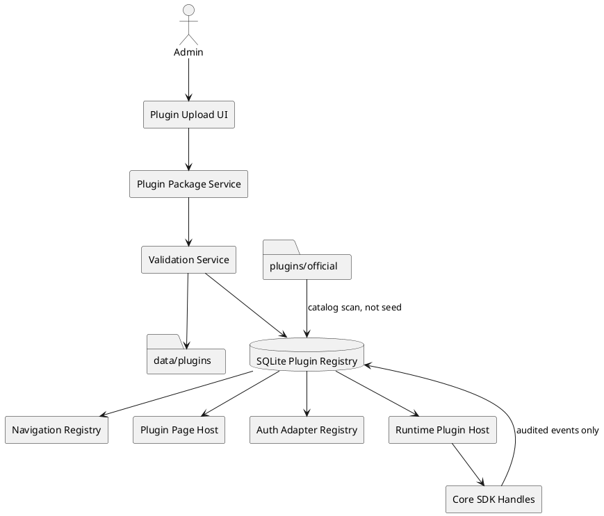
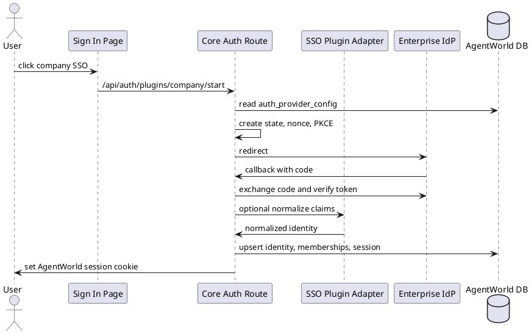

# AgentWorld 插件系统设计

## 1. 背景和目标

AgentWorld 已经有插件雏形：`plugin-core.ts` 定义了扩展点，`extension-core.ts` 可以导入插件清单、环境、Webhook、任务模板和任务蓝图，`plugin-sdk-core.ts` 支持 CodeHub 这类官方可执行插件。现阶段的问题是，声明导入和可执行加载仍是两套系统，左侧菜单和页面路由仍是静态代码，SSO 也只有开发入口和 OIDC/Assertion Bridge 的占位适配器。

插件系统的目标是：

- 外部开发者可以在 AgentWorld 外部做好插件包，通过界面导入后获得插件能力。
- 插件可以贡献左侧菜单、页面展示、配置面板、SSO 入口、工具、Webhook parser、输出发布器、任务蓝图、Skill 和看板视图。
- 默认插件随产品发布，但新装环境保持干净，不自动写入业务配置。
- 插件加载可禁用、可升级、可回滚、可审计。
- 第三方插件不能直接进入 Next.js 主进程执行任意代码，不能访问数据库、明文密钥或内部调度状态。
- 所有可见文案通过语言包贡献，不在插件或主干页面中硬编码。

## 2. 参考模型

设计吸收以下成熟系统的做法：

- VS Code：通过 contribution points 声明菜单、命令、视图，通过 activation events 懒加载插件。
- Backstage：区分 frontend plugin、backend plugin 和 core services，插件通过服务依赖访问平台能力。
- Grafana：通过 `plugin.json` 声明插件元数据、依赖、includes 和运行入口。
- WordPress：通过 action/filter hook 扩展，但 AgentWorld 不采用任意 PHP 式同进程 hook，而只保留“受控扩展点”的思想。
- Chrome Extension：权限显式声明和用户授权。
- WASI：能力句柄模型，插件只能使用平台授予的 capability。

这些模型共同指向一个原则：插件先声明贡献和权限，平台校验后按事件激活，插件运行时只能拿到 SDK handle。

## 3. 总体架构

插件系统分为三层：

1. 插件包层
   - 负责包格式、签名、校验和、离线资产、版本、兼容性和 SBOM。
   - 只保存到本地数据目录或官方插件目录。

2. 插件注册层
   - 负责把 manifest 和贡献项写入 SQLite。
   - 管理生命周期：上传、校验、安装、配置、启用、降级、禁用、卸载。
   - 给导航、页面、SSO、Webhook、工具和任务系统提供统一查询。

3. 插件运行层
   - 声明式页面和导航不需要执行插件代码。
   - 第三方 UI 默认使用 schema renderer 或 sandbox iframe。
   - 第三方逻辑默认通过 worker/child process/WASM 调用，不直接 `import()` 到 Next.js 主进程。
   - 官方可信插件可以 in-process 运行，但必须经过同一 manifest、权限和审计模型。



## 4. 插件包格式

插件包统一使用 `.awp`，本质是 zip。根目录必须包含 `agentworld.plugin.json`。

```text
agentworld.plugin.json
dist/
ui/
assets/
schemas/
README.md
LICENSE
checksums.sha256
signature.sig
sbom.json
```

规则：

- 插件包必须是已构建产物，不允许上传后执行 `npm install`、`postinstall` 或联网下载依赖。
- `assets/` 中放本地图片、字体、图标和 wasm，禁止远程 CDN。
- `checksums.sha256` 覆盖包内所有文件。
- `signature.sig` 支持企业内网的离线签名校验。
- `sbom.json` 推荐提供，用于开源后做供应链审计。
- 普通插件包不允许携带 native addon 或外部二进制；确需二进制时必须由管理员预置到 `plugins/trusted-binaries`，并在 manifest 中声明架构和校验和。

manifest 示例：

```json
{
  "apiVersion": "agentworld.io/plugin/v1alpha1",
  "kind": "AgentWorldPlugin",
  "metadata": {
    "id": "example.company-sso",
    "vendor": "example",
    "name": "Company SSO",
    "version": "1.0.0",
    "description": "OIDC based enterprise login plugin."
  },
  "compatibility": {
    "agentworld": "^0.1.0",
    "node": ">=22",
    "os": ["linux", "darwin"],
    "arch": ["arm64", "x64"]
  },
  "runtime": {
    "kind": "declarative",
    "activationEvents": [
      "onAuthStart:example.company-sso",
      "onAuthCallback:example.company-sso"
    ]
  },
  "permissions": {
    "requested": [
      { "resource": "auth.oidc.exchange", "effect": "allow" },
      { "resource": "secret.use", "scope": "sso.client_secret", "effect": "ask" }
    ]
  },
  "contributions": {
    "navigationItems": [
      {
        "id": "company-sso-admin",
        "slot": "sidebar.nav.foundation",
        "order": 820,
        "labelKey": "plugins.exampleCompanySso.nav.label",
        "descriptionKey": "plugins.exampleCompanySso.nav.description",
        "icon": "shield-check",
        "page": "admin"
      }
    ],
    "pages": [
      {
        "id": "admin",
        "route": "/plugins/example.company-sso/admin",
        "labelKey": "plugins.exampleCompanySso.pages.admin",
        "renderer": { "type": "schema", "schemaRef": "schemas/admin-page.schema.json" },
        "requiredPermissions": ["plugin.example.company-sso.view"]
      }
    ],
    "authAdapters": [
      {
        "id": "example.company-sso",
        "labelKey": "plugins.exampleCompanySso.name",
        "mode": "redirect",
        "protocol": "oidc"
      }
    ],
    "settingsPanels": [
      {
        "id": "company-sso-settings",
        "mountPoint": "settings.identityAccess",
        "labelKey": "plugins.exampleCompanySso.settings.title",
        "renderer": { "type": "schema", "schemaRef": "schemas/settings.schema.json" }
      }
    ],
    "languagePacks": [
      { "locale": "zh-CN", "path": "i18n/zh-CN.json" },
      { "locale": "en-US", "path": "i18n/en-US.json" }
    ]
  },
  "configSchema": {
    "type": "object",
    "required": ["issuerUrl", "clientId", "clientSecretRef"],
    "properties": {
      "issuerUrl": { "type": "string", "format": "uri" },
      "clientId": { "type": "string" },
      "clientSecretRef": { "type": "string" }
    }
  }
}
```

## 5. 插件目录规划

默认插件和第三方插件必须分开。

```text
plugins/
  official/
    codehub/
      agentworld.plugin.json
      dist/
      assets/

data/
  plugins/
    packages/
      <pluginId>/<version>/<sha256>.awp
    quarantine/
      <uploadId>/
    installed/
      <pluginId>/<version>/<sha256>/
    state/
      <pluginId>/

local-artifacts/
  plugins/
    <vendor>/<pluginId>/<version>/<os>-<arch>/
```

说明：

- `plugins/official` 是随产品发布的默认插件目录。它只提供“可安装目录”，不自动写入业务配置，符合新装环境干净的要求。
- `data/plugins` 是管理员通过界面导入后的真实安装目录，不能写入源码目录。
- `plugins/trusted-binaries` 只用于管理员离线预置的可信二进制或运行时组件，普通上传插件默认不能写这里。
- Linux 部署包必须包含 `plugins/official` 和 `local-artifacts`，并允许通过 `AGENTWORLD_PLUGIN_DIR` 覆盖数据目录。

当前已有的 `plugins/official/codehub/plugin.json` 应迁移或兼容为 `agentworld.plugin.json`。当前 `src/server/plugins/official/codehub.ts` 应逐步改为官方插件包内的 `dist/server.js`，主干只保留 SDK 和加载器。

## 6. 数据库模型

现有 `plugin_manifests` 只能存扁平字段，不足以表达一个插件的多贡献项。建议保留兼容读取，但新增以下表：

```sql
CREATE TABLE plugin_packages (
  id TEXT PRIMARY KEY,
  plugin_id TEXT NOT NULL,
  version TEXT NOT NULL,
  source TEXT NOT NULL,
  package_path TEXT NOT NULL,
  unpacked_path TEXT NOT NULL,
  sha256 TEXT NOT NULL,
  signature_status TEXT NOT NULL,
  manifest_json TEXT NOT NULL,
  validation_report_json TEXT NOT NULL,
  status TEXT NOT NULL,
  uploaded_by TEXT NOT NULL,
  uploaded_at TEXT NOT NULL,
  verified_at TEXT
);

CREATE TABLE plugin_installations (
  id TEXT PRIMARY KEY,
  plugin_id TEXT NOT NULL,
  version TEXT NOT NULL,
  package_id TEXT NOT NULL,
  tenant_space_id TEXT,
  lifecycle TEXT NOT NULL,
  config_json TEXT NOT NULL,
  secret_bindings_json TEXT NOT NULL,
  permission_policy_json TEXT NOT NULL,
  health_status TEXT NOT NULL,
  enabled_at TEXT,
  disabled_at TEXT,
  updated_by TEXT NOT NULL,
  updated_at TEXT NOT NULL
);

CREATE TABLE plugin_contributions (
  id TEXT PRIMARY KEY,
  plugin_id TEXT NOT NULL,
  version TEXT NOT NULL,
  contribution_type TEXT NOT NULL,
  contribution_id TEXT NOT NULL,
  mount_point TEXT NOT NULL,
  slot TEXT NOT NULL,
  label_key TEXT NOT NULL,
  schema_json TEXT NOT NULL,
  permission_refs_json TEXT NOT NULL,
  status TEXT NOT NULL,
  created_at TEXT NOT NULL
);

CREATE TABLE plugin_events (
  id TEXT PRIMARY KEY,
  plugin_id TEXT NOT NULL,
  event_type TEXT NOT NULL,
  severity TEXT NOT NULL,
  message TEXT NOT NULL,
  payload_json TEXT NOT NULL,
  created_at TEXT NOT NULL
);

CREATE TABLE plugin_state_kv (
  plugin_id TEXT NOT NULL,
  state_key TEXT NOT NULL,
  value_json TEXT NOT NULL,
  updated_at TEXT NOT NULL,
  PRIMARY KEY (plugin_id, state_key)
);
```

`plugin_manifests` 可以作为旧版导入协议的兼容视图，最终由 `plugin_contributions` 取代。

`slot` 用于页面扩展位置，例如 `sidebar.nav.foundation`、`settings.identityAccess`、`dashboard.widgets`、`agent.detail.tabs`、`taskRun.detail.panels`。第一阶段只实现 `sidebar.nav.*` 和 `/plugins/<pluginId>/<pageId>`，其他 slot 先进入 manifest schema 预留。

## 7. 生命周期

插件生命周期：

```text
uploaded -> quarantined -> validated -> installed -> configured -> enabled -> activated
                                      |             |             |
                                   rejected      disabled      degraded
```

含义：

- `uploaded`：收到包，但未信任。
- `quarantined`：保存到隔离目录，等待校验。
- `validated`：schema、签名、hash、兼容性、文件类型和权限检查通过。
- `installed`：包已解压到内容寻址目录，贡献项已写入注册表，默认不可执行。
- `configured`：必需配置、secret ref 和权限策略已绑定。
- `enabled`：贡献项可以出现在菜单、SSO 入口或任务选择中。
- `activated`：某个 activation event 触发，插件运行时被加载。
- `degraded`：健康检查失败或部分能力不可用。
- `disabled`：停止新调用，但保留历史数据和贡献快照。
- `uninstalled`：移除可运行能力和菜单入口，历史 TaskRun、事件、Finding、Artifact 不删除。

升级规则：

- 同一 `plugin_id` 可以安装多个版本，但每个租户/环境只启用一个版本。
- TaskRun 保存插件版本快照，升级不得改变历史任务解释语义。
- 回滚只切换 `plugin_installations` 的启用版本，不删除包。

## 8. 导入和安装流程

界面导入流程：

1. 管理员在插件管理页上传 `.awp`。
2. API 保存原包到 `data/plugins/packages`，计算 sha256。
3. 解压到 `data/plugins/quarantine/<uploadId>`。
4. 校验路径穿越、软链、zip bomb、文件大小、文件类型和远程资源引用。
5. 校验 `agentworld.plugin.json` schema、`apiVersion`、兼容版本和权限声明。
6. 校验 checksums 和签名。
7. 写入 `plugin_packages`，状态为 `validated` 或 `rejected`。
8. 管理员点击安装，写入 `plugin_installations` 和 `plugin_contributions`，状态为 `installed`。
9. 管理员完成配置和 secret ref 绑定，状态变为 `configured`。
10. 管理员启用，状态变为 `enabled`。
11. 某个 activation event 到来时加载插件运行时。

需要新增 API：

```text
GET    /api/plugins/catalog
POST   /api/plugins/packages
GET    /api/plugins/packages/:packageId/validation-report
POST   /api/plugins/:pluginId/install
PATCH  /api/plugins/:pluginId/configuration
POST   /api/plugins/:pluginId/enable
POST   /api/plugins/:pluginId/disable
POST   /api/plugins/:pluginId/uninstall
GET    /api/plugins/navigation
GET    /api/plugins/pages/:pluginId/:pageId
POST   /api/plugins/runtime/:pluginId/:contributionId
```

这些 API 必须先接入管理员权限校验。当前 `/api/plugins/manifests` 缺少权限闸门，应作为第一批修复。

## 9. 加载机制

插件加载由注册表驱动，不由页面硬编码。

加载顺序：

1. 扫描 `plugins/official` 得到官方可安装目录。
2. 读取 `plugin_packages` 和 `plugin_installations` 得到已安装插件。
3. 读取 `plugin_contributions` 得到已启用贡献项。
4. 根据当前用户、租户、团队、权限策略过滤贡献项。
5. 按 activation event 懒加载运行时。

activation event 建议：

```text
onRoute:/plugins/<pluginId>/<pageId>
onNavigation:<navigationItemId>
onSettingsPanel:<panelId>
onWebhook:<pathKey>
onTool:<toolId>
onOutputPublisher:<publisherId>
onAuthStart:<adapterId>
onAuthCallback:<adapterId>
onTaskBlueprint:<blueprintId>
onHealthCheck
```

`onStartup` 只允许官方可信插件使用，第三方插件默认禁止。

## 10. 左侧菜单定制

当前左侧菜单在 `navigation-config.tsx` 中静态定义。插件化后改为：

- 核心菜单仍由主干定义。
- 插件菜单由 `plugin_contributions` 的 `navigationItems` 提供。
- AppShell 在服务端读取当前用户可见的导航配置，传给 Sidebar。
- Sidebar 只渲染合并后的导航树。
- `secondaryNavigation` 这类用于面包屑和路由识别的导航也必须进入同一个模型，避免菜单、预加载和面包屑三套来源分裂。

插件菜单 manifest：

```json
{
  "id": "company-sso-admin",
  "slot": "sidebar.nav.foundation",
  "order": 820,
  "labelKey": "plugins.exampleCompanySso.nav.label",
  "descriptionKey": "plugins.exampleCompanySso.nav.description",
  "icon": "shield-check",
  "href": "/plugins/example.company-sso/admin",
  "requiredPermissions": ["plugin.example.company-sso.view"]
}
```

约束：

- `href` 必须在 `/plugins/<pluginId>/...` 下，禁止覆盖 `/settings`、`/identity-access`、`/api/*` 等核心路径。
- `icon` 使用白名单中的 lucide 名称，或使用插件本地 asset 图标。
- `labelKey` 和 `descriptionKey` 必须由插件语言包提供。
- 菜单显示受插件启用状态、用户权限和团队可见范围控制。
- 菜单隐藏不能作为权限边界，插件页面路由必须服务端二次校验 `systemAdminOnly`、`requiredPermissions`、`businessTeamScope` 和 `tenantScope`。

## 11. 页面展示层定制

插件页面统一挂载到核心宿主路由：

```text
/plugins/[pluginId]/[pageId]
```

页面渲染分三档：

1. `schema`
   - 推荐默认模式。
   - 插件贡献 JSON schema、数据源声明、表格/表单/详情/图表布局。
   - 主干使用内置组件渲染，天然继承语言包、权限和设计系统。

2. `iframe`
   - 适用于复杂 UI。
   - 资源必须来自插件本地 `ui/`，由 AgentWorld 以插件资源路由托管。
   - iframe 使用 sandbox，不给同源 cookie，不允许顶层导航。
   - 与平台通信只能走 postMessage bridge，bridge 只暴露受控 SDK。

3. `trusted-module`
   - 只允许官方插件或企业管理员预信任插件。
   - 作为长期能力，不作为开源插件系统第一阶段默认能力。

插件不能直接新增 Next.js 物理路由。所有插件页面都经过 Page Host，这样权限、语言包、审计和 CSP 才能统一。

页面 slot 预留：

- `dashboard.widgets`：总览页小组件。
- `teamWallboard.panels`：团队大盘局部面板。
- `settings.sections`：设置页分组。
- `identity.authProviders`：登录入口和身份配置。
- `agent.detail.tabs`：Agent 详情页 Tab。
- `taskRun.detail.panels`：任务运行详情页面板。

这些 slot 只能接收声明式 schema 或 sandbox iframe。核心页面决定 slot 位置和最大尺寸，插件不能把核心页面整体替换掉。

## 12. 逻辑定制

逻辑插件按贡献类型进入不同宿主：

- `authAdapters`：进入 Auth Adapter Registry。
- `webhookParsers`：进入 Webhook Trigger Host。
- `tools` 和 `toolBundles`：进入 Tool Host。
- `outputPublishers`：进入 Output Publisher Host。
- `providerAdapters`：进入 Provider Runtime Host。
- `taskBlueprints` 和 `scheduleTemplates`：导入标准表，但保留插件来源和版本。
- `skills`：导入 Skill 表和 AgentWorld 知识引擎 URI 绑定，但必须做团队范围和内容安全校验。
- `boardViews`：进入看板视图 registry。

运行时隔离：

- 官方可信插件可以 in-process，但仍使用 SDK context。
- 外部第三方插件默认用 Node worker/child process IPC。
- 高风险插件或未来开源生态优先支持 WASM/WASI。
- 插件运行时不能拿数据库连接、cookies、`.env` 或文件系统根路径。

SDK 只暴露：

- `readTaskContext`
- `readEnvironment`
- `resolveSecretRef`
- `requestPermission`
- `emitEvent`
- `createFinding`
- `createArtifact`
- `readPluginState`
- `writePluginState`
- `fetchAllowedUrl`

默认权限应收紧为 deny/ask。当前 `plugin-sdk-core.ts` 对部分能力默认 allow，需要在真正执行第三方插件前修正。

## 13. SSO 插件设计

SSO 插件是第一类真实验证插件。

当前基础：

- `auth_provider_configs` 已包含 OIDC 所需的 issuer、authorize、token、userinfo、jwks、client、scopes、mapping 和 config 字段。
- `auth-adapter-core.ts` 保留 `oidc_generic` 与 `assertion_bridge` 通用占位，企业 SSO 差异通过 `auth_sso` 插件能力接入。
- `auth-core.ts` 已有身份入库、membership、session cookie 和访问白名单逻辑。

目标设计：

- 插件贡献 `authAdapters`，例如 `official.oidc` 或 `company.sso`。
- 核心平台控制 `/api/auth/plugins/:adapterId/start` 和 `/api/auth/plugins/:adapterId/callback`。
- 核心平台负责 state、nonce、PKCE、token exchange、JWKS 校验、userinfo 拉取和 session cookie。
- 插件只贡献协议类型、claim mapping、配置 schema 和可选的 normalize hook。
- 企业 assertion bridge 可以贡献验签逻辑，但必须运行在隔离 host 中。
- 管理员判定、团队归属、白名单匹配必须由核心平台执行，插件不得直接设置管理员权限。

OIDC 流程：



这样可以满足“未来登录走公司的 SSO”，同时不把会话控制权交给插件。

## 14. 安全边界

必须防止：

- zip slip、软链逃逸、zip bomb。
- 上传后执行 `npm install`、`postinstall`、native addon、任意 shell。
- 第三方插件动态 `import()` 到 Next.js 主进程。
- 插件读取 `.env`、SQLite 文件、AgentWorld 知识引擎 数据目录或任意文件系统路径。
- 插件页面加载远程 JS、字体、图片、wasm。
- 插件伪装或覆盖核心路由、核心菜单和核心 API。
- 插件菜单只在客户端隐藏但服务端页面仍可访问。
- 插件绕过 SSO state、nonce、PKCE、JWKS、cookie 设置。
- 插件把 secret ref 解析成明文后写入日志、事件、知识库或 Artifact。
- 插件绕过团队可见范围写 Skill、知识、任务蓝图或输出发布器。
- 插件在 webhook parser 中绕过验签、重放保护和请求大小限制。

默认策略：

- 未签名包可以导入但不能启用高风险 runtime。
- 明文 secret 禁止进入 manifest 和 config。
- `network.outbound`、`filesystem.write`、`secret.use`、`notification.send` 默认为 ask 或 deny。
- 插件 iframe 默认不允许 same-origin、top navigation、forms 和 popups。
- 所有插件事件进入审计日志。

## 15. 与现有代码的对接

短期对接点：

- `src/server/plugin-core.ts`
  - 扩展 capability 和 contribution 类型。
  - 增加 manifest schema 类型。

- `src/server/extension-core.ts`
  - 从导入 JSON bundle 升级为安装 `.awp` 包。
  - 保留旧 `importExtensionBundle()` 作为兼容入口。

- `src/server/plugin-sdk-core.ts`
  - 把 `executablePluginModules` 从硬编码改成 registry loader。
  - 收紧默认权限。
  - 增加 worker/IPC host。

- `src/server/auth-adapter-core.ts`
  - 从静态数组改成“内置 adapter + 插件贡献 adapter”。
  - 增加 OIDC start/callback 所需接口。

- `src/components/navigation-config.tsx`
  - 核心菜单继续保留。
  - 增加合并插件菜单的 `resolveNavigation(authContext)`。
  - 把 `navigationGroups`、`secondaryNavigation`、`flatNavigation` 合并成单一 Navigation Model。

- `src/components/sidebar-nav.tsx`
  - 从静态 `navigationGroups` 改为 props 或 provider 输入。

- `src/components/app-shell.tsx`
  - 从 layout 接收 Navigation Model。
  - 面包屑使用同一个 Navigation Model，而不是再次 import 静态导航。

- `src/app/plugins/[pluginId]/[pageId]/page.tsx`
  - 新增插件页面宿主。
  - 服务端读取插件贡献项并二次校验权限。

- `src/app/api/plugins/*`
  - 新增上传、安装、启用、禁用、配置、导航和页面数据 API。
  - 增加管理员权限校验。

## 16. 分阶段落地计划

第一阶段：设计和注册表

- 完成 manifest schema。
- 新增插件包目录约定。
- 新增数据库表。
- 新增插件 catalog/install/config/enable/disable API。
- 官方插件只显示为可安装，不自动写配置。

第二阶段：UI 插件

- Sidebar 改为核心菜单加插件菜单。
- 新增 `/plugins/[pluginId]/[pageId]` 宿主。
- 实现 schema renderer。
- 实现插件语言包加载。

第三阶段：SSO 插件

- 实现官方 OIDC 插件。
- 新增 SSO start/callback 路由。
- 抽象 `signInWithEnterpriseIdentity()`。
- 接入 claim mapping、团队映射和白名单。

第四阶段：逻辑插件运行时

- registry loader 取代硬编码插件数组。
- 实现 worker/IPC runtime。
- 把 Webhook parser、Output publisher、Tool bundle 迁移到统一 host。
- 收紧 allow/ask/deny 权限。

第五阶段：开源生态

- 提供插件模板和 CLI 打包工具。
- 提供离线校验工具。
- 提供官方插件包：OIDC、CodeHub、GitLab/Gitea、Webhook toolkit、Notification publisher。
- 提供兼容性测试和插件安全扫描。

## 17. 验收标准

- 管理员可以上传 `.awp`，查看校验报告，安装、配置、启用和禁用插件。
- 新装环境不会自动写入业务配置，默认插件只出现在可安装目录。
- 插件可以贡献左侧菜单，菜单只指向 `/plugins/<pluginId>/<pageId>`。
- 插件页面可以通过 schema renderer 展示数据。
- OIDC SSO 插件可以完成公司登录，核心平台负责 cookie 和用户入库。
- 插件启用前必须绑定必需配置和 secret ref。
- 插件禁用后不再出现在菜单、SSO 入口和运行时引用中。
- 插件无法覆盖核心路由、读取数据库文件、读取 `.env` 或加载远程 UI 资源。
- 插件运行、权限决策和错误都进入审计日志。
