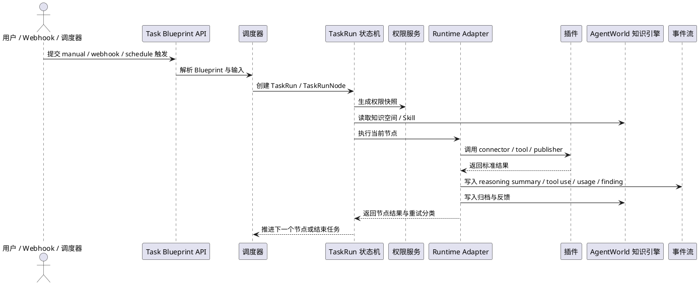
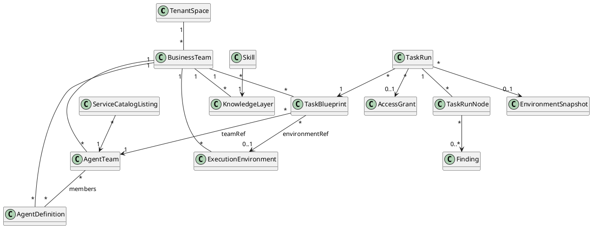
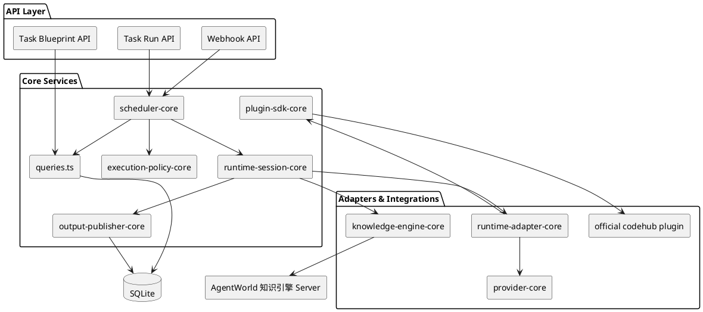
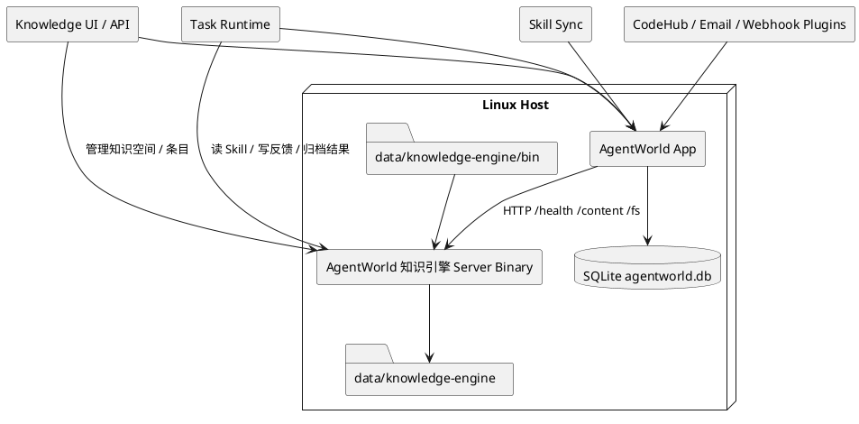

# AgentWorld 系统详细设计

## 1. 范围

本文描述 AgentWorld 的完整实现边界：领域模型、前后端排布、任务执行过程、插件扩展、AgentWorld 知识引擎 记忆集成、核心案例和 Linux 发布方式。

本项目尚未上线，因此领域名、数据库表、API 路径和文件名均按目标形态直接收敛，不保留旧路径兼容。

### 1.1 总体架构图

```plantuml
@startuml
skinparam componentStyle rectangle
skinparam packageStyle rectangle

actor "业务用户 / 管理员" as User
actor "外部系统" as External

package "Control Plane" {
  component "总览与治理控制台" as Console
  component "租户 / 业务团队治理" as TeamGov
  component "Agent / Agent Team 定义" as AgentGov
  component "Task Blueprint 管理" as BlueprintGov
  component "Connector / Codebase / MCP / Skill 管理" as ConfigGov
}

package "Execution Plane" {
  component "任务调度器" as Scheduler
  component "TaskRun / TaskRunNode 状态机" as TaskEngine
  component "权限与运行约束" as Policy
  component "Runtime Adapter Interface" as Runtime
  component "事件流 / Finding / Artifact" as Observability
}

package "Extension Plane" {
  component "插件注册表" as PluginRegistry
  component "Repository Connector" as RepoPlugin
  component "Webhook Parser" as WebhookPlugin
  component "Output Publisher" as OutputPlugin
  component "Tool Bundle" as ToolPlugin
}

package "Knowledge & Environment" {
  component "AgentWorld 知识引擎" as AgentWorld 知识引擎
  component "执行环境 / Codebase / Secret Ref" as Environment
}

database "SQLite" as DB

User --> Console
Console --> TeamGov
Console --> AgentGov
Console --> BlueprintGov
Console --> ConfigGov

External --> WebhookPlugin
BlueprintGov --> Scheduler
Scheduler --> TaskEngine
TaskEngine --> Policy
TaskEngine --> Runtime
TaskEngine --> Observability
TaskEngine --> Environment
TaskEngine --> AgentWorld 知识引擎
Runtime --> PluginRegistry
PluginRegistry --> RepoPlugin
PluginRegistry --> WebhookPlugin
PluginRegistry --> OutputPlugin
PluginRegistry --> ToolPlugin

TeamGov --> DB
AgentGov --> DB
BlueprintGov --> DB
ConfigGov --> DB
Scheduler --> DB
TaskEngine --> DB
Observability --> DB
Environment --> DB
AgentWorld 知识引擎 --> DB
@enduml
```

### 1.2 任务执行时序图



## 2. 领域模型

### 2.0 领域关系图



### 2.1 租户空间

租户空间是平台最高治理边界，负责：

- 模型白名单。
- 最大并发任务和全局配额。
- 全局运行约束。
- 默认安全策略。

实现表：`tenant_spaces`。

### 2.2 业务团队

业务团队承载企业组织分权，负责：

- 私有资源范围。
- 私有工具引用。
- 私有记忆命名空间。
- Agent、Agent 团队、环境、任务蓝图和任务模板归属。

实现表：`business_teams`。

### 2.3 Agent

Agent 是可执行角色，负责：

- 名称、角色、模型。
- Persona prompt。
- 工具绑定。
- 记忆范围。
- 安全配置和状态。

实现表：`agents`。

### 2.4 Agent 团队

Agent 团队是可运营服务单元，负责：

- Leader Agent。
- 成员 Agent。
- 工作流类型：single、sequential、parallel、DAG。
- 输入 schema、输出 schema。
- 超时时间和成功率目标。
- 可见性：个人、团队、全局设计目标；当前实现 public / private 基线。

实现表：`agent_teams`。

### 2.5 服务目录

服务目录用于让业务团队发现和使用其他团队公开的 Agent 团队能力，负责：

- 服务上架。
- 招募模式。
- 成功率和平均耗时。
- 标签和服务状态。

实现表：`service_catalog_listings`。

### 2.6 跨团队授权

跨团队授权是业务团队之间调用公开 Agent 团队服务的治理协议，负责：

- Provider Agent 团队。
- Consumer 业务团队。
- 动作范围。
- 工具范围。
- SLA 和服务账号引用。
- 服务账号引用。

实现表：`access_grants`。

### 2.7 运行约束

运行约束控制 Agent 调用过程中的工具、输出和安全策略，负责：

- allowed tools。
- blocked tools。
- approval required tools。
- 最大运行时间、最大步骤数、最大工具调用数。
- 思考折叠、结构化输出、默认语言。
- prompt scan、output scan、secret redaction。

实现表：`execution_policies`。

### 2.8 任务蓝图与任务执行

任务蓝图是平台调度和执行的统一配置实体，负责：

- 基础信息、业务团队归属、任务类别和可见性。
- 触发器：manual、cron、webhook、access grant。
- 输入 Schema、环境选择器、Agent 团队编排、记忆和 Skill 依赖。
- Provider 执行策略、权限策略、结果 Schema、输出通道和看板规则。
- 失败重试、并发控制、幂等键和归档策略。

任务执行是任务蓝图的一次运行实例，负责：

- 来源类型：manual、schedule、webhook、access_grant。
- 来源引用。
- 业务团队、Agent 团队、运行环境、跨团队授权。
- 输入、输出、trace id、状态、蓝图版本、幂等键、权限快照、环境快照和完成时间。

实现表：

- `task_blueprints`
- `task_templates`
- `schedule_templates`
- `task_runs`
- `task_run_plans`
- `task_run_nodes`
- `task_run_interventions`
- `event_logs`
- `task_events`
- `findings`
- `trace_spans`

### 2.9 执行环境

执行环境描述任务的执行对象，负责：

- 代码仓 provider、名称、URL、默认分支。
- 执行人引用。
- PRIVATE_KEY secret ref。
- 工作目录。
- 沙箱配置预留。
- 记忆层依赖。
- 可见性和状态。

实现表：

- `execution_environments`
- `environment_templates`
- `environment_snapshots`

### 2.10 记忆层

记忆层基于 AgentWorld 知识引擎，负责：

- 记忆层定义。
- Skill 管理。
- 任务上下文归档。
- 检视结果归档。
- 人工反馈回流。
- L0 / L1 / L2 读取。

实现表：

- `knowledge_layers`
- `inspection_skills`
- `knowledge-engine_knowledge_entries`

## 3. 后端设计

### 3.0 后端执行链路图



### 3.1 调度路径

任务入口包括：

- 手动提交：`POST /api/task-runs/submit`。
- 任务蓝图提交：`POST /api/task-blueprints/:id/submit`。
- 定时模板：`schedule_templates`。
- Webhook：`POST /api/webhooks/:pathKey`。
- 插件导入任务蓝图和任务模板：`POST /api/plugins/manifests`。

统一调度函数：

- `submitTaskRunFromBlueprint()`：解析 Task Blueprint，生成幂等键、环境快照、权限快照和运行实例。
- `submitTaskRun()`：生成 `task_runs`、`task_run_plans`、`task_run_nodes` 和初始事件。
- `executeTaskRunTick()`：推进 ready 节点、执行权限校验、模拟节点执行并写事件。
- `retryTaskRunNode()`：失败节点单独重试。
- `resumeTaskRun()`：人工恢复。
- `resolveTaskRunIntervention()`：人工门禁批准或拒绝。

### 3.2 调用路径

Agent 调用过程由 `invocation-core.ts` 描述，标准阶段为：

1. 组装调用上下文。
2. 合成运行约束。
3. 校验跨团队授权。
4. 选择 ProviderAdapter。
5. 挂载 Runtime。
6. 流式记录 trace 和工具事件。
7. 需要时进入人工门禁。
8. 完成节点收尾。

### 3.3 权限控制

权限由四层组成：

- Task Blueprint 权限策略：allow / ask / deny，且 deny 优先于 ask，ask 优先于 allow。
- 运行约束：控制工具、输出、安全扫描和审批。
- 跨团队授权：控制跨业务团队动作范围、工具范围和 SLA。
- Secret 与环境权限：PRIVATE_KEY 永远只保存 secret ref，不进入日志和任务输出。

所有工具执行前必须先经过 `evaluateExecutionPolicyToolPolicy()`；跨团队调用必须经过 `evaluateAccessGrantAccess()`。

### 3.4 插件导入

插件不修改主干，只导入扩展声明：

- `plugins`：插件清单。
- `environments`：执行环境。
- `taskBlueprints`：任务蓝图。
- `taskTemplates`：任务模板。
- `scheduleTemplates`：触发模板。

企业 Git、内部 MR 系统、Gitea、GitLab、邮件、IM 通过同一导入协议接入。主干只读取 manifest、环境、任务蓝图、任务模板和权限声明。

## 4. 前端设计

### 4.1 总览页

总览页按业务运营视角组织：

- 按来源统计任务运行。
- 最近任务运行和状态。
- Finding 聚合。
- 配置完整度。
- 任务蓝图入口。

### 4.2 任务空间

任务空间是执行层最重要的展示页，必须展示：

- 操作控制台：推进 tick、恢复、重试、批准、拒绝。
- 任务执行概览：状态、来源、租户空间、业务团队、Agent 团队和提交人。
- 蓝图快照：任务蓝图、版本、幂等键和触发器。
- 编排协议：Leader、Worker、聚合和冲突处理。
- 跨团队授权详情。
- 运行约束详情。
- 计划与节点。
- 人工干预。
- 执行指标。
- 调用阶段。
- Provider 选择依据。
- 按 fold group 分组的事件流。
- 标准 `task_events` 事件流。
- Environment Snapshot、权限快照和 Finding 输出。

事件流保留 thinking、tool use、tool result、approval、timeout、retry、policy hit 等信息，避免只展示最终结论。

### 4.3 设置页

设置页用于配置和审计：

- Provider。
- 执行引擎实例。
- 插件扩展点。
- 执行环境。
- 任务蓝图。
- Webhook。

## 5. AgentWorld 知识引擎 集成

### 5.0 集成架构图



### 5.1 集成方式

AgentWorld 知识引擎 通过服务端二进制直接集成，不依赖容器运行时。

查找顺序：

1. `KNOWLEDGE_ENGINE_SERVER_BIN`
2. `data/knowledge-engine/bin/knowledge-engine-server-${platform}-${arch}`
3. `data/knowledge-engine/bin/knowledge-engine-server`

Linux 发布包要求本地提供匹配架构的 `data/knowledge-engine/bin/knowledge-engine-server-linux-${arch}`、`.xz` 或 `.xz.part-*` 制品，支持 `x64` 与 `arm64`。内网源码安装不会从公网下载或构建 AgentWorld 知识引擎 二进制。

### 5.2 目录结构

```text
data/knowledge-engine/
  README.md
  manifest.json
  bin/
    knowledge-engine-server-${platform}-${arch}
    knowledge-engine-server-linux-x64
    knowledge-engine-server-linux-arm64.xz.part-*
  wheels/
data/knowledge-engine/
  ov.conf
  ovcli.conf
  workspace/
```

### 5.3 脚本

- `pnpm knowledge-engine:prepare`：生成服务端配置和 CLI 配置。
- `pnpm knowledge-engine:cli-config`：刷新 CLI 配置。
- `pnpm knowledge-engine:init`：调用 AgentWorld 知识引擎 server init。
- `pnpm knowledge-engine:doctor`：调用 AgentWorld 知识引擎 doctor。
- `pnpm knowledge-engine:start`：启动服务端二进制。
- `pnpm knowledge-engine:smoke`：验证 health、write、read、tree。
- `pnpm knowledge-engine:install`：校验本地 AgentWorld 知识引擎 二进制，不执行公网下载。
- `pnpm knowledge-engine:build-binary`：Linux 构建服务端二进制并放入 local-artifacts；Python 依赖只允许来自本地 wheelhouse。

AgentWorld 知识引擎 doctor 要求 VLM provider/model 配置完整。AgentWorld 不写入假 key，也不猜测私有模型名；部署方通过以下变量完成最小配置：

```text
KNOWLEDGE_ENGINE_VLM_PROVIDER=
KNOWLEDGE_ENGINE_VLM_MODEL=
KNOWLEDGE_ENGINE_VLM_API_BASE=
KNOWLEDGE_ENGINE_VLM_API_KEY=
```

如需覆盖默认 embedding，可配置 `KNOWLEDGE_ENGINE_EMBEDDING_PROVIDER`、`KNOWLEDGE_ENGINE_EMBEDDING_MODEL`、`KNOWLEDGE_ENGINE_EMBEDDING_API_BASE`、`KNOWLEDGE_ENGINE_EMBEDDING_API_KEY`、`KNOWLEDGE_ENGINE_EMBEDDING_DIMENSION`。未配置 VLM 时，`pnpm knowledge-engine:init` 会进入 AgentWorld 知识引擎 官方初始化向导。

### 5.4 访问接口

AgentWorld 通过 `knowledge-engine-core.ts` 调用：

- `GET /health`
- `POST /api/v1/content/write`
- `GET /api/v1/content/read`
- `GET /api/v1/content/abstract`
- `GET /api/v1/content/overview`
- `GET /api/v1/fs/tree`

如果远端不可用，系统会保留本地影子索引，并记录 sync 状态。

### 5.5 记忆 URI

默认 URI 规划：

- 仓库上下文：`agentworld://knowledge/resources/agentworld/code-inspection/repositories`
- 全局检视经验：`agentworld://knowledge/resources/agentworld/code-inspection/global`
- 安全 Skill：`agentworld://knowledge/agent/skills/agentworld/code-inspection/security`
- 测试 Skill：`agentworld://knowledge/agent/skills/agentworld/code-inspection/quality-test`
- 数据与接口 Skill：`agentworld://knowledge/agent/skills/agentworld/code-inspection/data-api`
- 正确反馈：`agentworld://knowledge/user/memories/agentworld/code-inspection/feedback/correct`
- 误报反馈：`agentworld://knowledge/user/memories/agentworld/code-inspection/feedback/incorrect`
- 解释不足反馈：`agentworld://knowledge/user/memories/agentworld/code-inspection/feedback/unclear`

## 6. 核心案例

### 6.1 配置化 MR 检视

配置对象：

- `task-template-merge-request-review`
- `template-merge-request-review`
- `env-merge-request-review`
- `PR Vanguard`
- `builtin.repo.git`

执行流程：

1. 代码平台 Webhook 提交 MR diff。
2. `api/webhooks/:pathKey` 解析 endpoint、任务模板和执行环境。
3. 写入 MR 上下文到 AgentWorld 知识引擎。
4. `submitTaskRun()` 生成可观测任务。
5. 检视 Skill 按层运行：MR 结构、安全敏感、测试影响、数据与接口。
6. 生成 MR 评论。
7. 配置 token 时回写 MR；未配置时只记录本地评论内容。
8. finding 和人工反馈写回 AgentWorld 知识引擎。

插件扩展方式：

- 企业 Git 插件只需导入 `enterprise.repo.git` manifest。
- 插件声明 diff API、comment API、凭据引用和 webhook parser。
- MR 检视任务模板可以复用，不改主干任务流程。

### 6.2 每日全量安全检视

配置对象：

- `task-template-daily-security-scan`
- `template-daily-security-scan`
- `env-daily-security-scan`
- `builtin.notify.email`

执行流程：

1. 调度器按每日模板生成任务。
2. 环境层选择仓库集合、分支、执行人和工作目录。
3. 安全 Skill 从 AgentWorld 知识引擎 读取安全记忆和历史反馈。
4. Agent 团队执行全量安全扫描。
5. 生成风险报告。
6. 邮件插件发送摘要。
7. 结果和反馈归档到 AgentWorld 知识引擎。

## 7. 发布设计

Linux 发布包由 `pnpm package:linux` 生成，要求在 Linux 构建机上执行。

发布包包含：

- `.next/standalone`。
- `.next/static`。
- Node.js Linux runtime。
- `data/knowledge-engine/bin/knowledge-engine-server-linux-${arch}`、`.xz` 或 `.xz.part-*`，发布时复制为包内 `data/knowledge-engine/bin/knowledge-engine-server`。
- `data/knowledge-engine/ov.conf`。
- `data/knowledge-engine/ovcli.conf`。
- `agentworld` 启动脚本。
- `knowledge-engine-server` 启动脚本。

部署顺序：

1. 配置 `.env` 或导出环境变量。
2. 启动 `./knowledge-engine-server`。
3. 启动 `./agentworld`。
4. 执行 `pnpm knowledge-engine:smoke` 或等价 smoke 检查。

## 8. 可靠性和扩展性

- 幂等：任务提交、Webhook、节点推进和知识写入可重试。
- 可观测：事件流、trace id、节点状态、策略命中和人工干预持久化。
- 降级：AgentWorld 知识引擎 远端不可用时保留本地影子索引。
- 安全：密钥只保存 secret ref；插件权限与运行约束对齐。
- 扩展：新增代码平台、通知渠道、Provider 和 Skill 只新增插件或扩展包。
- 上线前可演进：当前没有兼容历史数据包袱，可继续打磨字段和模型命名。

## 9. 实现对照

- Provider 执行层：`provider-core.ts`、`runtime-adapter-core.ts`、`runtime-provider-config.ts`、`runtime-session-core.ts`
- Agent 定义层：`registry-core.ts`、`agent-teams/page.tsx`
- 工具 / Skill 管理层：`execution-policy-core.ts`、`plugin-core.ts`、`knowledge-engine-core.ts`
- 多 Agent 编排层：`planner-core.ts`、`executor-core.ts`、`invocation-core.ts`
- Agent 团队任务执行层：`queries.ts`、`trace-core.ts`、`task-runs/[id]/page.tsx`
- 业务团队管理层：`tenant-space-core.ts`、`access-grant-core.ts`
- 任务执行展示层：`environment-core.ts`、`scheduler-core.ts`、`page.tsx`、`task-runs/[id]/page.tsx`
- 环境层：`execution_environments`、`settings/page.tsx`
- 记忆层：`knowledge-engine-core.ts`、`knowledge/page.tsx`
