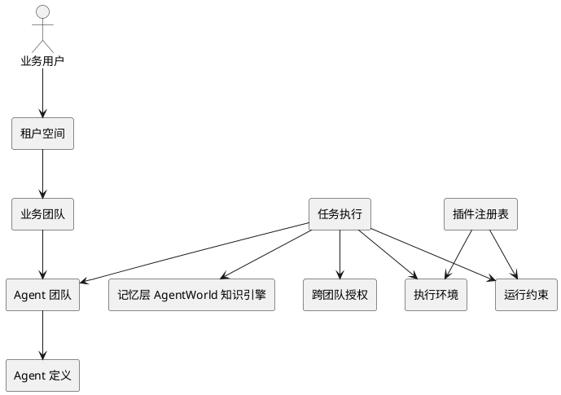
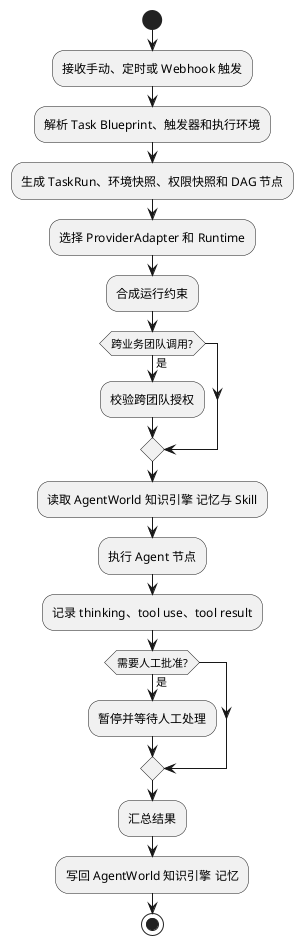
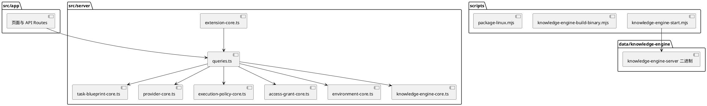
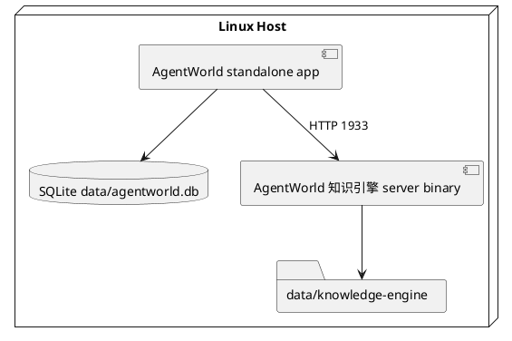
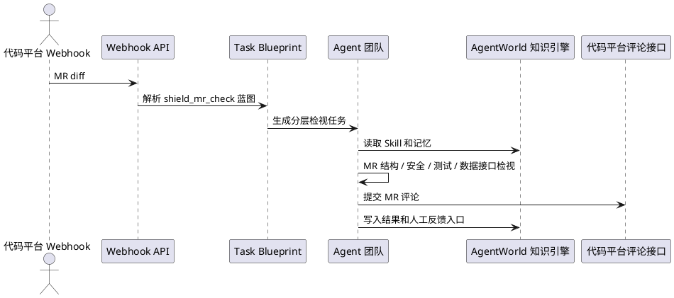

# AgentWorld 系统概要设计

## 1. 系统定位

AgentWorld 定位为团队级 Agent 平台。平台核心不是单人聊天，也不是固定流程自动化，而是将 Provider 执行、Agent 定义、工具与 Skill、Agent 团队编排、任务执行、业务团队治理、执行展示、执行环境和记忆管理统一为一个可治理系统。

默认术语采用严肃标准表达：租户空间、业务团队、Agent、Agent 团队、服务目录、跨团队授权、任务执行、运行约束、执行环境、记忆层。风格化语言不作为默认产品表达，只作为可选术语皮肤能力保留。

## 2. 设计原则

- Agent 调度和 Agent 调用分层：调度负责生成任务、排队、分派和看板；调用负责 Provider 选择、权限校验、执行环境、记忆和事件流。
- 开源主干保持稳定：Provider、触发器、邮件、IM、代码仓、输出发布和看板指标通过插件清单、任务蓝图和环境配置导入。
- 任务全局可见，动作受控：任务执行情况全局展示，但跨团队调用、工具使用和写操作受运行约束与跨团队授权控制。
- 执行过程完整可追溯：任务空间必须记录 plan、reasoning summary、tool use、tool result、approval、retry、policy hit、Finding 和 artifact。
- 记忆可沉淀、可读取、可反馈：AgentWorld 知识引擎 作为分层记忆服务，提供 Skill、上下文和人工反馈的长期存储。
- 部署简单：应用发布包面向 Linux 自包含运行，AgentWorld 知识引擎 通过服务端二进制直连，不依赖容器运行时。

## 3. 平台能力域

1. Provider 执行层：控制台只暴露 AI Provider 配置；底层 Agent Runtime 由系统内置，其他执行器通过插件接入。
2. Agent 定义层：定义角色、提示词、模型、工具、权限、记忆范围、状态和团队归属。
3. 工具 / Skill 管理层：管理工具和 Skill，权限模型采用 allow / deny / approval，并与运行约束对齐。
4. 多 Agent 编排层：定义 Agent 团队 Leader、协作 Agent、依赖关系、团队目标和交互提示词。
5. Agent 团队任务执行层：每个 Agent 团队接受任务，生成任务空间，记录完整执行交互。
6. 业务团队管理层：租户空间和业务团队管理权限、可见性、创建者、编辑者和使用者。
7. 任务执行展示层：按业务团队、任务蓝图、触发方式、任务类别、状态、Finding 和优先级组织任务看板。
8. 环境层：配置 Environment Template、Environment Snapshot、代码仓、执行人、PRIVATE_KEY 引用、执行路径、记忆依赖和未来沙箱。
9. 记忆层：基于 AgentWorld 知识引擎 做分层、分域、分团队的记忆和 Skill 管理。

## 4. 4+1 视图

### 4.1 逻辑视图



### 4.2 进程视图



### 4.3 开发视图



### 4.4 物理视图



### 4.5 场景视图



## 5. 前端排布

- 总览：展示任务运行、Finding 聚合、蓝图状态、配置完整度和最近任务。
- 租户空间：展示模型白名单、最大并发和全局规则。
- 业务团队：展示私有工具、私有记忆命名空间和状态。
- Agent 团队：展示 Leader、成员 Agent、工作流、工具集、模型和在线编辑入口。
- 任务蓝图：展示触发器、输入 Schema、环境选择器、Agent 编排、权限预览、输出和看板规则。
- 任务执行：展示任务列表和任务空间，任务空间保留完整事件流。
- 服务目录：展示可被其他业务团队使用的 Agent 团队服务。
- 跨团队授权：展示 provider team、consumer team、动作范围、工具范围和 SLA。
- Runtime：展示已配置执行引擎实例、发现结果和健康状态。
- 运行约束：展示工具权限、人工门禁、输出策略和安全扫描。
- 记忆：展示 AgentWorld 知识引擎 层级、Skill、知识条目和 L0/L1/L2 读取。
- 设置：展示 Provider、执行引擎、执行环境、Webhook、任务蓝图和扩展导入入口。

## 6. 案例配置

### 6.1 配置化 MR 检视

MR 检视流程通过配置而不是写死实现：

- Webhook 入口：MR diff。
- 任务蓝图：`merge_request_review`。
- 任务模板：`task-template-merge-request-review`。
- 触发模板：`template-merge-request-review`。
- 执行环境：`env-shield-mr-check`。
- Agent 团队：`PR Vanguard`。
- 记忆层：仓库上下文、全局检视经验、安全、测试、数据与接口。
- 输出：MR 评论、任务执行轨迹、检视 finding、AgentWorld 知识引擎 记忆。

### 6.2 每日全量安全检视

每日安全检视同样通过配置实现：

- 触发类型：每日定时。
- 任务蓝图：`daily_security_scan`。
- 任务模板：`task-template-daily-security-scan`。
- 执行环境：`env-daily-security-scan`。
- 代码仓选择：按业务团队、分支和仓库集合选择。
- 通知插件：邮件插件。
- 输出：安全风险报告、邮件摘要、长期安全记忆。

## 7. 部署概要

AgentWorld 发布为 Linux 自包含包。AgentWorld 知识引擎 不要求容器运行时，优先使用：

```text
data/knowledge-engine/bin/knowledge-engine-server-${platform}-${arch}
```

如需外置二进制：

```text
KNOWLEDGE_ENGINE_SERVER_BIN=/opt/knowledge-engine/knowledge-engine-server
```

发布包包含 Node.js runtime、AgentWorld standalone app、AgentWorld 知识引擎 二进制、本地字体和配置文件。Linux 打包要求本地提供匹配架构的 `data/knowledge-engine/bin/knowledge-engine-server-linux-${arch}`、`.xz` 或 `.xz.part-*` 制品，支持 `x64` 与 `arm64`；打包后会复制为包内 `data/knowledge-engine/bin/knowledge-engine-server`。默认执行 `./agentworld` 时，启动器会先检查 AgentWorld 知识引擎 `/health`，必要时拉起包内 AgentWorld 知识引擎，再启动 AgentWorld standalone 服务；`./knowledge-engine-server` 仅作为手动诊断入口。
